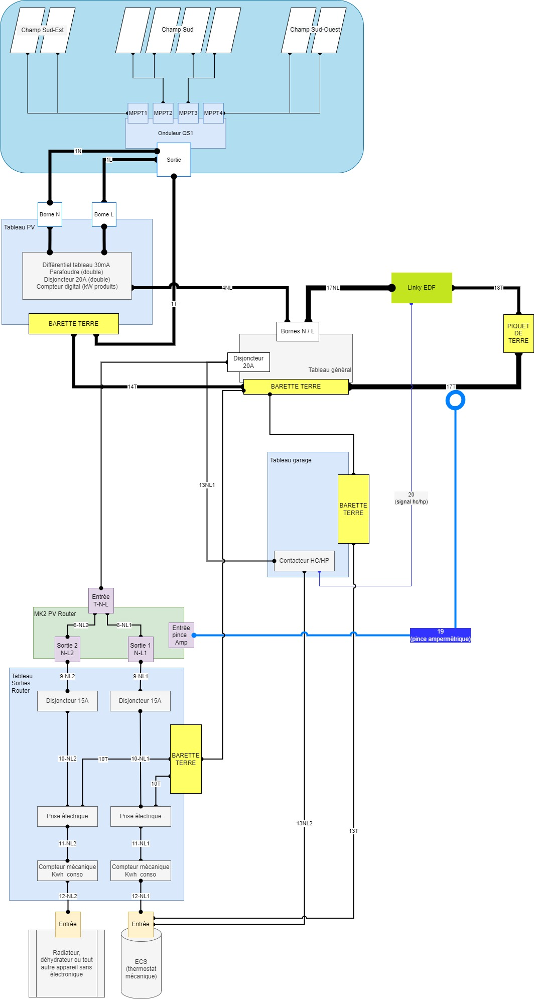
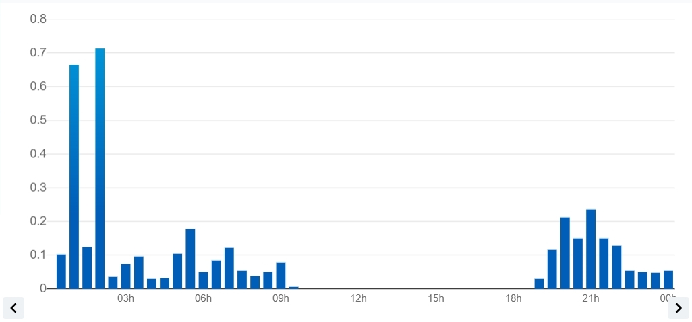
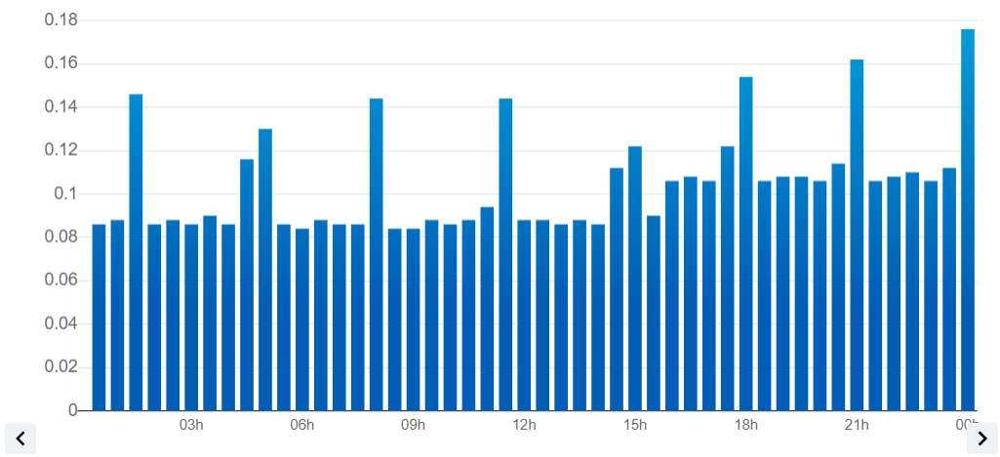
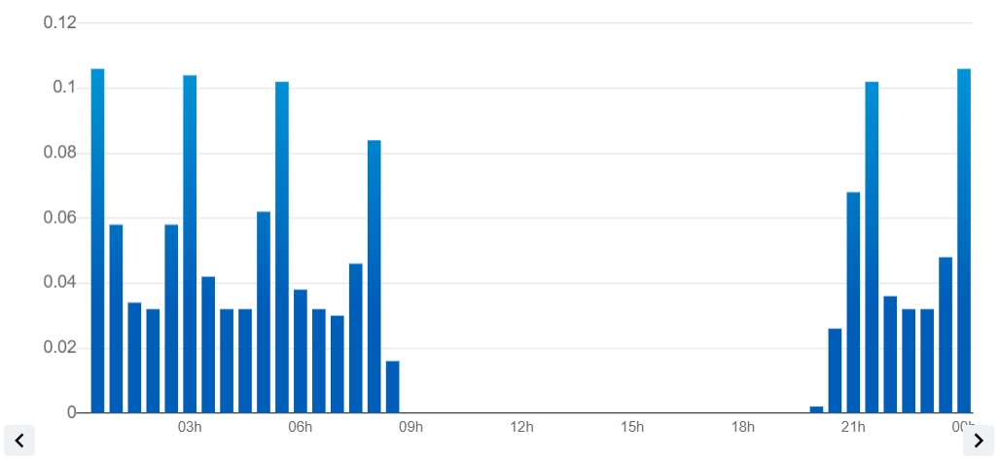

Seven years ago, we bought our house and the property is about 4000 m², on a very rocky terrace (“AOC _Saint Joseph_” in Ardèche).

It wasn’t very inviting for planting anything (we tried and keep trying with the [“_No Dig_” method by Charles Dowding](https://www.youtube.com/c/CharlesDowding1nodig) and [Damien Dekarz’s advice, in France](https://www.youtube.com/c/permacultureetc)). However, it seemed exploitable for putting up some photovoltaic panels.



This article was [published originally in French in June 2022](https://jeremielitzler.fr/post/2022-06/retour-d-experience-sur-une-installation-pv-1mois/). It has been translated, but the units and images with text remain in French as it’s difficult to get them in English language.



<!--
- Photovoltaics: my experience after 9 months (part 1)] (https://jeremielitzler.fr/post/2022-12/retour-d-experience-sur-une-installation-pv-9mois-partie-1/index.md)
- Photovoltaics: my experience after 9 months (part 2)] (https://jeremielitzler.fr/post/2022-12/retour-d-experience-sur-une-installation-pv-9mois-partie-2/index.md)
- Photovoltaics: my experience after 1 year] (https://jeremielitzler.fr/post/2023-03/retour-d-experience-sur-une-installation-pv-1an/index.md) -->

We heat our domestic hot water in off-peak hours. It’s a 200-liter-big water tank with 10 cm of raw sheep’s wool layer that we added the first winter, because it’s in the garage, temperatures can go as low as 8° C. I know we could do it differently, but we don’t have anywhere else to put it.

This insulation let us reduce our consumption from 12 to 13kWh to heat the water to 8–10 kWh for one day, with equivalent hot water consumption.

## Why A PV System?

### Measuring Our Consumption

I’m pretty careful about electricity consumption and I agree with those who advocate [energy sobriety (french article)](https://negawatt.org/La-sobriete-energetique) to reduce our impact on the environment.

I made an estimate of our consumption in 2016, listing each electrified item, because, for me, knowing the household’s consumption and the breakdown on equipment is the first step towards greater efficiency and awareness about energy usage. I recently [took notes (french article)](https://jeremielitzler.fr/post/2022-05/les-bases-d-une-installation-solaire-en-autonomie/) on an interview between [Rémi chez “_Nos pieds sur terre_”](https://nospiedssurterre.fr/) and [Brian, of “_l’Archipelle_”](https://www.youtube.com/c/LArchiPelle) which validates this first step.

I had estimated 2900 kWh over 1 year. You can consult [this table](https://docs.google.com/spreadsheets/d/1-1A2I04MqVy3-zxMwQJ7Zy83OP200ruxGRUNXsHlNbQ/edit?usp=sharing) for details and feel free to copy the Google Sheets for your case.

You can see, for example, that I had estimated the hot water production to take 30% of the total estimate.

_NB:_ the table excludes the oven, dishwasher and air purifier ([Murprotec CTA3](https://www.murprotec.fr/boutique/boutique/4-lot-de-2-filtres-cta3.html)) installed in 2018.

I also closely monitored our consumption with:

- a daily reading on the EDF digital meter for several years,
- then more recently, thanks to Linky, a weekly reading, to know our passive consumption (e.g., how much does the house need as a minimum?) and our day and night consumption,
- and in the case of water heaters, specific metering from November 2019 after buying an old digital meter from EDF.

Here’s what it’s been like since 2014:

- our all-inclusive annual consumption:

| Month | 2014   | 2015    | 2016    | 2017    | 2018    | 2019    | 2020    | 2021    | 2022   |
| ----- | ------ | ------- | ------- | ------- | ------- | ------- | ------- | ------- | ------ |
| 1     |        | 306.00  | 331.00  | 334.00  | 273.00  | 313.00  | 305.00  | 320.00  | 417.00 |
| 2     |        | 452.00  | 288.00  | 250.00  | 270.00  | 270.00  | 353.00  | 295.00  | 100.00 |
| 3     |        | 270.00  | 296.00  | 252.00  | 188.00  | 293.00  | 310.00  | 260.00  | 268.00 |
| 4     |        | 157.00  | 211.00  | 81.00   | 195.00  | 141.00  | 246.00  | 253.00  | 118.00 |
| 5     |        | 292.00  | 221.00  | 254.00  | 200.00  | 238.00  | 217.00  | 213.00  | 79.00  |
| 6     |        | 265.00  | 176.00  | 88.00   | 172.00  | 182.00  | 258.00  | 156.00  |        |
| 7     |        | 123.45  | 205.00  | 191.00  | 171.00  | 191.00  | 191.00  | 82.00   |        |
| 8     |        | 213.59  | 138.00  | 194.00  | 86.00   | 132.00  | 116.00  | 187.00  |        |
| 9     |        | 137.96  | 174.00  | 182.00  | 132.00  | 204.00  | 198.00  | 58.00   |        |
| 10    | 0.00   | 265.00  | 141.00  | 164.00  | 219.00  | 139.00  | 214.00  | 347.00  |        |
| 11    | 373.00 | 218.00  | 254.00  | 251.00  | 304.00  | 313.00  | 277.00  | 298.00  |        |
| 12    | 332.00 | 358.00  | 292.00  | 291.00  | 305.00  | 382.00  | 334.00  | 369.00  |        |
| Total | 705.00 | 3058.00 | 2727.00 | 2532.00 | 2515.00 | 2798.00 | 3019.00 | 2838.00 | 982.00 |

- our electric consumption to heat water:

| Month | 2014 | 2015 | 2016 | 2017 | 2018 | 2019   | 2020   | 2021   | 2022   |
| ----- | ---- | ---- | ---- | ---- | ---- | ------ | ------ | ------ | ------ |
| 1     |      | 0.00 | 0.00 | 0.00 | 0.00 | 0.00   | 117.00 | 120.00 | 138.00 |
| 2     |      | 0.00 | 0.00 | 0.00 | 0.00 | 0.00   | 109.00 | 106.00 | 60.00  |
| 3     |      | 0.00 | 0.00 | 0.00 | 0.00 | 0.00   | 112.00 | 93.00  | 46.00  |
| 4     |      | 0.00 | 0.00 | 0.00 | 0.00 | 0.00   | 88.00  | 83.00  | 31.00  |
| 5     |      | 0.00 | 0.00 | 0.00 | 0.00 | 0.00   | 73.00  | 81.00  | 8.00   |
| 6     |      | 0.00 | 0.00 | 0.00 | 0.00 | 0.00   | 84.00  | 35.00  |        |
| 7     |      | 0.00 | 0.00 | 0.00 | 0.00 | 0.00   | 44.00  | 8.00   |        |
| 8     |      | 0.00 | 0.00 | 0.00 | 0.00 | 0.00   | 18.00  | 48.00  |        |
| 9     |      | 0.00 | 0.00 | 0.00 | 0.00 | 0.00   | 53.00  | 12.00  |        |
| 10    | 0.00 | 0.00 | 0.00 | 0.00 | 0.00 | 0.00   | 64     | 122    |        |
| 11    | 0.00 | 0.00 | 0.00 | 0.00 | 0.00 | 95.00  | 107    | 120    |        |
| 12    | 0.00 | 0.00 | 0.00 | 0.00 | 0.00 | 111.00 | 118    | 129    |        |
| Total | 0    | 0    | 0    | 0    | 206  | 987    | 957    | 283    |

This confirmed the estimate of 30% consumption by the cumulus.

### Sunshine Exposure Simulation

I also carried out a sunshine simulation using the [“PHOTOVOLTAIC GEOGRAPHICAL INFORMATION SYSTEM”](https://re.jrc.ec.europa.eu/pvg_tools/fr/#PVP) at the roof of the house (lowest point on the property) and at the highest terrace on the property (sunniest point).

| Month            | Hours (house roof) | Hours (terrace) | Diff. in % of sunshine |
| ---------------- | ------------------ | --------------- | ---------------------- |
| 1                | 124.07             | 191.80          | + 35.31%               |
| 2                | 174.13             | 230.27          | + 24.38%               |
| 3                | 274.47             | 313.67          | + 12.50%               |
| 4                | 328.07             | 358.20          | + 8.41%                |
| 5                | 386.80             | 435.40          | + 11.16%               |
| 6                | 394.93             | 443.87          | + 11.02%               |
| 7                | 398.93             | 450.27          | + 11.40%               |
| 8                | 359.47             | 398.27          | + 9.74%                |
| 9                | 293.93             | 325.20          | + 9.61%                |
| 10               | 228.87             | 281.20          | + 18.61%               |
| 11               | 140.40             | 210.27          | + 33.23%               |
| 12               | 105.33             | 162.47          | + 35.17%               |
| Annually 3209.40 | 3800.87            | + 15.56%        |

As you can see, there’s no contest!

If we wanted to generate electricity from the sun, the terrace is the best site, even if the property doesn’t have the most ideal sun exposure in the world. We’re on the first third of a 300-meter-high hill.

## Why Only Build In 2022?

My prerequisites for the project were:

- to respect a maximum budget of 2,000 euros, with reuse of panels to reduce costs and for environmental reasons.
- not to inject the unused production onto the grid, i.e., to consume as much as possible.
- to be profitable before replacing sensitive elements (inverter in particular).

So I read a lot on the subject (for ex. [a French photovoltaic forum](https://forum-photovoltaique.fr/)) and simulated the cost on the various web shops selling PV equipment, but I didn’t go for it because of:

- the cost of the equipment
- the fact that companies only sell setups of 3kWp at prices ranging from 7,000 to 15,000 euros.

Also, the fact that the installation couldn’t be carried out on the roof of the house was blocking me. I wanted to avoid giving away the electricity not consumed (injected into the grid) to companies (Enedis, Engie, etc.) who sell it to us at increasingly high prices. In France, it’s mandatory to install on a roof to sell the production from PV modules.

In May 2022, the grid buys the electricity at 6 to 10 cents whereas it sells it to me for between 17 and 22 centimes (my night-day tariff with Engie in May 2022).

At the end of 2021, I receive an email on my “Leboncoin” alert entitled “photovoltaic panels” (“Leboncoin” is like “Craiglist”). It was from a craftsman promoting his services to use the photovoltaic solution for hot water production at more or less 1000 euros. I said to myself: “This is within my budget and the craftsman I was looking for!”

## Presentation Of The Installation

After some very interesting discussions with the SolaireEthic craftsman (see [his very interesting website](https://solairethic.fr/)), we decided on the following solution:

- 1 [APSystems QS1 microinverter (4 MPPT)](https://usa.apsystems.com/qs1/).
- 1 underground 6 mm² AC line 120 m long from the target terrace on the property to the house (50 cm from the main switchboard in the house).
  - The overall distance is due to the location of the terrace.
- 8 panels of 190 Wp recycled (7–8 years old), i.e. 1520 Wp
  - If we take into account the 0.3% reduction in production, we’re looking at between 1484 and 1488 Wp.
  - The 0.3% value comes from the study carried out since 1992 in Savoie (I don’t have the link), but quoted in [my note-taking (§ “Dimensioning photovoltaic panels”) (french article)](https://jeremielitzler.fr/post/2022-05/les-bases-d-une-installation-solaire-en-autonomie/).

I then:

- Dug the trench (not easy with rocky soil, very cold temperatures, between December 2022 and January 2023, and a 25-meter difference in altitude between the terrace and the house).
- Ordered the self-consumption optimization kit from [Robin Emley (now retired)](https://openenergymonitor.org/mk2pvrouter/), assembled by [Le Profes’Solaire](https://sites.google.com/view/le-professolaire/) (unfortunately, he has stopped his assembly service, but he still seems to offer welding).

Here is the result:

## What Do The Figures Say After 2 Months?

From April 1 to May 31, we measured the following:

| month | produced (kWh) | self-consumed (kWh) | injected into the grid (kWh) |
| ----- | -------------- | ------------------- | ---------------------------- |
| April | 160.6          | 147.6               | 13                           |
| May   | 210.4          | 186.4               | 24                           |

So we have a good consumption of production (> 90%). There would be less injection if:

- I’d connected the solar router’s CT the right way, which I didn’t do until April 4!
  - It measures the direction of electricity.
  - If it goes to the grid, it activates the solar router.
- We had a storage system to either:
  - consume at night
  - consume later

If we compare the same data from commissioning on March 27 to April 4, we see:

| produced (kWh) | self-consumed (kWh) | fed into the grid (kWh) | stored (kWh) |
| -------------- | ------------------- | ----------------------- | ------------ |
| 30.8           | 12.8                | 18                      |

It gives a 40% of production consumption.

BTW, the reason why I chose not to make a deal with the grid provider is that you can’t resell when the panels are installed on the ground. See § “What are the conditions for selling solar electricity to EDF?” on [this article in french](https://www.choisir.com/energie/articles/104505/l-obligation-d-achat-solaire-d-edf).

## What Are My Observations?

### Solar Router From [Robin Emley](https://openenergymonitor.org/mk2pvrouter/)

It’s very efficient.

I’ve observed that you inject about 100Wh into the grid with the solar router, or 1 kWh every 10 days, when we produce 6 to 7 kWh per day. This is very marginal and acceptable.

On the other hand, the mechanical meters I’ve fitted to the router outputs don’t allow you to count kWh precisely. It seems under-measured. In fact, the solar router count doesn’t match with those mechanical meters.

Perhaps lowering the water heater resistance so that “power produced = power used” would make the measurements more accurate.

Indeed, depending on the power of the appliance, there was less metering because of the intermittence of the current sent by the router.

For example, with a 600 W dehydrator, the count is more accurate.

### Domestic Hot Water

We’ve set the water heater thermostat to 4 over 5 when heating via solar instead of 3 over 5 when heating during off-peak hours.

On a sunny day, the sun heats more than enough for the day.

On a gray day, we manage to maintain the temperature.

If the weather was worse, there would be 2 days of hot water in stock after a fine day. Of course, this varies according to hot water use.

I’ve considered installing a second 200-liter hot water tank to store solar-generated hot water.

However, it’s an investment of 700 to 800 euros and the need isn’t really there, as we don’t really need 400 liters of hot water, especially during the summer. Plus, we only welcome 2 or 3 extra people very rarely during the year.

### Management Problem Between The Router Power Supply And The Night-Day Contactor

As shown in the installation diagram above, I’ve set up the two water heater power supplies in parallel. However, I should have a switch that controls the power source next to the router rather than doing it manually in the garage.

There’s also some strange behavior on the efficiency of the night/day contactor. It doesn’t receive the signal we’re in night mode or, maybe, the signal from the grid is missing? I don’t know whether it’s a bad connection or a network problem. In fact, before Linky was installed, we’d had inconsistencies where the contactor was _active_ during the day while it was set in _Auto_ mode..

### Daily Consumption With Presence

We can clearly see the refrigerator cycling on and off, and the peak represents the dishwasher running between midnight and 3 a.m.

### Daily Consumption In Our Absence

In February 2022, we were away for 5 weeks. The average daily consumption was 2.5 kWh.

In April 2022, we were away for a few days. The average daily consumption dropped to 0.7 kWh, i.e. -72%. Not bad!

## What’s Next?

I’m going to:

1. Try to estimate from the PVG reports and our setup how long it will take to make the installation profitable.
2. Provide feedback in October, e.g., 6 months after commissioning.
3. Talk to Rémi at “_Nos pieds sur terre_” about making our installation cost-effective.

See you soon!
