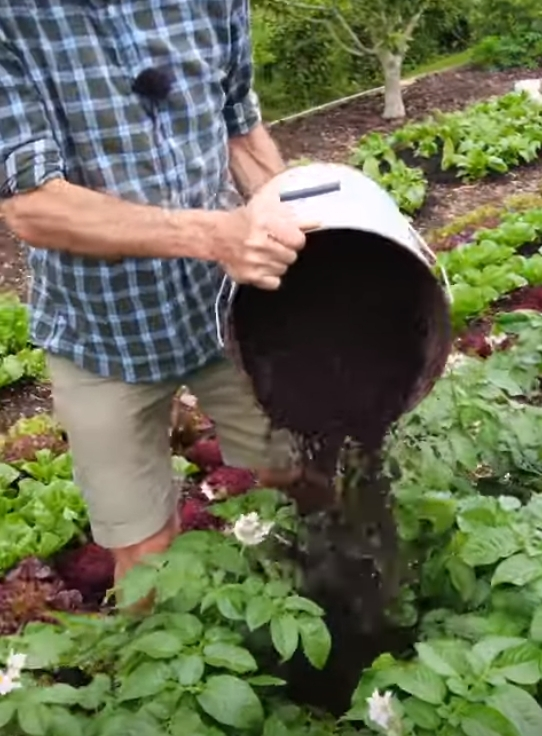

Using compost, Charles shares a trick that makes it easy and quick earth potatoes. Try it!

Thanks to Charles Dowding for sharing his wisdom and knowledge! I wrote the following notes watching the short video published on Charles Dowding's channel. You can watch it using [this YouTube link](https://www.youtube.com/shorts/8OqHLJ5PDmQ).

<!-- more -->

## What is "earthing up potatoes"

It is the process of covering with soil the potatoes to protect them from the light of the sun (otherwise, they turn bad) and therefore helping the plant produce more potatoes.

## What does Charles suggest

He uses **dry compost** and pours it on top of the plant using a bucket.

The dry compost is key so it can fall to the bottom of the plan stem.



That means not doing it on a rainy day ;)



To finish, follow up with a watering if no rain is due by the next day.
