---

title: July tour of new no dig garden, by Charles Dowding
description: "Charles Dowding walks through his new no dig garden, talking about harvests, pest covers, compost, watering."
date: 2022-10-15
image: '/images/2022-10-15-a-pea-pod-with-large-seeds-in-the-hands-of-charles.jpg'
imageAlt: A pea pod with large seeds in the hands of Charles
categories:
  - Gardening
tags:
  - Charles Dowding
  - No Dig
  - In July
  - Compost
---

Charles Dowding walks through his new no dig garden, talking about harvests, pest covers, compost, watering.

<!-- more -->

Thanks to Charles Dowding for sharing his wisdom and knowledge! I wrote the following notes watching the video published on Charles Dowding's channel. You can watch it using [this YouTube link](https://www.youtube.com/watch?v=tzjdcDQ7A8E).

## Introduction

No dig and compost method are good to keep the watering low.

## A look at an area that was a grassy meadow 5 months ago

Using a plastic cover, most of the former weeds are kept at bay and Charles is now growing:

- potatoes

  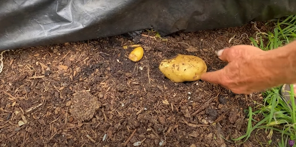

- and squash (Crown prince below).

  



Plastic has its place in gardening.

First, you can use it over several years.

Second, it works great to cover a weedy patch.





Butternut plants need warm to grow well.

That is why the plants below are smaller than the Crow prince above:

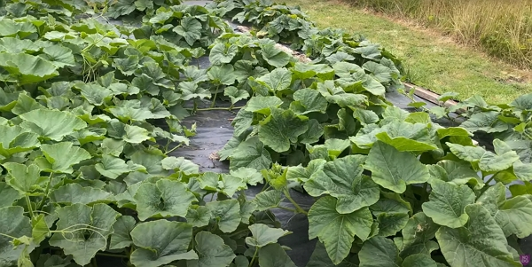



## Potatoes close to the point of harvest

Charles suggests to water potatoes close to the point of harvest.

But how do you know potatoes are close to the point of harvest?

1. The leaves are turning yellow
2. The stems are dropping down

There is no one perfect timing, but the 2 tips above gives you an idea.

## Bortolli climbing plants for dry beans

Amazingly, Charles doesn't have to water as of July. But he would need to water if the dry weather continues a few more weeks.

Yes, the climate in Summerset is probably much more humid than the South of France where I live, but that'll need to be tested, because Damien Dekarz said the same thing while cultivating more South of my location the Tarn area.

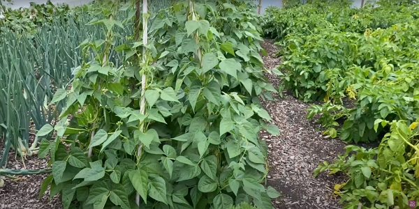

## Onions

Charles didn't water the onions by the month of July.

Why are onions not watered? Charles waits at the point where it is close to harvest to water them, then getting a nice swell-up of the bulbs.

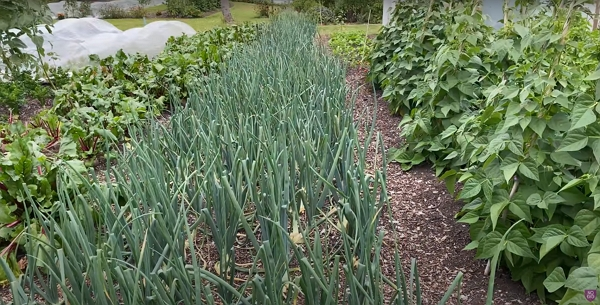

When do we know that onions are ready?

When the stems looks like the picture above, it is a sign the onions are ready.

The bending of the neck is to help the onions to start drying. It will help for storage later on. You can just pull the onions off the soil and let them dry for a few days.

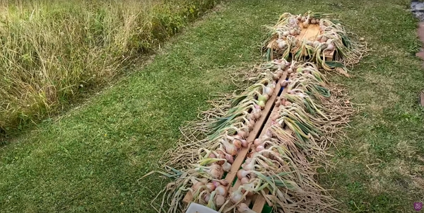

The onions above are drying on a pallet-like wood structure after harvesting to keep onions off the ground.

Charles showed an onion with a flower and he suggested eating those first, but we will know more on videos dedicated to the onions, which is a big subject on its own.

## Beetroot and deer damage to leaves

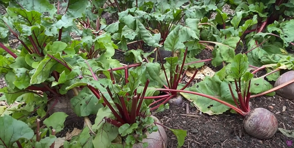

The deer haven't really damaged much of the strip of beetroots. And anyways, the beets are massive!

## Cabbage and how to control pest with Bacillus thunringiensis

Bacillus thunringiensis is an insecticide. Charles didn't give much information.

However a little research and you can find that this bacteria isn't really 100% risk-free. It can affect the auxiliary insects (bees in particular) if not prepared well and sprayed at the proper time. See [this French article](https://www.lamesangeverte.com/fr/24-les-pulverisations-de-bacillus-thuringiensis-contre-la-chenille-processionnaire).

## Cracking soil at the edge of the bed

With no dig, the soil isn't cracking because of the structure of the soil, filled with good compost, life within the soil.

## Compost heaps, the pallet three bay system

I have taken notes on this in [this article](../../2022-04/3-heap-types-how-they-work-and-what-they-give-charles-dowding/index.md)

## Salads in July

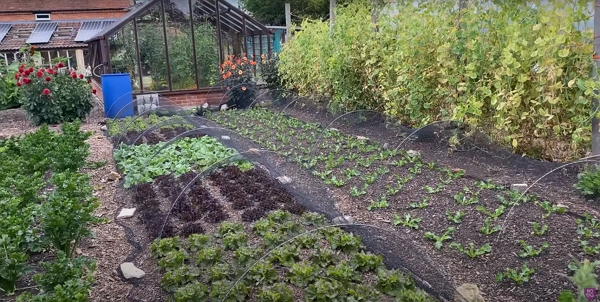

The above left strip is 3 weeks old and the salads look quite big!

The right strip has been planted about 10 days before the video shooting.

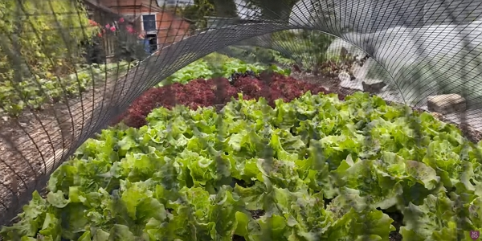

## Peas are ending

The peas will turn yellow when they are finishing producing.

The above image is a pea that you can eat the whole pod and seeds.

But usually, you harvest them when they are dried like the example below.

## French beans and watering

Charles suggests holding off the watering until the bean plants start producing crops.

He puts on a good dose of water every 3 days, in his area. Of course, this will vary from an area to another and it will depend on the weather too.

## Cucumbers in the polytunnel

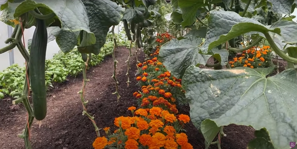

You can see how the stems of the cucumber plants are well trimmed from the ground to about 2 feet up.

The cucumbers we see above have been sowed on April 15th.

However, to get the plant size you see, it needs a lot of water.

## Growing and seedlings in the greenhouse

It seems that the tomatoes do better in terms of leaf quality in the greenhouse because of the smaller temperature difference between night and day than in a polytunnel.

But it does get hot (Charles had up to 38°C...).

Cucumbers like the warmth, but one needs to be careful with the seedlings.

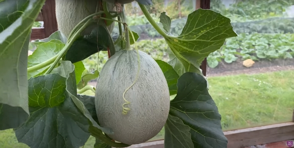

In regards to melons, if you grow different varieties close to each other, keeping the seeds of the fruits may not produce the same plant the next because hybridization.

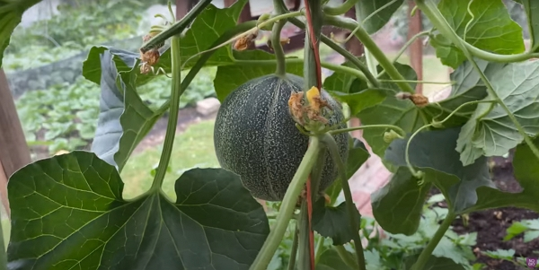

## Tomatoes and harvesting time

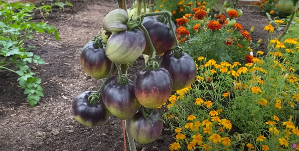

Tomatoes can be harvested when the color is changing, like the ones below.

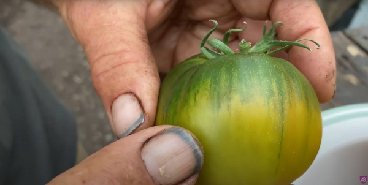

Charles suggests watching [Joe Lampl's channel](https://www.youtube.com/user/joegardenerTV?app=desktop) to know more about tomatoes.

Picking your tomatoes not fully rip take some stress off the plant, which can focus the other fruits, new fruits and the leaves.

And you don't lose flavor from the tomatoes by harvesting them this way.
