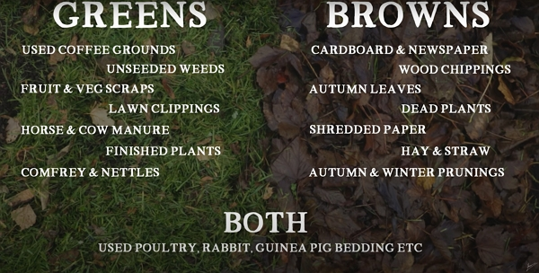

Sometimes, we think of making compost as a complex process, but, in reality, it’s easy to produce high-quality compost.

Thanks to Huw Richards for sharing his wisdom and knowledge! I wrote the following notes watching the video published on Huw Richards’s channel. You can watch it using [this YouTube link](https://www.youtube.com/watch?v=swLkA1cHJ4Y).

## What is compost

To start off, let’s define compost: it’s the breakdown of organic matter into beautiful rich humus.

## The few key things about lazy composting

### You need bins of 1 meter long

Why? It isn’t going to warm up as easily as in a dalek size bin. It needs a larger size bin to be able to build up the warmth.

That warmth and heat help to break down the material.

### The ingredients

You will typically add:

- green material: grass, vegetable waste, coffee ground…
- brown material: dead leaves, wood, cardboard…



Apply it in a thin layer (2–3 cm maximum) because it can get sludgy if too thick.





I have found that mixing grass clippings with wood dust helps build a thin compost and helps to avoid the sludge.



## Ratio of green and brown

Huw tries to go for a 1 part green for 2 parts brown.

But, with lazy composting, he doesn’t overthink it. **But you will need to _follow one key rule_**.

## You need diversity

Two or three ingredients aren’t enough.

The more you add diverse sources of material, the more balance the compost will be in terms of pH and nutrients.

## When a bin is full

The only thing to do: press on the material to compact it a little.

Put on some boots, climb in the bin and jump!



Don’t do it if you didn’t build a strong structure 🤣



Finally, cover the compost with cardboard to keep some rainfall off the compost pile. You want moisture but you don’t have anaerobic environment.

## When is lazy compost ready

It will take longer, because it doesn’t get as hot.

So instead, two to three months, it will take between six and eight months.

Huw uses the technique of smelling the compost: if it smells like the forest floor, then it’s ready.

Then you can apply it to the beds as a cover for winter.

## What about rats

You will get rats if you put in cooked food, diaries and bread in the compost bin.

And wouldn’t you prefer having them in the compost bin or your food storage?

## How many compost bins

Three bins appears to be a good target:

- one is usable for the garden
- one is full and is starting to break down
- one is being filled

Therefore you will have compost available most of the time!
