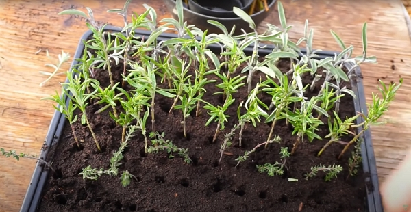
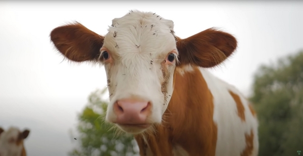
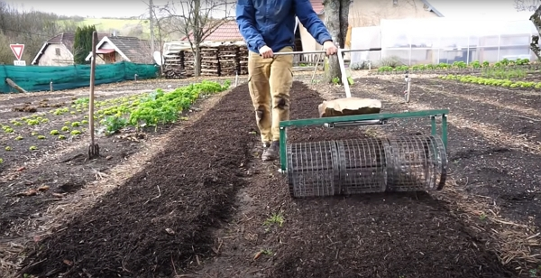
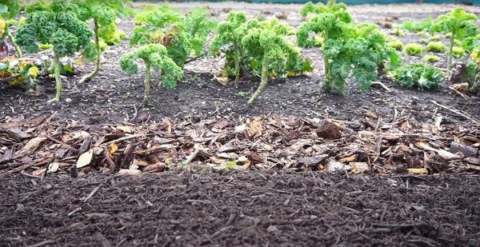
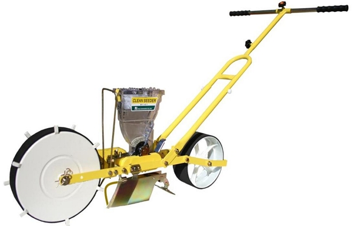
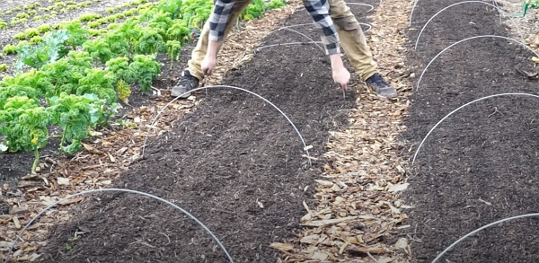
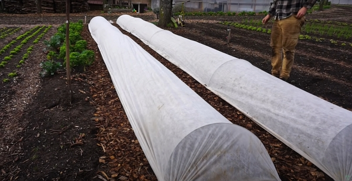

What was true in January is still applicable in February. However, during the month of February, we’re seen at the end of the winter's tunnel. Moreno will go into more depth about Market Gardening for this month.

Thanks to Moreno for sharing his wisdom and knowledge! I wrote the following notes watching the video published on The Dutch Farmer’s channel.

<!-- more -->

You can watch it using [this YouTube link](https://www.youtube.com/watch?v=KB7mGo8RY2k).

## Keep on propagating and planting shrubs and flowers

We should continue to propagate the shrubs and aromatic plants to multiply them.

Also, if you can afford to buy and plant flower bulbs to increase the diversity on the farm, go for it!

## Crop planting plan

Now is the time to complete the plan for the year.

You will need to organize the seeds, the tools to be ready when the sowing and planting will start.

That includes finishing the last cleaning of garden space so they’re all ready to receive the crops.

## Harvest of winter crops

If you did plant winter crops, you will continue getting the crops, weather-permitting, of course.

For example, what you planted in August and September last year could still be available for sale.

 Let's take kale: in February, it’s still producing and it’s a hardy (meaning resistant) and it’s the most profitable crop at this time of the year.

Unless you live in a cold climate, where you will need a greenhouse or a polytunnel, then you go for kale next season.

And even if you live in a colder climate, using fleeces (white cover sheet) you can add protection so the crops perform better.



In fact, if your beds are positioned under trees, the falling branches can damage the fleece that is actually no thicker than toilet paper.

In my experience, I think it also depends on the quality of the fleece. I personally use [this fleece for Winter Garden cover](https://www.amazon.fr/gp/product/B00F63IMCE) which I bought already 2 years ago and this year. It holds very well over time.



In the vlog, Moreno harvests carrots sowed during the previous summer.

## Working with the birth-death cycle of nature

As a farmer, you work to extract the most nutrient out of the soil to grow annual crops.

In nature, the ecosystem would look like what you see in a forest, with trees and perennials. It’s self-sustaining.

One of our jobs as annual vegetables grower is to bring fertility to our land so we’re as close as possible to the natural cycle. This is a key way to continue getting predictable and quality yields year after year.

### How does work

After harvesting the remaining crops and tidying up the beds, you apply a 5 cm layer of compost evenly.



Moreno showcases a non-mature compost in the vlog.

It contains quite a lot of wood.

It isn’t a problem **as long as it isn’t tilled into the soil**.

If you apply it on the surface, the roots will go down below that compost while it finishes breaking-down.



Using a one-year-old cow manure compost would be much better.

For Moreno, he made a deal with a local farmer owing cows. The farmer sets aside a big pile of cow manure for a year and using a aerating machine, he breaks down the manure into a perfect compost for market gardening.

After you applied the compost, you can also firm up the layer with a nice little tool called _a bed roller_.

For more details about low-cost tools for market gardening, check out [this vlog from Moreno](https://www.youtube.com/watch?v=yUFr0C1FJjE) which I will cover someday.

### Clean pathways with woodchips

Woodchip serves 2 roles:

- creating clean and tidy pathways
- feeding the soil as it starts to break down.

It’s an amazing added element to the garden.

It acts as a sponge for an excess of water and it brings fungi that are an important ingredient to good soil life.

In a way, it’s like adding a blanket to the soil, protecting the soil underneath from the weather.

Finally, you barely get dirty boots with a woodchip-covered pathway 🌟.

It isn’t a must to apply woodchips, but you have them available for free or a small cost, definitely use them.

## Direct sowing in February



It will depend on where you live, but in a 7B climate, you can still get frost up the first week of May.

It would be a shame to lose early-sowed crops in one cold night.

Check out the gardening climate using [this link from Gardenia.net](https://www.gardenia.net/guide/european-hardiness-zones).



So what can you plant?

Moreno lives in a 7B climate zone and will direct sow:

- arugula
- radishes
- turnips
- mustards
- spinach
- kale

Undercover, you can also plant beets and carrots.

In an unheated polytunnel, you can also start seedlings for other crops for the Brassicaceae family like cauliflower, broccoli, cabbages.

Lettuces, fennel or some Swiss shards are also crops you can start seedlings for.

Also, for slow-growing plants, like peppers and eggplants, they need a lot more time to getting start and therefore they will need heat. February is the perfect time to start them if you can afford the cost of heating mat.

However, count the cost: is it worth the money to grow from scratch those vegetables as you will need to allocate a cozy and protected place in your home?

Do you have a local farmer handling large number of seedlings for those crops? Maybe prefer buying your plants from him instead.

### Using a jang seeder for arugula

The jang seeder is a great tool to sow large number of seeds when working on a market garden.

You need to follow a couple of important steps:

- pick the right roller for the seeds to plant.
  - For arugula, you will need the _YYG24_ plate.

- install the plate into the hopper, which is the case that holds the seeds.
- weight the seeds you use to plant the beds to calculate the production cost of the bed and the crop.
  - keeping a spreadsheet to record what you use and produce is important for a sustainable market garden. See [the previous post for details](../../2023-01/market-gardening-in-january-the-dutch-farmer/index.md#work-on-projects-and-planning).

To choose the density of sowing for arugula, you will need to choose your goal:

- if you need to grow small leaves, then go for a high density (the 6-row seeder is then a better-suited tool)
- if you need to grow larger leaves, then the jang seeder is used.

After sowing, place a fleece into the top of small steel wire hoofs



A very hard frost can kill the seeds even with the fleece. You take a risk by seeding now.


