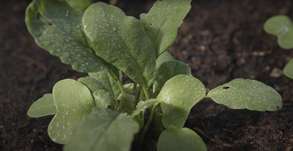
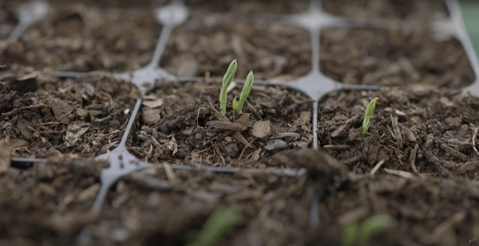
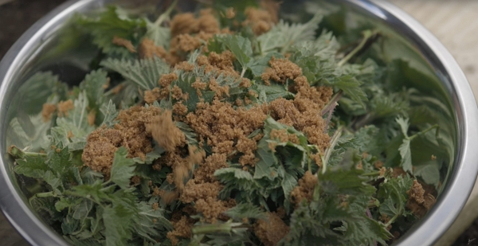
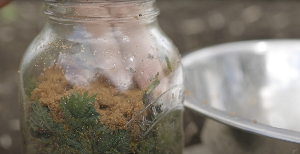
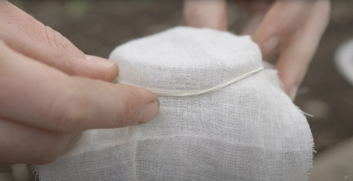
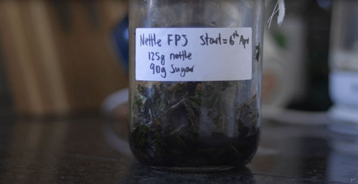

When you grow seedlings, good care of the plants is key. Using nettle, we can increase and reach success.

Thanks to Huw Richards for sharing his wisdom and knowledge! I wrote the following notes watching the video published on Huw Richards’ channel.

<!-- more -->

You can watch it using [this YouTube link](https://www.youtube.com/watch?v=DlLWanDZwuU).

## What is FPJ

FPJ stands for Fermented Plant Juice, obtained with brown sugar or vinegar.

You use the liquid from that. When we use plants, we want to extract the minerals from those plants.

### How do you make FPJ

The process is simple to produce FPJ:

- you sizzle the target plant
- you add organic brown sugar
- you mix up and wait

See below [the detailed procedure](#step-by-step-tutorial-to-make-fpj).

### What are the benefits of FPJ

The sugar will work as a solvent, extracting all the good stuff from the plant.

It’s even more important when you deal with a broad spectrum plant.

A broad spectrum plant is a plant that contains the 14–16 minerals plants need to grow.

The stinging nettle has all of them and the fermentation extraction provide the exact proportion the plants need!

### What is the difference between the water method and the sugar method

The rain water method works.

The main differences are:

- the concentration level of minerals that is higher with the brown sugar method.
  - consequently, the dilution will be more important: 500 to 1 instead of 10 to 1.
- the shelf life is very good and the smell absent.

To compare to making compost, it takes up to 2 years to obtain compost and even more time so that the soil assimilates the nutrients from it to give as food to the plants.

Another advantage: you can apply the fermented juice directly and the plant assimilates within the minerals from it within hours.

Also, the making of FPJ takes very little time.

## Benefits of nettle in the context of sowing

Apart from the broad spectrum, the nettle will provide the boost of nutrients that the seeds need to get started.

Just like a baby needs very close care and attention in the first 2 years of his life, the seedling needs the same care and attention to become a productive and healthy crop.

## Step-by-step tutorial to make FPJ

### Tools

You will need:

- a 2-liter stainless bowl
- a couple of jars:
  - one of 250 ml that will hold the juice,
  - one of 1 liter to make the juice.
- a cotton clothe
- labels
- a scale
- a pair of scissors
- a pan
- a fennel
- a pair of gloves, because nettles sting!
- a sterilized rock that fits in the jar : it will hold the plant

Optionally, read the book _The regenerative grower’s guide to Garder Amendments_ by Nigel Palmer ([Google search to find the book](https://www.google.com/search?q=The+Regenerative+Grower%27s+Guide+to+Garden+Amendments%3A+Using+Locally+Sourced+Materials+to+Make+Mineral+and+Biological+Extracts+and+Ferments)).

### The ingredients

You will just need:

- brown sugar
- the weed plant you want to extract juice from

### The procedure



The following quantities apply for a 1-liter jar.



1. Collect 125 gr of fresh stinging nettles.





2. Don’t water the nettles.
3. Put the nettles in the bowl and sizzle them.
4. Add the brown sugar in a ratio of 3 parts of nettles to 2 parts of sugar. So that equals to about 80–85 gr of brown sugar.

5. Mix the two ingredients.
6. Fill the jar to 80% capacity and top up with a small layer of brown sugar.

7. Add the stone to help the fermentation process to kick-start by pushing down the plant down.
8. Cover the jar with a piece of the cotton clothe.

9. Label the jar so you know what is the recipe and when it was made.

10. Place the jar in a storage place at room temperature and not in direct sunlight.

After a few hours, a brown juice will start to appear at the bottom:

Leaving it for a week before you strain the juice.

To strain the juice, don’t be tempted to squize it.

Simply:

- Set the fennel and a clean cloth on top.

- Put the big jar upside-down on the fennel and let the juice strain naturally, even if you need to leave it overnight.

- Label the jar and store the juice at room temperature.

The smell of the juice is going to be very nice.

## How to use FPJ for seedlings

You won’t need much, so you’d better get an eyedropper ;)

Take another a jar of 500 ml and fill to half with rain water.

Add a few drops (for 250 ml at a ration 1:500, you will need 2 ml of juice, which about 70 drops) in the water and add the seeds from 20 min to 1 hour.

The time you leave the seeds in the water depends on the seed.





Once the seedlings are in the ground, you either:

- drench them with water using the 1:5000 ratio
- foliar spray for the more delicate seedlings

Either method should be applied in the morning.

Again, if you like those articles, let me know by subscribing to my free newsletter.
