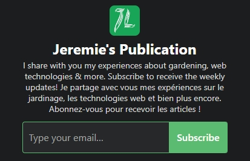

Let’s look at the steps to set it up so you can provide contents in two languages.

<!-- more -->

<!-- markdownlint-disable MD033 -->
<p class="newsletter-wrapper"><iframe class="newsletter-embed" src="https://iamjeremie.substack.com/embed" frameborder="0" scrolling="no"></iframe></p>

When it comes to creating your newsletter, you have a wide choice of solutions.

I chose Substack because of their values: putting the writers first and provide efficient tools to help them grow their subscriber base.

However, when you speak 2 languages fluently, it isn’t straight forward how you can maintain a newsletter in each language in a single publication.

You could use two distinct publications, but I had written quite a few posts when I realized I needed to tidy up my publication regarding the dual-language content.

Plus, some parts of the publication can’t be translated anyways.

## English must be the default language

As of today, you can’t set up all the texts in your preferred language.

The following will be in English, so pick the values carefully:

- the Publication name,
- the Short description (it could include both languages, but it’s limited to 258 characters…),
- the Categories,
- the Square logo,
- the Cover photo, that is displayed on the welcome page,
- the Site design, which is simply the main color, the layout and font steps,
- the Publication details, with your name, copyright and mailing address.

Some navigation tabs will always be in English, for now. However, the subscribing buttons will be translated to the visitor's browser language.

For example, on my Chrome profile, I see:



With a French Chrome profile, I see:


Regarding the following, we will look at how to set them up in the following paragraphs:

- the About page,
- the Welcome email,
- the Navigation,
- the Sections,
- the Email banner, header, and footer settings
- the Email opt-out page

## Setup the About page

I chose to write the content of this page in two languages.

You can [view it here](https://iamjeremie.substack.com/about).

The setup is simple: I use `heading2` to separate the content of each language.

Also, I added a link to my blog for more detailed information, which is, of course, available in two languages.

## Setup sections to create a newsletter per language

Next, we will create the sections, which is also called the newsletters.

For each one, you can customize:

- the title
- the description
- the email sender name, if your name set above in the Publication details isn’t language-friendly for the language you’re dealing with.
- the web URL of the section/newsletter.
- the fact that you want to hide the posts under this section from the homepage.

Substack says about this point:

> If checked, posts from this section won’t appear on your publication homepage or publication archive. Posts will still appear in the section’s page.

- and a logo, if you need it to be different from the Publication logo.

## Setup the Navigation

Once the sections are created, you can tidy up the navigation, visible on top of each page of your publication.

I don’t remember exactly the default, but you will have:

- the Homepage,
- the Archive page,
- the About page,
- each Section page,
- and the Newsletters page

I hide the Archive page and the Sections (which are added automatically on creation.

That will give you a neat result (highlighted in red):


## Setup the Welcome email

Similarly, the welcome email is written using `heading3` to separate the languages (`heading2` is used for the title).

What is important here is the section you will add to explain the new subscriber how to enable either the publication’s updates or a selected newsletter (maybe your subscriber speaks only French).


In my case, I will need to write a special post to my current French subscribers to help them opt-in to the French newsletter only.

## My welcome email

```markdown
# Welcome! Bienvenue !

This email is written in english and french.

Cet e-mail est écrit en anglais et français. Défilez un peu plus bas pour le français.

## For english speakers

### Ready to learn more?

You are in the right place!

If you are like me, you may wonder how to do that or this in a wide range of fields of work.

I would like to share my experiences and provide a good return on investment to you.

You will start receiving updates right here in your inbox. You can also log in to [Substack](https://substack.com/) to read the archives [in english](https://iamjeremie.substack.com/s/the-newsletter?utm_source=blog_english) or [in french](https://iamjeremie.substack.com/s/le-bulletin-d-information?utm_source=blog_english).

### Enable the newsletter(s) you need

From your SubStack account, you willl need to toggle the newsletter(s), either english, french or both, you want to receive notifications for.

Use [this link to access your settings](https://iamjeremie.substack.com/account). You will see this:


As shown above, you will receive only posts published under the publication.

Use the toggle to either:

- receive only posts from the english newsletter named “The Newsletter”.
- receive only posts from the french newsletter named “Le bulletin d’information”.

### Some housekeeping…

If you can’t find the newsletter, check your Spam folder. And please mark this address as ‘not spam.’ If the newsletter isn’t in your spam folder, either, you should look in the Promotions tab.

You can always see everything on the [SubStack website](https://iamjeremie.substack.com/).

Thanks again, and please recommend to your friends if you feel like it.

<hr>

## Pour les francophones

### Prêt à apprendre davantage ?

Vous êtes au bon endroit !

Si vous êtes comme moi, vous vous demandez peut-être comment faire ceci ou cela dans un large éventail de domaines.

J'aimerais partager mes expériences et vous fournir un bon retour sur investissement.

Vous commencerez à recevoir des mises à jour ici même dans votre boîte de réception. Vous pouvez également vous connecter [au site Web de Substack](https://substack.com/) pour lire les archives complètes ([en anglais](https://iamjeremie.substack.com/s/the-newsletter?utm_source=blog_english) ou [en français](https://iamjeremie.substack.com/s/le-bulletin-d-information?utm_source=blog_english)).

### Activez la ou les newsletters dont vous avez besoin

Depuis votre compte SubStack, vous devrez basculer le ou les bulletins d’information, en anglais, en français ou les deux, pour lesquelles vous souhaitez recevoir des notifications.

Utilisez [ce lien pour accéder à vos paramètres concernant ma publication](https://iamjeremie.substack.com/account). Vous verrez ceci :


Comme indiqué ci-dessus, vous ne recevrez que les messages publiés sous la publication (première ligne).

Utilisez la bascule pour :

- recevoir uniquement les messages de la newsletter anglaise nommée "The Newsletter" (troisième ligne).

- recevoir uniquement les messages de la newsletter française nommée "Le bulletin d'information" (seconde ligne).

### Un peu de ménage…

Si vous ne trouvez pas le bulletin d’information, vérifiez votre dossier Spam. Et veuillez marquer cette adresse comme "non spam". Si le bulletin d’information ne se trouve pas non plus dans votre dossier Spam, vous devriez regarder dans l'onglet Promotions.

Vous pouvez toujours tout voir [sur le site Web de Substack](https://iamjeremie.substack.com/).

Merci encore et recommendez moi à vos amis si vous en avez envie.

<hr>

```

## Setup the opt-out email in both languages

Just like you did for the welcome email, you will use the same techniques to define dual language content on the opt-out email.

## Are you doing it differently

Let me know in the comment!

I asked Substack when they will have the full support for the languages we need.

Here is their answer:


Let’s be patient and hope for a release to come soon!

:::center ⏬⏬⏬ :::

<!-- markdownlint-disable MD033 -->
<p class="newsletter-wrapper"><iframe class="newsletter-embed" src="https://iamjeremie.substack.com/embed" frameborder="0" scrolling="no"></iframe></p>
