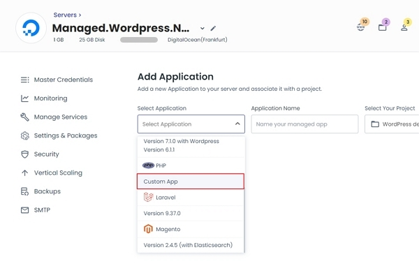
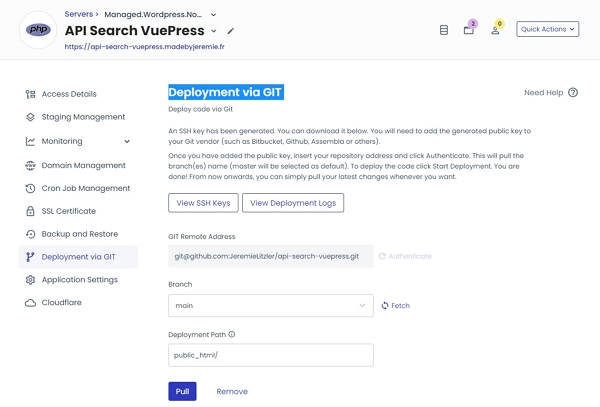

I am developping a custom search API from VuePress static websites and I needed to host it.

Since I have a Cloudways VPS, let's see how to run the REST API.

<!-- more -->

## What do you need

- Create an account [on Cloudways](https://www.cloudways.com/en/?id=174912).
- Provision a VPS (`https://unified.cloudways.com/server/create`) (the smallest is fine for my REST API).
- Create a custom PHP app.



## Important file to include in your repository

Make sure to add a `.htaccess` containing the following:

```sh
# To make the index.php work
DirectoryIndex
# Redirect traffic to your port 3000
RewriteEngine On
RewriteBase /
RewriteRule ^(.*)?$ http://127.0.0.1:3000/$1 [P,L]
```

## Deploying the REST API

You can use the "_Deployment via GIT_" that allow you to pull the code from you repository.





You will need to use the `pull` button under the Cloudways application.

Doing a `git pull` in `applications/your_rest_api/public_html/` will not work.



## Asking Cloudways support to enable `mod_proxy`

This might not be enabled, so do check with the support Team if you get errors about this.

Your best bet is to ask by default.

## Install `pm2` package to run your REST API

Unless you do the following, your NodeJS app will stop running after 4h.

Running `node app.js` is not sufficient.

`pm2` enables you to launch the REST API and have it run without stopping.

To enable `pm2`, run the following via SSH logged in with your master user:

```sh
cd  && echo "export PATH='$PATH:/home/master/bin/npm'" >> .bash_aliases
cd ~ && echo "export NODE_PATH='$NODE_PATH:/home/master/bin/npm/lib/node_modules'" >> .bash_aliases
npm config set prefix "/home/master/bin/npm/lib/node_modules"
cd  && echo "alias pm2='/home/master/bin/npm/lib/node_modules/bin/pm2'" >> .bash_aliases
npm install pm2@latest -g
```

Restart the shell by exiting and reconnecting.

Then run on the root directory of the serve (where you land once connected):

```sh
pm2 applications/your_rest_api/public_html/app.js
```

You should get:


That's it!

I hope you enjoy this peace. I release a new article once to twice every week. Consider subscribing to my newsletter

## Credits

Thanks to the CloudKeeper for his articles:

- [https://www.thecloudkeeper.io/how-to-host-a-nodejs-app-on-cloudways/](https://www.thecloudkeeper.io/how-to-host-a-nodejs-app-on-cloudways/)
- [https://www.thecloudkeeper.io/how-to-install-node-modules-on-cloudways-via-npm/](https://www.thecloudkeeper.io/how-to-install-node-modules-on-cloudways-via-npm/)
