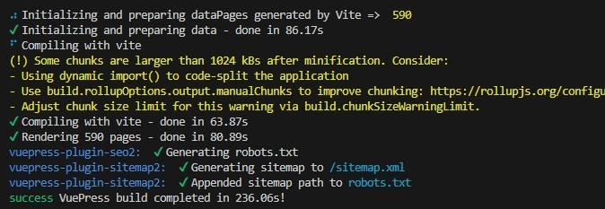

I have used VuePress for a year. At work, we use it for documenting our processes and guides (about 400+ articles).

The build took:

- 86 seconds to initialize and prepare the data
- 64 seconds to compile
- 81 seconds to render

which equals to 236 seconds in total



On a virtual development machine, it took:

- 61 seconds to initialize and prepare the data
- 199 seconds to compile
- 90 seconds to render
- which equals to 368 seconds in total

It seems fine and the CI build on Azure DevOps was taking about 4 min, which is similar.

But two colleagues reported that it took over 800 seconds…

The story and reasons behind this can be found here: [https://github.com/orgs/vuepress-theme-hope/discussions/2887](https://github.com/orgs/vuepress-theme-hope/discussions/2887).

Personally, on my websites, I had issues with VuePress in terms of SEO:

- non-normalized taxonomy,
- no access to customization of the category and tag pages,
- bloated frontmatter to add canonical links and OpenGraph meta.

## Which alternative

### The goal

I needed:

- The functionalities in terms of Markdown syntax
- A performant build
- Support for blockcontainer, e.g., to display notes, tips, warnings and so on.
- Support for meta data for OpenGraph and canonical
- Taxonomy with categories and tags
- In-line markdown links to link to other posts or pages within the website

Plus, if I could have support for natural SEO with the ability to customize the title and description of all pages (in particular the taxonomy pages) and normalize the URLs so that SEO is happy, that’d be great.

This last point would be possible and would be a nice surprise, but I didn’t know it when I started investigating Hugo.

### The choice

I thought about using a static site generator like Hugo for the build time.

However, this would require to adapt the content because VuePress and Hugo are very different when it comes to parsing the markdown (the first is in JavaScript and the other in Go…).

I knew nothing about Go language :O

## Hugo prerequisites

To start using Hugo, we need:

- to download and install Go (nothing particular to do on installing, just click “next”): [https://go.dev/dl/](https://go.dev/dl/)
- to download Hugo (I took the latest version 0.117.0): [https://github.com/gohugoio/hugo/releases/](https://github.com/gohugoio/hugo/releases/)

### Install Hugo

For windows user:

- Create a folder `Hugo` in `C:\Program Files`
- Copy the content of the ZIP downloaded earlier into `C:\Program Files\Hugo`
- Add to the `PATH` the path to Hugo executable `C:\Program Files\Hugo`
- (Re)Launch Visual Studio Code and open the terminal `Git Bash` with `CTRL+ù`.
- Execute the command `hugo`. You should see the message “_Error: Unable to locate config file or config directory. Perhaps you need to create a new site_”. It tells you that Hugo is operational :)



To run the `hugo` command, prefer using:

- Git Bash, included with Git by default.
- Powershell 7.x or more recent.



## The tasks to migrate the content

### 1- Don’t use fenced code blocks with "{x,y,...}" after language’s declaration

Something like that won’t compile:

````markdown
```xml{1,26}
... some XML ...
````

Clean up the occurrences if you have any.

### 2- Copy the content of `.vuepress/public` into the folder `content/static`

Also, if you are using something like Drawio and that you use the _export to HTML_ feature, you will need to add what follows at the top of each exported HTML file:

```markdown
+++
+++
```

This allows the website to compile (see [https://discourse.gohugo.io/t/solved-using-html-for-content-pages-instead-of-markdown/3374/5](https://discourse.gohugo.io/t/solved-using-html-for-content-pages-instead-of-markdown/3374/5)).

### 3- Rename all the `README.md` to `index.md`, if you used to name the root file

Hugo requires the markdown files in a directory to be named `index.md` when you use the following folder structure.

```md
content/
    |__ post/
        |__ my-article/
            |__ index.md
            |__ images/
```

I saw tutorials where people named them `something-else.md`, but it is when you use this other folder structure:

```md
content/
    |__ post/
        |__ my-article.md
```

I prefer the former because I keep the images specific to a post in the same place as the markdown file.

The script below has to be run into the `content` directory to convert the `README.md` files to `index.md`.

```bash
find . -iname 'README.md' -execdir mv {} index.md \;
```

### 4- Pick a theme

I tried the theme suggested by Hugo’s starter guide, but it was way too dull and I couldn’t get the list page to work.

Then I have found [Jimmy](https://github.com/CaiJimmy)’s Stack theme: [https://github.com/CaiJimmy/hugo-theme-stack-starter](https://github.com/CaiJimmy/hugo-theme-stack-starter).

It is rich, works and is documented!

With this theme, I was missing the fenced blocks I use on the VuePress them for notes, tips, warnings and dangers messages.

### 5- Update on the theme

To be honest, at first, with Hugo-recommended theme, I was a bit confused about how Hugo works.

Then, using [Jimmy](https://github.com/CaiJimmy)’s theme made everything click.

My goal was to keep the natural relative links between the different files (relative links) and use the VuePress syntax provided in the [Mr Hope theme](https://theme-hope.vuejs.press/guide/markdown/container.html) somehow.

#### Relative links

Out of the box, Hugo doesn't provide the ability to render a relative markdown link like this one:

```markdown
[My link to another page within the site](../page/about.md)
```

to this link in HTML:

```html
<a href="https://mydomain.com/page/about/">My link to another page within the site</a>
```

While you could use the `` shortcode as the Hugo documentation tells you, it is not practical and lack intellisense within VSC for me to select the files.



Do what Joe Mooring says [in the GitHub issue](https://github.com/gohugoio/hugo/issues/11054#issuecomment-1572295424).



Plus, I couldn't figure out how to replace the hundreds of links in my websites from markdown native syntax to shortcode syntax...

Thankfully, after a little bit of research, I found the template override of `render-link.html` that does exactly what I needed.

See [here in my repository](https://github.com/JeremieLitzler/iamjeremie.me-with-hugo-theme-stack/blob/master/layouts/_default/_markup/render-link.html).

You have to put it under `layouts/_default/_markup/render-link.html`.



However, for relative links to any file not named `index.md`, it will not work.

I use this pattern for large pages:

```markdown
content/
    |__ post/
        |__ my-article/
            |__ images/
            |__ index.md
            |__ part-1.md
            |__ part-2.md
            |__ ...
            |__ part-N.md

```

You need to either:

- Put the file into it own folder.

```markdown
content/
    |__ post/
        |__ my-article/
            |__ images/
            |__ index.md
            |__ part-1/
                |__ index.md
            |__ part-2/
                |__ index.md
            ...
            |__ part-N/
                |__ index.md

```

- Merge the files together.



#### Block containers

Next, I wanted to use the equivalent syntax below with Hugo:

```markdown
:::warning My container title

My container body

:::
```

With the help of [Lovirr](https://github.com/Lovirr) and [CaiJimmy](https://github.com/CaiJimmy), I found the solution: creating a custom shortcode. See [my discussion with them](https://github.com/CaiJimmy/hugo-theme-stack/discussions/867) on the topic.

You put it under `layouts/shortcodes`. In my case, I named it `blockcontainer.html`.

The content is [available in my repository](https://github.com/JeremieLitzler/iamjeremie.me-with-hugo-theme-stack/blob/master/layouts/shortcodes/blockcontainer.html).

You can change the CSS class, if you want. My styles are the following:

```css
root {
  --theme-color: #3eaf7c;
  --accent-color: var(--theme-color);
  --body-text-color: rgba(0, 0, 0, 0.8);

  --notice-note-light: #fdfdfe;
  --notice-note-dark: #858585;
  --notice-tip-light: #e6f6e6;
  --notice-tip-dark: var(--theme-color);
  --notice-warn-light: #fff8e6;
  --notice-warn-dark: #e6a700;
  --notice-danger-light: #ffebec;
  --notice-danger-dark: #e13238;
}

:root[data-scheme=dark] {
  --body-text-color: rgba(255, 255, 255, 0.8);

  --notice-note-light: #858585;
  --notice-note-dark: #fdfdfe;
  --notice-tip-light: var(--theme-color);
  --notice-tip-dark: #e6f6e6;
  --notice-warn-light: #e6a700;
  --notice-warn-dark: #fff8e6;
  --notice-danger-light: #e13238;
  --notice-danger-dark: #ffebec;
}

.jli-notice {
  padding: 0.5em;
  border-radius: 0.5em;
  margin: 1em 0;
}

.jli-notice .highlight,
.jli-notice .gallery,
.jli-notice blockquote {
  margin-left: initial;
  margin-right: initial;
  width: initial;
}


.jli-notice p {
  margin: 0;
}

.jli-notice-title {
  font-weight: bold;
}


.jli-notice-note {
  background-color: var(--notice-note-light);
  border: 1px solid var(--notice-note-dark);
  border-left: 4px solid var(--notice-note-dark);
}

.jli-notice-tip {
  background-color: var(--notice-tip-light);
  border: 1px solid var(--notice-tip-dark);
  border-left: 4px solid var(--notice-tip-dark);
}

.jli-notice-warning {
  background-color: var(--notice-warn-light);
  border: 1px solid var(--notice-warn-dark);
  border-left: 4px solid var(--notice-warn-dark);
}

.jli-notice-danger {
  background-color: var(--notice-danger-light);
  border: 1px solid var(--notice-danger-dark);
  border-left: 4px solid var(--notice-danger-dark);
}
```

Next, I created [this Visual Studio Code snippet](https://github.com/JeremieLitzler/iamjeremie.me-with-hugo-theme-stack/blob/master/.vscode/shortcodes.code-snippets) to use it very easily when I write content.

In the markdown file, it looks like that:

```markdown


My container body


```

To be clear, in the above example,

- `jli-notice-warning` is CSS class added to the div block. It is referenced by `$noticeType` in the HTML definition of the shortcode.
- `My container title` is the title that the shortcode renders in the first `p` element
- `My container body` is the body or content of the shortcode. It can be any valid multiline markdown content. See `$raw` in the HTML definition of the shortcode.

As you see shortcodes works like an HTML element, with an opening and closing tag.

You could use the opening syntax only:

```markdown

```

You can use regular Markdown for images and links in the body.

For relative links to other pages or posts within a same site, be careful not to use the following markdown content when inside the blockcontainer.

For example, with the following structure under `content` directory:

```css
content/
    |__ post/
        |__ an-awesome-post
            |__ index.md
        |__ my-first-post
            |__ index.md
```

You can write the following markdown :

```markdown


[My awesome post](../an-awesome-post/index.md)


```

While the link would work outside the shortcode, it won’t inside… I haven’t figured out why.

However, I figured out how to make it work within the shortcode. You must use an absolute reference:

```markdown


[My awesome post](/post/an-awesome-post/index.md)


```

### 6- Update the frontmatter

First, I used to have `heroImage` and `heroAlt` (alternative text of the `heroImage`).

In Hugo, `heroImage` is `image` and it works the same. The value `image: /images/my-image.jpg` means the image must go in `static/images/`.

However, contrary to VuePress and the theme I used, this value works `image: images/my-image.jpg` (for a page, the image is in `/page/images/my-image.jpg`).



You must add frontmatter to each markdown file. Otherwise, you see the article but no title to click to navigate to the page or post, even if you have `# My title` at the top...



### 7- Images in the markdown files

You simply need to declare an image in the usual way:

```markdown
 #when a folder “images” exists at the same level as the markdown file


# when the image is in “/static/images”

```

## Comparison of VuePress vs. Hugo

- Build performance ⇒ better on Hugo

  for the same content, it takes half the time

  

  instead of

  

  In my team's documentation site at work, the build time went from ~250 seconds to 5 seconds. Not bad ;)

- Blockcontainer ⇒ OK, using a custom shortcode.

- Metadata ⇒ OK, OpenGraph + canonical are generated out-of-the-box and use the frontmatter `title`, `description` and `image`.

- SEO ⇒ better, because I have control over all the pages, especially the categories and tags, even though I have to manually create them.

  - See the [demo of the Hugo theme](https://github.com/CaiJimmy/hugo-theme-stack-starter) I'm using. You will quickly understand how it works.

- Image ⇒ I'm not sure. While the documentation says responsiveness is available out-of-the-box and `webp` is possible, I have yet to figure this out.

  - I couldn't compare with VuePress because LightHouse, PageSpeed.web.dev and GTMetrix tell me they can't analyze the VuePress article I wanted to compare...

- Category and tag taxonomy ⇒ better, URL is normalized and page is customizable :)

- In-line markdown links to other posts or pages ⇒ OK

One thing I needed to do: the organization of my content. While I used the following structure of my articles:

```md
docs/
    |__ 2023/
        |__ 08/
            |__ my-article/
                |__ index.md
                |__ images/
```

I move to this structure:

```md
content/
    |__ post/
        |__ 2023-08
            |__ my-article/
                |__ index.md
                |__ images/
```

I had to implement redirects from the old path to the new one.

This is achievable with `netlify.toml` file. See [https://docs.netlify.com/routing/redirects/](https://docs.netlify.com/routing/redirects/)

Feel free to use [this Google Sheet](https://docs.google.com/spreadsheets/d/1cAA9Gfhx3jg3GRdvWGFvq-Gz2yXH66e8Yg4P_BFpw3Q) to build your redirects.

Use this bash script to list all posts that you copy the Sheet:

```bash
cd /docs
find . -iname 'README.md'
```

As you finish reading this long, but I hope useful article, I wish an awesome journey with Hugo.
