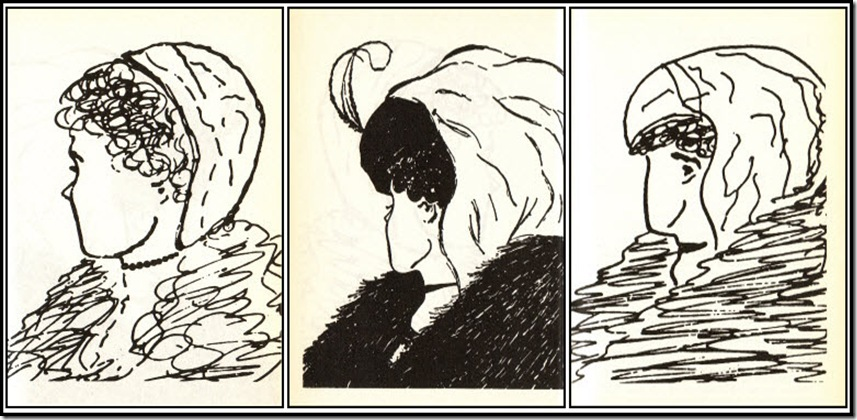

## Paradigm shifts

> Common sense isn’t always common practice
>
> ~ Stephen R. Covey

BODY ⇒ MIND ⇒ HEART ⇒ SPIRIT

How do I perceive my attitude?

There’s no shortcuts in life. You take one, you’ll get short-term sucess, but probably you’ll reap long-term issues…

> What we are communicates far more eloquantly than anything we can say or do.
>
> ~ Stephen R. Covey

What are my maps about “ways things are” (realities) and “ways things should be” (values)?

How many young women do you see? And how many old women?

At page 39, the paradigm shift is interesting to look at in the occassion that I feel that my children are loud:

> A man and his children came into the subway, the kids were very loud and annoying the other passangers. The father didn’t seem to care.
>
> Stephen R. Covey came to him and asked that he controlled them so they annoy the fellow passangers.
> The man just witnessed his wife die an hour ago.

Think about this paradigm: is it worth screaming and getting angry after children when they _annoy_ you? Certainly not.

See the quote of Thoreau:

> For every thousand hacking at the leaves of evil, there is one striking at the root”

As Stephen said:

> We can only achieve quantum improvements in our lives as we quite hacking at the leaves of attitude and behavior and get to work on the root, the paradigms at which our attitudes and behaviors flow.

## Principles

They are the following:

- fairness
- integrity
- honesty
- service
- quality/excellence
- human dignity
- patience
- nurturrance
- encouragement

There is a process to go throught from A to B.

No shortcuts possible. I know what I'm talking about: in my software engineering, when we skip a step _just to save time_ or _to deliver faster_, we pay more afterwards.

Same goes about your relationships.

Alose, to growth, we must take the steps in the right direction.

Interpersonal relationships mean to listen. And to listen, you need emotional strength.

Look at the drawing again:

So what are the 7 habits?

They enable you to move:

- first, from dependence to independence
- second, independence to interdependence

I think I am too focused on independence that when I read pages 57 and 58, I see that I can continue to try on my own to improve, but I will not feel satisfied.

I need help: interdependence is to continue to grow with others.

Too much independence is often a sign of dependence in reality.

You could compare this to harvesting a crop after you plant it instead of the contrary, which is obviously impossible.

## Effectiveness defined
