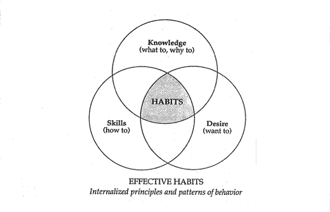

## Paradigm shifts

> Common sense isn’t always common practice
>
> ~ Stephen R. Covey

BODY ⇒ MIND ⇒ HEART ⇒ SPIRIT

How do I perceive my attitude?

There are no shortcuts in life. You take one, you’ll get short-term success, but probably you’ll reap long-term issues…

> What we are communicates far more eloquently than anything we can say or do.
>
> ~ Stephen R. Covey

What are my maps about “ways things are” (realities) and “ways things should be” (values)?

How many young women do you see? And how many old women?

At page 39, the paradigm shift is interesting to look at in the occasion that I feel that my children are loud:

> A man and his children came into the subway, the kids were very loud and annoying the other passengers. The father didn’t seem to care.
>
> Stephen R. Covey came to him and asked that he controlled them so they annoy the fellow passengers.
> The man just witnessed his wife die an hour ago.

Think about this paradigm: is it worth screaming and getting angry after children when they _annoy_ you? Certainly not.

See the quote of Thoreau:

> “For every thousand hacking at the leaves of evil, there is one striking at the root”

As Stephen said:

> We can only achieve quantum improvements in our lives as we are hacking at the leaves of attitude and behavior and get to work on the root, the paradigms at which our attitudes and behaviors flow.

## Principles

They are the following:

- fairness
- integrity
- honesty
- service
- quality/excellence
- human dignity
- patience
- nurturance
- encouragement

There is a process to go through from A to B.

No shortcuts possible. I know what I’m talking about: in my software engineering, when we skip a step _just to save time_ or _to deliver faster_, we pay more afterwards.

Same goes about your relationships.

Also, to grow, we must take the steps in the right direction.

Interpersonal relationships mean to listen. And to listen, you need emotional strength.

Look at the drawing again:

So what are the 7 habits?

They enable you to move:

- first, from dependence to independence
- second, independence to interdependence

I think I am too focused on independence. When I read pages 57 and 58, I see that I can continue to try on my own to improve, but I will not feel satisfied nor efficient.

I need help: interdependence is to continue to grow with others.

Too much independence is often a sign of dependence in reality.

You could compare this to harvesting a crop after you plant it instead of the contrary, which is obviously impossible.

## Effectiveness defined

It’s a balance of P/PC.

P stands for Production.

PC stands for Production Capabilities.

If one is missing, it cannot work.

For example, in the book, Dr. Covey tells the story of the goose producing the golden eggs. The farmer kills it when he becomes greedy that he cannot wait until the next day to get the golden egg. He thought that by “opening the goose”, he would get more golden egg. But in the final analysis, he would get none, for the rest of his life.

We find 3 kinds of assets in the P/PC principle:

- Physical
- Financial
- Human

A balanced P/PC occurs when the assets are preserved, but not only.

Similarly, asset balance is key to success and effectiveness.

What does it mean?
If you have too much physical assets over human assets, what would happen for a married couple had too many _golden eggs_ but no relationship?

Another example: you could buy a tool made with wooden handles that helps you aerate the soil in the garden. You use it often because it does its job very well. But neglect to store it by leaving it outside. Weeks after weeks and the rain falls, the wood of the handle begins to rot and eventually, during a use, the handles break and you left with nothing to take care of the garden. You will need to buy a new handle while taking a few seconds at each use would have prevented this from happening.

In this case, we focused too much on the soil being aerated (P) and not on the care of the tool (PC).

See on pages 63 to 64 the last four paragraphs that show that neglecting the goose (PC) for the golden eggs (P) in a couple or in a parent/child relationship will sicken the goose day by day and eventually, it will die.

Let me quote two paragraphs:

> And what about a parent’s relationship with a child? When children are little, they are very dependent, very vulnerable. It becomes so easy to neglect the PC work—the training, the communicating, the relating, the listening. It’s easy to take advantage, to manipulate, to get what you want the way you want it-right now! You’re bigger, you’re smarter and you’re _right_! So why not just tell them what to do? If necessary, yell at them, intimidate them, insist on your way.
>
> Or you can indulge the. You can go for the golden eggs of popularity, of pleasing them, giving them their way all the time. Then they grow up without any internal sense of standards or expectations, without a personal commitment to being disciplined or responsible.

In summary, care for the goose—the quality of the relationship—and it will be fed well and it will be healthy.
