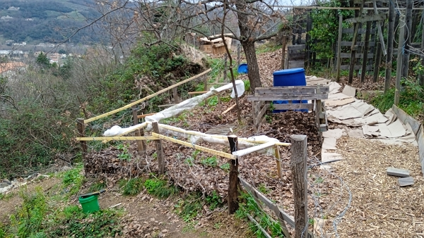

[< Back to the table of contents](index.md) | [Go to December](2022-12.md) | [Go to February >](2023-02.md)

## January 1st

I started with picking another trailer-full of dead leaves. It'll probably be the last round next week.

Next, I made 2 compost heaps:

- one for the compost toilets
- one for the kitchen and garden wastes

I made a second kitchen and garden wastes heap because the first one was full.

I took 2h30 to build it from recycled pallets.

See how I made them [in this article](../../../2022/12/how-to-make-a-compost-bin-from-pallets-huw-richards/index.md)

Unfortunately, the remaining pile of fragmented wood was picked up during the past week. Still I managed to recover a good 15 bags of the remaining scraps (the bags were the pellet bags that usually contains 15 kg of pellets).

So, I'd say it was about half a trailer worth of fragmented wood.

I will need to complete the alley covering when I find time to go buy woodchips at the local sawmill.

### About the garlic

Here is the picture of the growing garlic.

I'm still not sure they will survive.

So I am planning to plant some more in the gaps between the ones growing and in the beds where I usually plant the tomatoes.

Just to make sure, in case of severe frost, that I will have something.

However, I think I will delay next year the planting to mid december. We'll see how it goes.

And BTW, the same goes for the broad beans.

### About the broad beans

Here is the picture of the growing broad beans.

See the comment [in the garlic's section](#about-the-garlic) about the early rising of the plants.

## January 8th

Today was the last pickup of those abundant dead leaves, which in total I gathered 12 trailer-full, equivalent to 12 meters cube of leaves.

We will see how I use it apart from covering the beds for winter, adding brown material in the compost and composting toilet wastes.

### About garden design

Also, I have purchased a subscription from [Terra Potager](#), a french web application that helps you organize and track your sowing planning and design your garden beds.

Given the setup of my garden, it will take some time to get started.

It contains what other gardeners do in France. So maybe, I'll use their suggestions on when and what to plan in my garden.

For example, I planted garlic and broad bean early november, but with the mild winter we are having, they sprouted easily.

As I am sure how they will handle frost, I've build some kind of tunnel to deploy and fold whenever I need so the frost doesn't kill the plan if it comes in the next months.

I made it so it can fold and deploy easily.

I use [this winter garden cover](https://amzn.to/3Cwfuoo) which I bought already 2 years ago. It is a goood quality product and it doesn't tare easily, even after 2 years. So I recommend.

I need a good amount so the 48 m² of this option leaves me with some left for the kiwai and the beds I haven't work on today.

Here are a few pictures of the build:

@tab active title View of garlic and broad beans beds

@tab title View of another bed with echinacea and garlic



It has worked well so far, especially for the broad beans when the temperatures went down to -4°C.

It is easy fold and unfold. Aurélie would love it to disappear when folded, but it stapped to the wood structure. And it is much easier to have it I need it...

## January 22th, 2023

With the girls, we planted where we usually have the tomatoes:

- about a few garlic cloves.
- about two rows of broad beans.

## January 29th, 2023

Yet, again, we planted about 50-60 garlic cloves a little bit everywhere I could think of.

We also planted a couple of seeds in a new bed I made on this day.

[< Back to the table of contents](index.md) | [Go to December](2022-12.md) | [Go to February >](2023-02.md)
