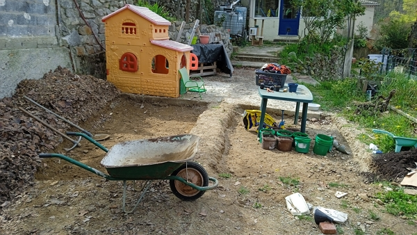
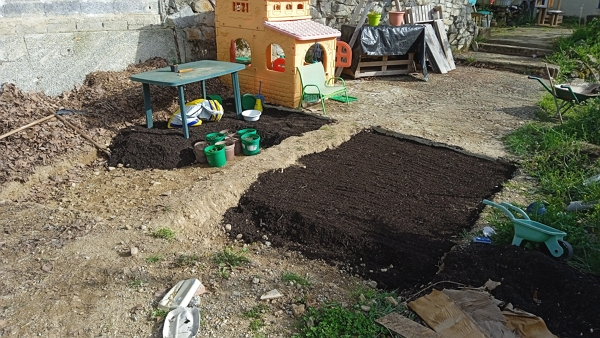

[< Back to the table of contents](index.md) | [Go to March](2023-03.md) | [Go to May >](2023-05.md)

## April 2nd

The lettuces are not looking great, but the sweet peas are growing by the day.

I am not sure the lettuce will survive the transplantation. But it is OK, sweet peas will produce well.

Garlic is getting larger and larger.

## April 9th

I transplanted the red mesclun which sprouted very quickly (ready in 2 weeks). It was a lot easier to get the seedlings out compared to the the 4 seasons lettuce and the sweet peas.

I set them in the bed where I had planted the sweet peas. I also finished transplating the 4 seasons lettuces in the leftover space.

Since the garden was running low, I added a 5 cm of the dark compost, I bought 2 weeks earlier, to cover the bed and provide a good protection from the sun heating more and more each passing day.

I suspect that the mesclun was **planted in a thicker and more densed compost**. Therefore, when I pushed each module, they all popped out easily. That's one lesson learnt for the first year I use those tiny greenhouses

Today, I also harvested 110 g of garlic (I couldn't resiste). The 4 four garlics I harvested were as thick as my index finger and it tastes so good. I ate it raw in a salad with gratted carrots, an avocado and some wild smoked fish.

I watered well the new transplant and the existing ones, as well as the potatoes beds.

Speaking of potatoes, I am going to try growing some in 200 liters blue barels. I used Damien Dekarz's technique (I have got a french article on the topic under [Damien Dekarz's tag](../../../fr/tag/damien-dekarz/).

I have made a single 16mm hole at the bottom, 20 cm up the base to keep the water in.

Then I applied stones around it to prevent the hole to be sealed from the dirt.

I applied a 40 cm layer of hay, added 10 cm of dirt mixed with the dark compost.

I set the potatoes whole or halves (5 per barrel) and added 15 cm of the dirt and compost mix.

Finally, I added 10cm of hay and 20 liters of water.

Another experimentation: yesterday, I prepared some roasted potatoes and I purposefully cutting the sproutings from the potatoes I cooked to see if they would grow in the one year and a half old compost at the north of the garden.

The compost is cool and moist and very soft. Plus, we still have plenty of autumn leaves on top, making it is a perfect place to grow vegetables.

We'll see how it turns out.

## April 10th

I dug continue the former area where we had the guest house.

I think I have completed half of it.

The debris removed are still mainly sand and little rock mixed with some durt.

I left a pathway to walk on.

## April 13th

I bought and applied 2 trailers of compost onto the dug areas.

This is about 700 kg of compost with quite a little bit of woody parts. It cost me 34 euros and 2h of my time to go to get it and empty it.

I have observed that it works fine for the sweet peas and mesclun I planted. Also, it seems that the slugs aren't coming over it since I haven't seen any attack on the peas and mesclun so far.

It took me 3h to pick up and apply the compost.

At the end of the day, I tried to install the second watering pipe that runs from the network water pipe in the basement.

I went to purchase the different pieces to connect the existing pipe that I used last year.

The new pipe will help to have water at the other end of the garden. It isn't completed yet, with a few connection to adjust beacause they are leaking a little.

These pipes will be used over the summer time to water the garden, once the seven 1000-liters water tanks will be empty.

## April 16th

I continue to dig the 20 cm deep beds. It took me X hours to dig all of it.





Then, I sowed:

- one large pot with purple basil we harvested the seed from in 2021.
- one medium pot with curly parsley
- two medium pots with commun parsley
- eight medium modules with 2 to 3 seeds of corn, harvested in 2021.

In the garden,

- The mesclun lettuce is doing great.
- The sweet peas need tutoring to grow taller.
- The 4 saisons lettuces are hanging there. Maybe, not all of them remain, but some show signs that they are growing.
- The echinacea is producing leaves in both location. The dark compost is helping them as the leaves seem not to withstand too many attacks.
- The potatoes are growing, so I added a 5 cm layer of a mix sifted soil and compost. I topped up with more unsifted compost.
- The strawberries are putting flowers.
- The garlic look healthy.
- The broad bean plants are still producing flowers and growing in height. The earliest flowers are now tiny green beans.
- The raspberry stems are sprouting more and more out the layer of autumn leaves.
- The trees, apple and cherry, look strong. Only the one near the car show sign of a desease





Someone in the neighborhood brought me grass clippings which I filled the compost bins with, adding them in layers with autumn leaves.

I'll need to build a third compost bin soon!

## April, 24th

Carrots are finally growing among the onions. The onions are looking well.

All the garlic is growing at their pace.

To get some more climbing capabilities for the peas, I think I need to add some poles.

No potatoes in the blue barrel just yet.

There are about eleven clusters of raspberries sprouting out the dead leaves blanket, just like last year.

The apple tree among the berries aren’t looking good. Leaves are a bit diseased. I'll need to remove them and I'll need to treat the apple tree next weekend.

Also, I'll just need to weed out some of the weeds in the garden with the berries. At this time of the year, weeds are growing very fast, even if it didn't rain a lot for the first 4 months!

The broad beans are ready to get started for the harvest.

And yet, there are a lot of flowers. Many used to be flowers and it's all transformed. I removed a single top of a broad bean plant, infested with aphids.

Also, as the temperatures start rising, I need to clear some water that's stagnating.

The borage flower, next to the broad bean bed, is very big and very nice. It's going to make some good green material for the compost. For now, it’s feeding the pollinators.

I think, in the compost I made last year with wood dust and grass crippling, there is like a lot of almond trees sprouting :O

So there's just one growing in a pile of dead leaves. Crazy. I just picked a dead leave pile and carrying the almond tree with me. It's funny.

Back to the garden's entrance, many mesclun salads seem to hold on in the first bed with the garlic. I think the compost I'm buying in bulk works nicely to keep the slugs away.

Regarding the comfrey, well, three or four clusters show good progress. I already see flowers. Very nice. Purple.

The Echinacea under the comfrey is well protected by the compost.

We have some more borages growing in a few patches here, close to the potatoes.

We also have voluntary potatoes. I don't know why there are potatoes there. So I left the plants growing in the ones we planted this year. I think everything is coming out. I just need to weed out the bindweed that's growing with the peas.

I set the mimosa branches to help them grow. I'm not sure they’re holding to it yet. So I'll see what I can do about that. Maybe a netting would have been better, but now it's too late, and it’s another purchase…

So maybe I'll put a string or something.

The mesclun salad is holding well. Some patches grow better than the others. Yet, from seed, it's pretty awesome. The salad I planted in the same patch is growing as well.

We had rain yesterday, so it's pretty damp.

The thrown-free blackberry bush is doing well.

Another area to weed out is where I planted the climbing white rose bush, because there's a lot of grass over there.

The carrots in the buckets are growing, there are very few of them [only 9].

So let's say carrots is probably not the crop to grow in buckets.

The lamb's lettuce doesn't provide much to eat so far. So we'll need to wait a little bit. But I think the bucket isn’t the best place for them, or maybe it was sewed too thick.

[< Back to the table of contents](index.md) | [Go to March](2023-03.md) | [Go to May >](2023-05.md)
