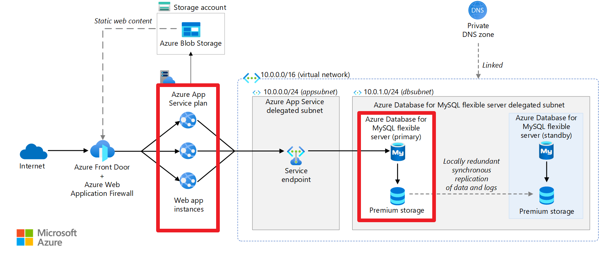
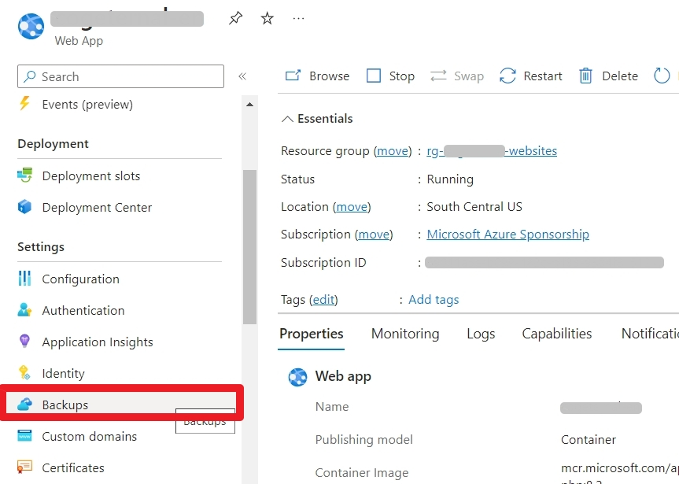
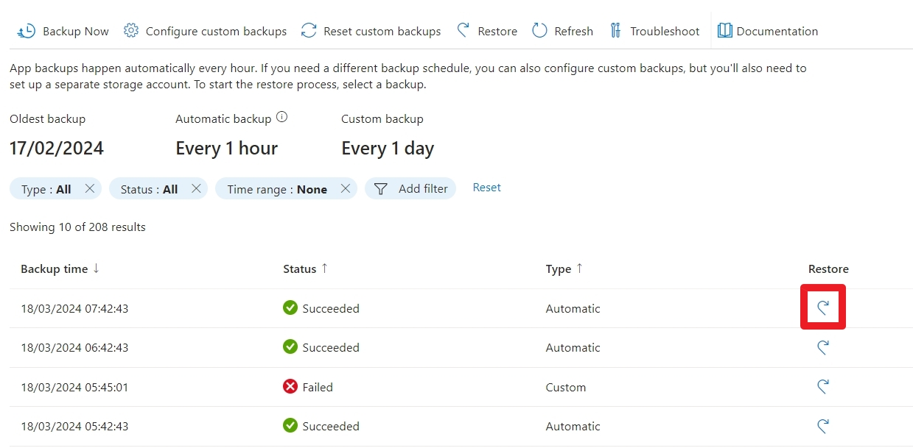
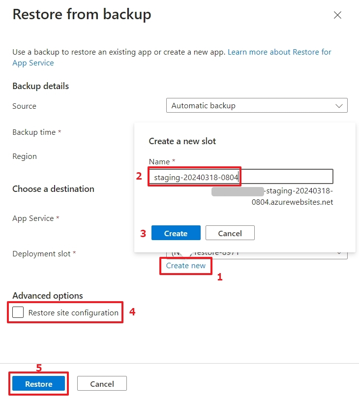
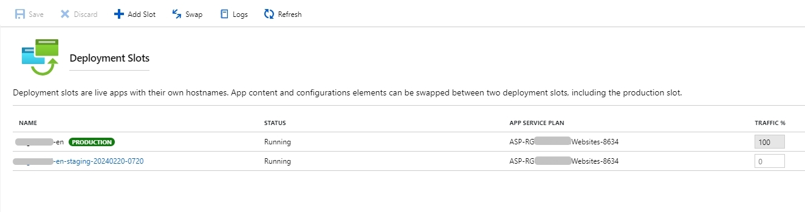
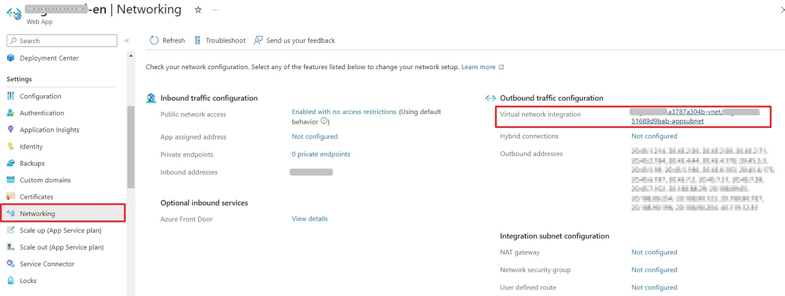

## Prerequisites

To get started, you need to:

- have an account and a subscription whether it’s a free trial or a non-profit sponsorship on Microsoft Azure.
- be able to access to the source hosting you want to migrate from.
- be able to install the plugin `all-in-one wp migration`on the source website to migrate its content.

## Create the app service

The architecture of the WordPress app service on Microsoft Azure is the following:

Credit: image from [this article](https://learn.microsoft.com/en-us/azure/architecture/example-scenario/infrastructure/wordpress-app-service) on Microsoft Learn.

What we will focus the most on will be the **App Service** and the **Azure Database for MySQL flexible server**.

I will mention the Storage account but I won’t go into the details.

So, from [the Portal](https://portal.azure.com/#home),

1. You select `Create a resource`
2. I followed the [Microsoft guide on WordPress migration](https://learn.microsoft.com/en-us/azure/app-service/migrate-wordpress) and here are the steps summarized into 5 steps:



Use the official Microsoft App Service option.





- creating a new Resource group to organize the resources created, for example with the `RG_Websites_Ressources`.
- selecting the initial App Service plan size, starting from free.

NB: if you perform a migration, the initial WordPress credentials account isn’t important since you will override it in later stages.









I **unchecked everything**, _unlike it’s shown in the screenshot_.

If you need to create a storage account, you can do it separately.









I think it’s important to tag the resources that you’re about to create.





The creation takes a while. So take a break and come back 15–20 minutes.



## Clean up the resources

To view all the resources you’ve just created, go to [Portal homepage](https://portal.azure.com/#home) and select `Resource groups`tile.

Then, select the resource group you created earlier, for example `RG_Websites_Ressources`.

When you create an app service using the template in the Azure marketplace, it creates a bit too many resources.

I haven’t noted all the ones that I deleted so let me show you which you need to keep:

- One storage account
- One app service per website
- One database instance per app service
- One virtual network

If you happen to create several app services using the previous step method, you will end up with a lot of resources.

Plus, you will have one App Service plan per creation, which may not be something you want. For example, on the project, we’re running 2 app services using a single App Service plan.

It’s easy to create a new app service from an existing one.

The only distinct resources you need is an app service and a MySQL server instance (and even that one you could share between app services but I haven’t run into that scenario).

## Size the resources correctly

The good news is that you can resize the app service and / or the MySQL server after creation. And all it takes is _just_ a few clicks.

In my case, I had 2 websites and one was significantly larger than the other.

To modify the size of the app service, simply:

- Browse to the app service resource.
- Select the `Scale up (app service Plan)` blade.
- Select the desired size.
- Confirm by clicking the `Select` button.

To modify the MySQL server resource:

- Browse to the resource.
- Select the `Compute + storage`blade.
- Select the Compute tier: either `Burstable`, `General Purpose` or `Business Critical`.
- Select the Compute size.
- Adjust the Storage size (minimum of 20 GiB is useful more than enough).
- Adjust the backup settings if needed
- confirm by clicking the `Save` button

## Configure the app service with HTTP/2

With WordPress, themes and plugins can generate quite a lot of requests on each page load. HTTP/2 leverage technology to optimize that and ditch the bundling strategy we have used with HTTP/1.1 servers.

Microsoft announced HTTP/2 support in [this article](https://azure.microsoft.com/fr-fr/blog/announcing-http-2-support-in-azure-app-service/) on March 27, 2018.

To enable it, here are the steps:

- Go to the _app service_
- Select _Configuration blade_ and then the _General Settings_ tab
- Scroll down to find the HTTP/2 setting and set it to `2.0`.
- Save and restart the app service.

You can also find the raw configuration of the app service in the Azure Resource Explorer (`https://resources.azure.com`), but it’s more sensitive to edit over there.

You need to go under _subscriptions > Microsoft Azure Sponsorship > resourceGroup > RG-YourOrg-Websites > providers > Microsoft.Web > sites > YourWebsiteName (aka name of the app service)_.

## Migrate from the shared hosting to Microsoft Azure

This was the main task.

While I started to perform the migration using [the manual method](https://learn.microsoft.com/en-us/azure/app-service/migrate-wordpress#manual-migration-process) for greater flexibility, I had to go back to [the plugin method](https://learn.microsoft.com/en-us/azure/app-service/migrate-wordpress#migrate-wordpress-with-all-in-one-wp-migration-plugin).

Why?

The [Advanced Custom Fields plugin](https://www.advancedcustomfields.com/) wasn’t working after performing the manual steps. It was a no-go since the existing website used it heavily.

After a few attempts to find the cause, I finally migrated the website using the All-In-One WP Migration plugin.

The steps were pretty simple and nothing is missing in the guide.

As for the post’s migration actions, what Microsoft lists is pretty much what I did:

- Search and replace (paths and domains) using [_Better Replace_ plugin](https://wordpress.org/plugins/better-search-replace/) to use the temporary domain (for ex.: `mywebsite.azurewebsites.net`).

- Configure the custom domain once we had checked that all the functionalities worked and the pages all used the temporary domain. To configure your site with a custom domain follow the steps described in [the guide “Map existing custom DNS name”](https://learn.microsoft.com/en-us/azure/app-service/app-service-web-tutorial-custom-domain).

  

  

- Update SSL certificates: once Microsoft Azure serves the domain, it’s as simple as going to the `Custom domains`blade in the app service and add the binding to be `SNI SSL`. This requires that you configure your registar to point the target domain to Microsoft Azure.

## Cost: for non-profits, take advantage of Microsoft’s sponsorship

If you’re a non-profit organization, you can benefit from a Sponsorship from Microsoft.

At the time of writing, it’s **$2000 per year**!

For that amount, you can easily host a large website. In the case I dealt with, we have:

- two MySQL servers,
  - the first at $62.33 per month (large website with more than 6000 pages and posts and a good steady traffic with a spike on Saturdays).
  - the second at $10.21 per month (small website for now),
- an app service Plan (_Premium v2 P1V2_) at $75.92 per month, which is enough to run 2 app services.
- a storage account with 772 GB of Blob storage and 6 GB of File storage (yes, the organization serves a lot of audio, video and PDF files).

Learn more at [https://www.microsoft.com/en-us/nonprofits/azure](https://www.microsoft.com/en-us/nonprofits/azure).

## Maintenance and updates with deployment slots

Even if I was tempted to use a plugin for that, I didn’t.

In the following paragraphs, I detail the steps I took to use deployment slots.

### Why deployment slots

Once you completed migrating the website, it’s time to think about how to perform the maintenance. That includes updating the core of WordPress, the theme and the plugins.

While you could use a plugin, such as UpdrafPlus or something else, I recommend using the deployment slots, native of Microsoft Azure, and they’re free of charge.

I agree with you: it’s more technical, but the app service plan available to you includes it.

Plus, I personally tried UpdrafPlus on Microsoft Azure and it didn’t go as well as I’d have hoped (random locking the database if the MySQL wasn’t big enough).

I have shared below a full procedure used for months by this former client in the US. And it works great!

### About backups in Microsoft Azure

Before we dive into the procedure itself, let’s talk about the backups.

By default, your database instance and app service are back up automatically.

The database is backed up once a day, around one hour after its creation.
You can take manual backup at any time, within the limit of 50 per instance.



When you create a new instance (which is the case when you perform maintenance), the counter starts from 0 again.

So you will never run out 😁



The app service is backed up every hour. You could set up manual backups but I don’t see a use for it.
Plus, it requires to setup a storage account (additional costs) and to hook it up to the app service.

No doing a manual backup of the app service means the synchronization between the database and the app service may be out a bit.

To avoid loss of data, I recommend taking a manual backup of the database right after an automatic backup of the app service (this is a step in the procedure).

Also refrain from making modifications (apart from the updates to perform) before completing the maintenance tasks.

### Use the deployment slots

When you have an app service running, you need to go to the `Backups` blade.

Once in the dashboard, you can perform a restore from the last automatic backup:

You will need to:

- Click on _Create new_ under _Deployment slot_ to customize the _slot_ name (optional)
  - Enter the name of the _slot_. Below, I share how I name it.
- Select the parent app service to clone the settings from.
- Confirm by clicking `Add`.

After a few minutes, the deployment _slots_ dashboard (See the _deployment slots blade_) is updated:



You need to add the virtual network to the _slot_, as it is not _copied_ with the restore method.

The action is simple: just click on _Not configured_ for _Virtual network integration_ on the right of the Networking dashboard and select the appropriate network.

**Be sure to wait 5-10 minutes before adding it**, as this will fail if the slot has not completed its deployment.





And don’t use the _Add slot_ method from the deployment slots dashboard because it doesn’t work. In fact, it creates a blank WordPress site and there is too much to do…



## Next steps

I have created for the organization I worked for [a Google Sheet checklist](https://docs.google.com/spreadsheets/d/1G8uoIAh-UOGrIepgz0q-iR9WkbgJVocGeL8J9RQMpbY) which you can copy and use.

If you find an issue or a step that is obsolete, [let me know](../../../page/contact-me/index.md).

I recommend going through this procedure monthly or bimonthly. It takes less than one hour after you became familiar with it.

## Conclusion

I started from scratch, without any experience on Microsoft Azure. Still, I picked up rather quickly and I applied skills I had to organize the resources properly and lead the project to completion.

I didn’t do everything but I asked questions about what I didn’t do. The son of the head of the organization pushed to use Microsoft Azure as he’s currently a Principal Cloud Engineer, specialized in cost optimization on Microsoft Azure.

He helped settings up the CDN to serve the audio, video and PDF content. He also helped to set up the dedicated Office 365 account used as the account sending emails from the website. Using the plugin [_WPO365 | MICROSOFT 365 GRAPH MAILER_](https://wordpress.org/plugins/wpo365-msgraphmailer/), we connected the forms to the Office 365 account to send the messages.

Microsoft Azure can be intimidated with the vast possibilities it provides. It’s a complex ecosystem. Yet, it’s a valuable skill to have and I’m glad I acquired it.
