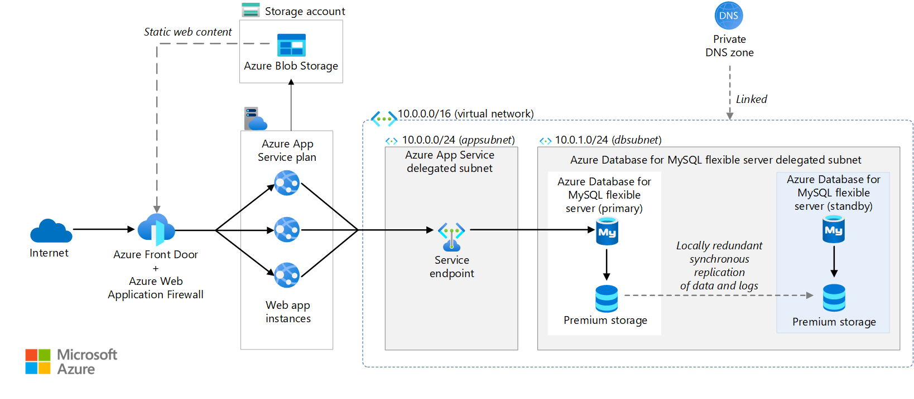
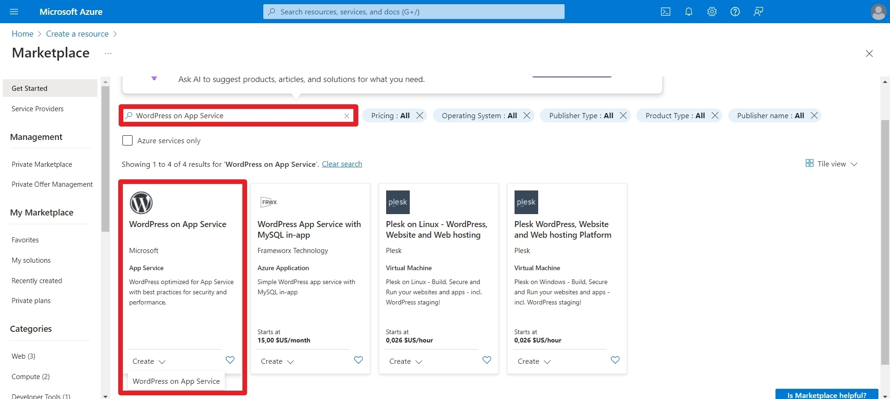
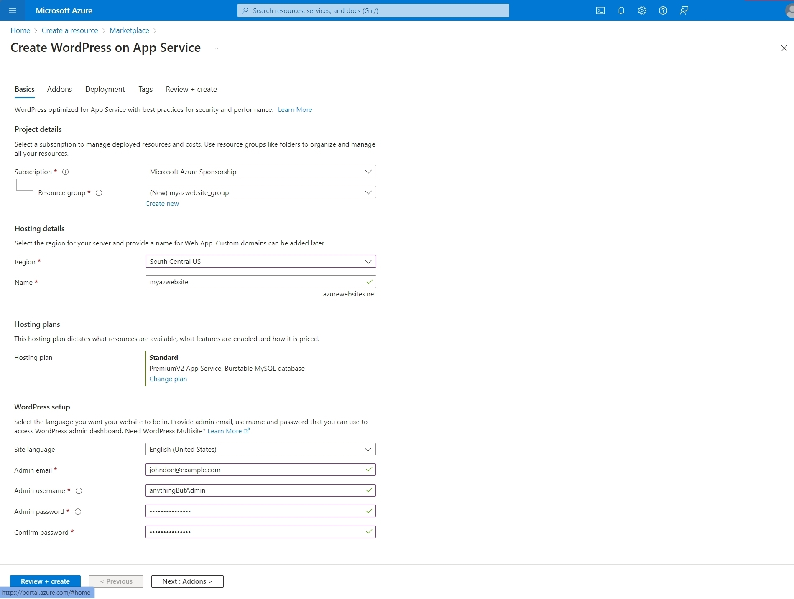
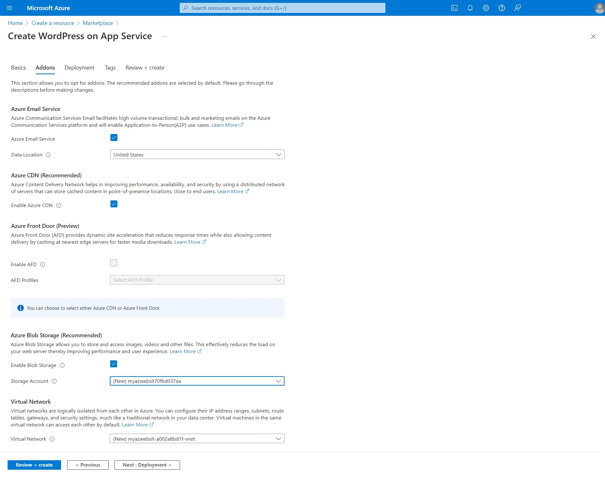
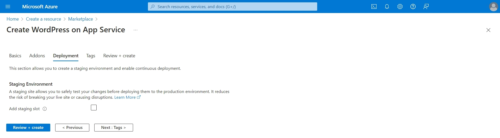
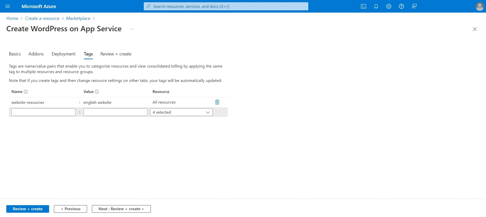
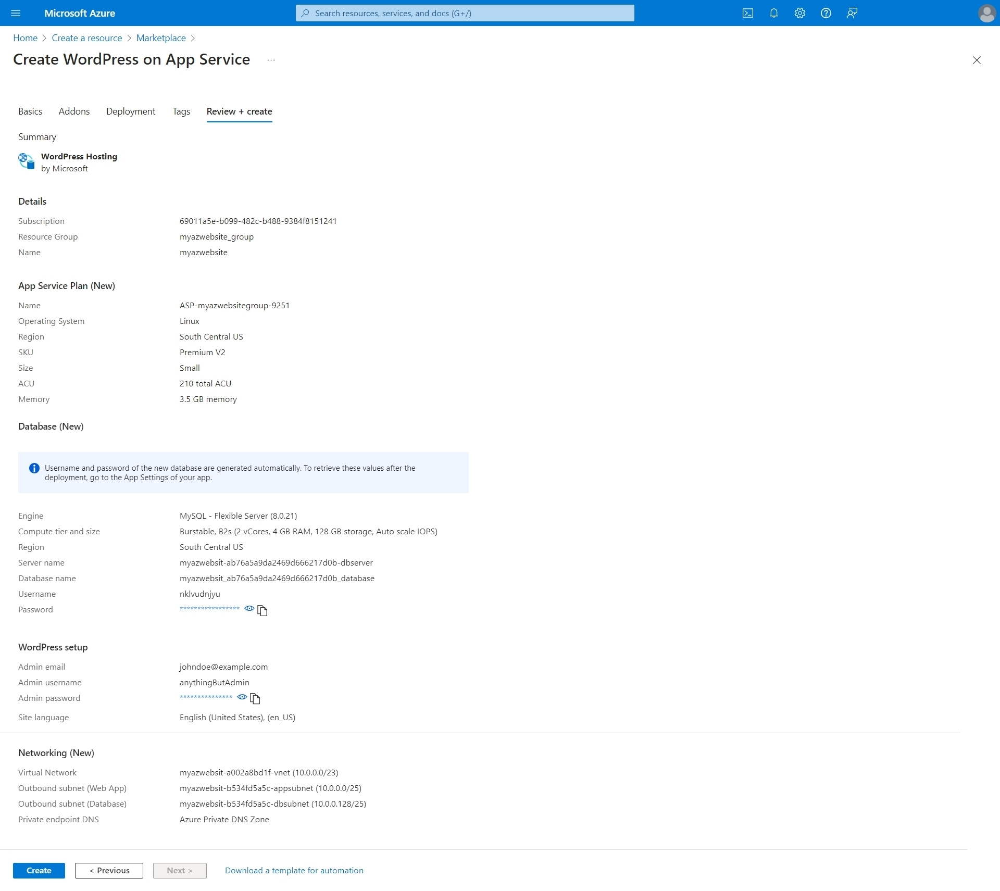
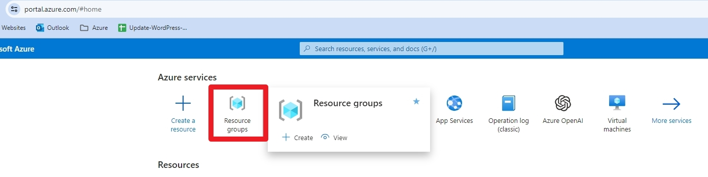

## Prerequisites

You need to:

- have an account on Microsoft Azure.
- be able to access to the source hosting you want to migrate to.
- be able to add the plugin `` to migrate the website content.

## Create an app service

The architecture of the WordPress App Service on Microsoft Azure is the following:

Credit: image from [this article](https://learn.microsoft.com/en-us/azure/architecture/example-scenario/infrastructure/wordpress-app-service) on Microsoft Learn.

From [the Portal](https://portal.azure.com/#home),

1. You select `Create a resource`
2. I followed the [Microsoft guide](https://learn.microsoft.com/en-us/azure/app-service/migrate-wordpress): here are the steps summarize into 5 steps:

Use the official Microsoft option.

The importants steps here are:

- creating a new Resource group to organize what will be created, for example with the `RG_Websites_Ressources`.
- selecting the initial App service Plan size.

NB: if you perform a migration, the initial WordPress credentials account isn't really important since you will override it in later stages.

In my case, I **unchecked everything**, _unlike it is shown in the screenshot_.

If you need to create a storage account, you can do it seperatly.

This is not necessary right now.

I think it is important to tag the resources that you're about to create.

It will organize under the resource group.

The creation takes a while. So take a break and come back 15-20 minutes.

## Clean up the resources

To to view all the resources you've just created, go to [homepage](https://portal.azure.com/#home) and select `Resource groups`.

Then, select the resource group you created earlies, for example `RG_Websites_Ressources`.

When you create an App service using the template in the Azure marketplace, it creates a bit too many resources.

I haven't noted all the ones that I deleted so let me show you which to keep:

- One Storage account
- One App Service per website
- One database instance per App service
- One Virtual network

If you happen to create several App service using the previous step method, you will end up with a lot of resources.

However, it is to create a new App service from an existing one.

The only distinct resources you need is an App service and a MySQL server isntance (even that one you could share but I haven't run into that scenario).

## Size the resources correctly

The good news, you can resize the App service and / or the MySQL server later on.

In my case, I had 2 websites and one was was significantly lager than the other.

To modify the size of the App Service, simply:

- browse to the App service resource.
- select the `Scale up (App Service Plan)` blade.
- select the desired size.
- confirm by clicking the `Select` button.

To modify the MySQL server resource:

- browse to the resource.
- select the `Compute + storage` blade.
- select the Compute tier: either `Burstable`, `General Purpose` or `Business Critical`.
- select the Compute size.
- adjust the Storage size (minimum of 20 GiB is useful more than enough).
- adjust the backups retention if needed
- confirm by clicking the `Save` button

## Configure the app service with HTTP2

HTTP/2 support was announced by Microsoft in [this article](https://azure.microsoft.com/fr-fr/blog/announcing-http-2-support-in-azure-app-service/) on March 27th, 2018.

To enable it is a litlle bit tricky to find, but I will share the steps:

- Go to the _App Service_
- Select _Configuration blade_ and then the _General Settings_ tab
- Scroll down to find the HTTP/2 setting and set it to `2.0`.
- Save and restart the App Service.

You can find the row confirguration in the [Azure Resource Explorer](https://resources.azure.com), but it is more sensitive to edit over there.

You need to go under _subscriptions > Microsoft Azure Sponsorship > resourceGroup > RG-YourOrg-Websites > providers > Microsoft.Web > sites > YourWebsiteName (aka name of the App service)_.

## Migrate from a shared hosting to Azure

This was the main task. While I started to perform the migration using [the manual method](https://learn.microsoft.com/en-us/azure/app-service/migrate-wordpress#manual-migration-process) for greater flexibility, I had to go back to [the Plugin method](https://learn.microsoft.com/en-us/azure/app-service/migrate-wordpress#migrate-wordpress-with-all-in-one-wp-migration-plugin).

Why?

The Advanced Custom Fields plugin wasn't working and it was a no-go since it was heavily used.

After a few attempts to find the cause, I finally migrated the website using the All-In-One WP Migration plugin.

The steps were pretty simple and nothing is missing in the guide.

As for the post's migration actions, what Microsoft lists is pretty much what I did:

- Search and replace (paths and domains) using _Better Replace_ plugin to use the temporary domain (for ex.: `mywebsite.azurewebsites.net`).

- Configuring the custom domain once we had checked that all the functionnalities worked and the pages all used the temporary domain. To configure your site with a custom domain follow the steps described in [the guide "Map existing custom DNS name"](https://learn.microsoft.com/en-us/azure/app-service/app-service-web-tutorial-custom-domain).

- Updating SSL certificates: once the domain is served by Azure, it is as simple as going to the `Custom domains` blade in the App Service and add the binding to be `SNI SSL`.

## Cost: for non-profits, take advantage of Microsoft's sponsorship

If you are a non-profits organization, you can benefit from a Sponsorship from Microsoft.

At the time of writing, it is $2000 per year!

For that amount, you can easily host a large website. In the case I dealt with, we have:

- two MySQL servers, one at $10.21 per month (small website for now) and another at $62.33 per month (large website with several thousand pages and a good steady traffic with a spike on Saturdays).
- an App Service Plan (_Premium v2 P1V2_) at $75.92 per month.
- a storage account with 772 GB of Blob storage and 6 GB of File storage.
  See more details at [https://www.microsoft.com/en-us/nonprofits/azure](https://www.microsoft.com/en-us/nonprofits/azure).

## Maintenance and updates with deployment slots

### Why deployment slots

Once you are done migrating the website, it is time to think about how to perform the maintenance. That includes updating the core of WordPress, the theme and the plugins.

While you could use a plugin, such as UpdrafPlus or something else, I recommend to use the deployment slots native of Azure.

I agree with you that it is more technical, but it is all included in the App Service Plan available to you. Plus, I personnaly tried UpdrafPlus on Azure and it didn't go as well as I'd have hoped.

### About backups in Microsoft Azure

So, by default, your database instance and App Service are backup automatically.

The database is backep up once a day, around the hour it was created.
You can take manual backup at any time, within the limit of 50 per instance.

The App Service is backed up every hour. You could setup manual backups but I don't see a use for it.

The time of backup may not be in synchronization between the database and the App Service.

To avoid loss of data or issue, I recommend to take a manual backup of the database right after an automatic backup of the App Service.

Also refrain from making modifications before you are done with the maintenance tasks.

### About the deployment slots

When you have an App Service running, ...
