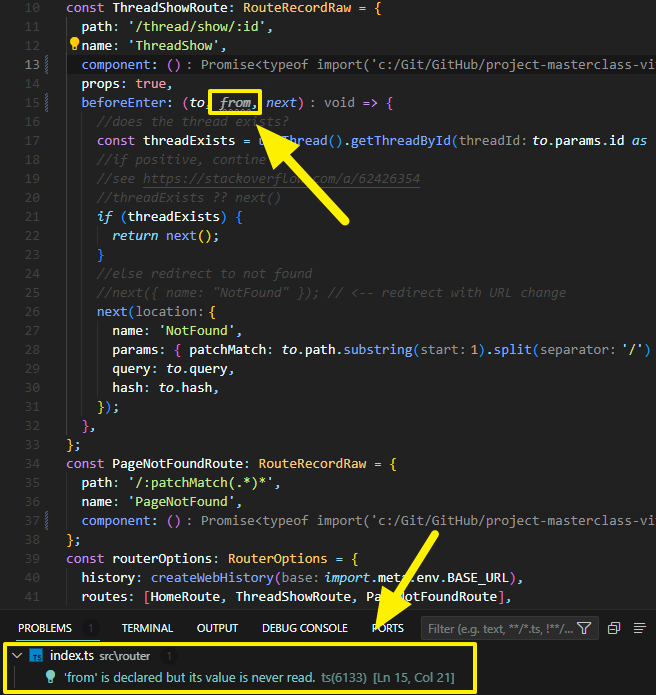

I am pretty new to TypeScript, as I am going through the [VueSchool curiculum](https://vueschool.io/courses).

I like what TypeScript brings to the code and how it makes you think more how to write your code.

As I progressed, I wondered about something: how would you solve the TypeScript linting error when an argument in a method is not used but is mandatory ?

Fun fact, I quickly came across this usecase.

In this case, I had no choice. The navigation guard `beforeEnter` requires the second argument to be `from`, even if I don't use it...

How did I fix it? Simple: listen to what ESLint has to say. Sometimes, it provides a quick fix.

In my case, it suggested me to mark the unused argument with a underscore and tada, ESLint became happy.
