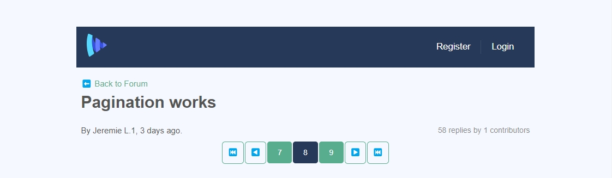

While working on [the Masterclass course at Vueschool.io](https://vueschool.io/the-vuejs-master-class), I was building this awesome pagination from scratch to challenge myself:



You can see it is action on [this demo page](https://vueschool-masterclass-vite.netlify.app/forum/-KvdCowY9mDvM0EH8Pvs) or [this one](https://vueschool-masterclass-vite.netlify.app/thread/-KsjwU_A01lZRcljDlOp).

It contains previous and next page buttons to move one page at a time and a previous and next range for moving forward the pagination to select a specific page.

I used the query string `page=x` in the URL so that the current page would be detected on load and page change.

Once I nailed the algorithm to update the range shown and the logic to display the buttons under some particular state, I tried to integrate it with a parent component.

At first, I used the `updated` hook to manage the change of page and it worked on the vuecli-powered application.

It worked all well with the Option API.

But, after transposing the JavaScript to TypeScript and using the Composition API, the vite-powered application wouldn’t behave as expected on the previous and next page buttons, resulting into a blocked navigation.

What was wrong?

In my `App.vue`, I wasn’t using a unique `:key` on the `router-view` component. This caused the re-render of the page to fail visually.

To solve that, thanks to Daniel Kelly, as [he explained in this lesson](https://vueschool.io/lessons/storing-the-current-page-as-a-url-query-variable), I needed to include the query string in the key.

Before, I had:

```html
<router-view :key="`$route.path" />
```

After, it became:

```html
<router-view :key="`${$route.path}${JSON.stringify($route.query)}`" />
```

On route change, using the `:key` prop is really essential to avoid bugs that this one.
