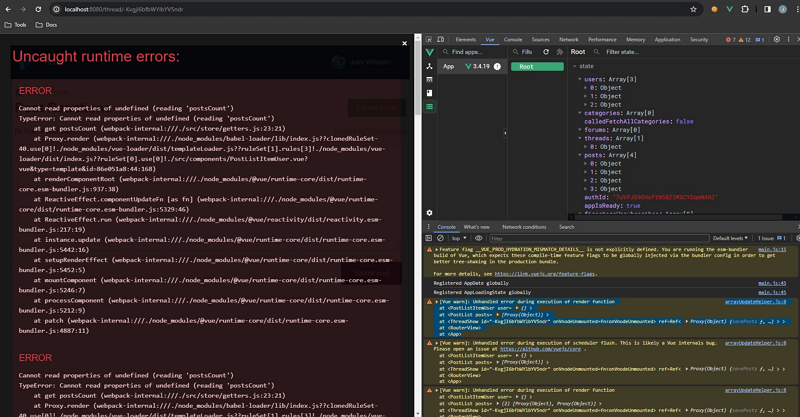

It’s very common to have a parent component, let’s say a forum thread with a list of post, where it (for ex. the thread page) is passing to its child (the post list component) data fetched asynchronously.

In that scenario, you will use the `created` hook (with the Options API) to fetch all the data before showing the page.

And because the fetching is asynchronous, you use `await` on the fetching methods (or actions if you use state management) and `async` on the hook.

For example:

```jsx
async created() {
    const thread = await this.$store.dispatch("fetchThread", {
      id: this.$route.params.id,
    });
    const posts = await this.$store.dispatch("fetchPosts", {
      ids: thread.posts,
    });
    const users = posts.map((post) => post.userId);
    await this.$store.dispatch("fetchUsers", {
      ids: users,
    });
  }
```

Then, you use a `computed` to get the data fetched:

```jsx
//
  computed: {
    threadPosts() {
      const matches = this.$store.getters['posts/getPostsByThread'].filter((post) => post.threadId === this.id);
      return matches;
    }
  }
```

And pass it on to the child in the parent’s template:

```html
<template>
  <div class="col-large push-top">
    ...
    <post-list :posts="threadPosts" />
    ...
  </div>
</template>
```

But, when you test it as it is, you get something like that:



That is because you haven’t told the child component that the data is **ready** and so it tries to load the template and the props are undefined…

However, with Vue, unless the parent tells the children explicitly otherwise, it (Vue) will load all components.

So how do you solve this? It’s so easy: conditionally load the child components awaiting the data from the parent:

```html
<post-list :posts="threadPosts" v-if="$store.getters.isAppIsReady" />
```

`$store.getters.isAppIsReady` is a _getter_ that you set to true when the data fetching completes in the `created` hook.

Or you can also define the parent’s template with two sections:

- one that is the loading section, shown while the `created` hook fetches the data
- one that the page loads when the data is ready.

```html
<template>
  <app-loading-state
    v-if="!$store.getters.isAppIsReady"
    message="Loading the thread... Please wait ⌛"
  />
  <section v-else>
    <div class="col-large push-top">
      ...
      <post-list :posts="threadPosts" />
      ...
    </div>
  </section>
</template>
```

So when a child component appears to be missing data it receives through props, check that the parent handle properly the fetching of asynchronous data.

Credit: Photo by [Ferenc Almasi](https://unsplash.com/@flowforfrank?utm_content=creditCopyText&utm_medium=referral&utm_source=unsplash) on [Unsplash](https://unsplash.com/photos/text-ayjnmG4oUX4?utm_content=creditCopyText&utm_medium=referral&utm_source=unsplash)
