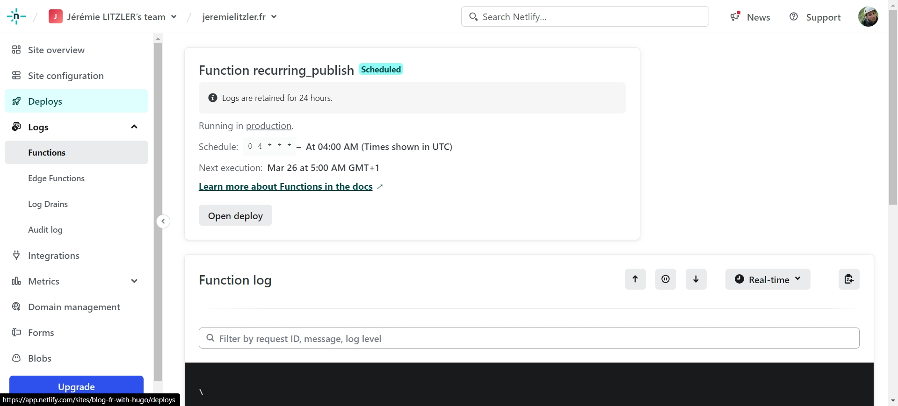

Why did I need that?

Using Hugo as a SSG (Static Site Generator), you can write an article and set the publish date in the future.

However, because of how SSG work, you would need a build to publish the article on the publish date.

So how?

Using EasyCron and the Netlify deploy hooks, it is possible. FOR FREE!

No need of a Zapier account.

Thanks to [Talves](https://answers.netlify.com/u/talves) on [this forum thread](https://answers.netlify.com/t/scheduling-builds-and-deploys-with-netlify/2563/5) and [this guide](https://www.raymondcamden.com/2022/02/04/an-early-look-at-netlify-scheduled-functions) (even if the solution is a bit obsolete), I manage to find the solution.

Here are the steps:

- install Netlify CLI:

```bash
npm i -D netlify-cli*
```

- install _@netlify/functions_ package:

```bash
npm i @netlify/functions*
```

- add a npm script: _"netlify": "netlify"_ to be able to run the CLI to create the function.
- create a function using the CLI:

```bash
npm run netlify functions:create recurring_publish*
```

- add where the functions are store in _netlify.toml_:

```toml
[build]
ignore = "exit 1"
publish = "public"
functions = "functions" #the function was create into the directory 'functions' at the root of your repository.
```

- use this code (i’ve commeted it heavily) :

```jsx
/**
 * Import the schedule function to use cron expression
 * for recurring functions.
 */
import { schedule } from "@netlify/functions";
import { log } from "console";
log("RECURRING_PUBLISH>Starting registering recurring-publish function...");
/**
 *
 * @param {Object} event The event sent by Netlify CD
 * @returns
 */
const handler = async (event) => {
  log("RECURRING_PUBLISH>Starting function");
  log("RECURRING_PUBLISH>event", event);
  /**
   * Environment variables are retrieved via process.env
   * but not the global object `Netlify.env` as some docs
   * suggests. Or it requires a certain package. The said-
   * docs don't mention it.
   *
   * @see https://docs.netlify.com/functions/get-started/?fn-language=ts#environment-variables
   *
   * For setting Environment Variable, your app deploy settings and the
   * "Environment Variables" blade.
   *
   * @see https://docs.netlify.com/configure-builds/environment-variables/
   */
  let RECURRING_BUILD_HOOK = process.env.RECURRING_BUILD_HOOK;
  log(
    "RECURRING_PUBLISH>Got RECURRING_BUILD_HOOK variable =>",
    RECURRING_BUILD_HOOK
  );
  log("RECURRING_PUBLISH>Fetching as POST the RECURRING_BUILD_HOOK...");
  /**
   * Note: because functions use the standard Fetch API,
   * which was only added natively to Node.js in version
   * 18.0.0, no need for other libraries...
   *
   * As of March 25th 2024, it should be fine.
   * @see https://docs.netlify.com/functions/get-started/?fn-language=ts#runtime
   */
  try {
    await fetch(RECURRING_BUILD_HOOK, { method: "POST" });
    log("RECURRING_PUBLISH>Build hook fetch success!");
    return {
      statusCode: 200,
      body: JSON.stringify({ message: `Build ran successfully.` }),
    };
  } catch (error) {
    log("RECURRING_PUBLISH>Build hook fetch error!");
    return { statusCode: 500, body: error.toString() };
  }
};

let RECURRING_PUBLISH_CRON = process.env.RECURRING_PUBLISH_CRON;
/**
 * This was my attempt to use an environment variable to configure the cron.
 * But Netlify build agent tells me it is not possible...
 * Though the logs show the variable is read.
 */
log(
  "RECURRING_PUBLISH>Got RECURRING_PUBLISH_CRON variable =>",
  RECURRING_PUBLISH_CRON
);
//module.exports.handler = schedule(RECURRING_PUBLISH_CRON, handler);
//module.exports.handler = schedule("*/5 * * * *", handler);//every 5 min
module.exports.handler = schedule("0 4 * * *", handler); //every day at 4am GMT
log("RECURRING_PUBLISH>Done registering");
```

- push everything for a new build.

At the end of the build, check _Logs > Functions_ blade under your app:



The _recurring_publish_ function should appear and tell you it will run the next cron time, in the example at 4:00AM GMT time.

NB: you cannot use an environment variable to define the CRON value as Netlify will tell you:

```log
9:25:40 AM:   Unable to find cron expression for scheduled function.
              The cron expression (first argument) for the `schedule` helper needs to be
              accessible inside the file and cannot be imported.
```
