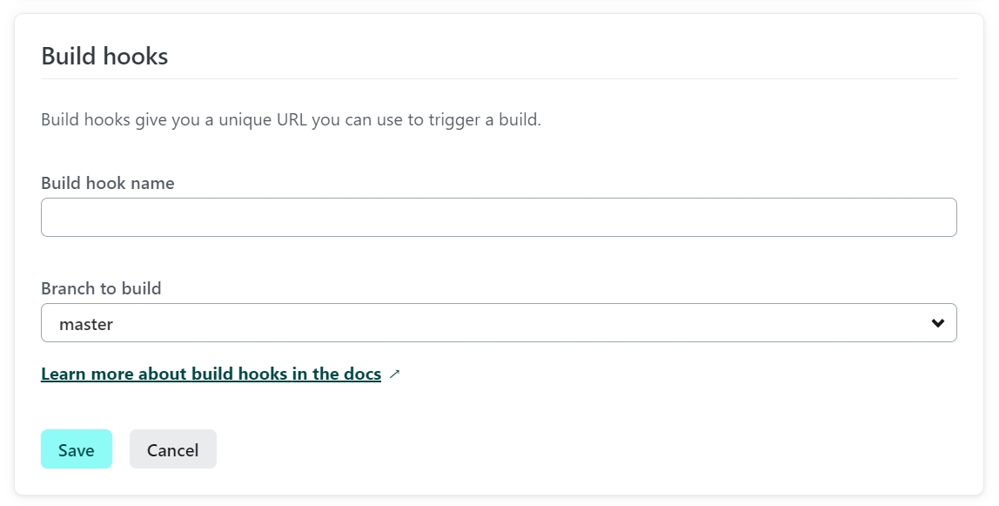

Why did I need that?

Using Hugo as a SSG (Static Site Generator), you can write an article and set the publish date in the future.

However, because of how SSG work, you would need a build to publish the article on the target date.

I could easily trigger the build manually from the Netlify dashboard, but wouldn’t it be better to have an automated process handle this. So how do you automate the build?

Thanks to [Talves](https://answers.netlify.com/u/talves) on [this forum thread](https://answers.netlify.com/t/scheduling-builds-and-deploys-with-netlify/2563/5) that pointed me to [this guide](https://www.raymondcamden.com/2022/02/04/an-early-look-at-netlify-scheduled-functions) (even if the solution is a bit obsolete), I manage to find the solution from that starting point.

Here are the steps:

## In the Netlify Dashboard

- Create a Build hook from `https://app.netlify.com/sites/<your-site-name>/configuration/deploys`

  - Select your site
  - Then, go to `Deploys` blade in the primary menu.
  - Then, select `Deploy settings`
  - By default, you’re in the proper screen (`Build & deploy > continuous deployment`). There, scroll down `Build hooks`.
  - Click `Add build book`
  - Give a name to the hook like _Daily publish_ and select the branch you want to target.

  

  - Click _Save_ and copy the URL.

- Next, go to `Environment variables` that is a little bit down this secondary blade menu.

  

- Add a new environment variable that you’ll call `RECURRING_PUBLISH` and paste the copied URL as the value.





## In your IDE with a clone of your repository

- Install Netlify CLI as a development dependency on your repository:

  ```bash
  npm i -D netlify-cli*
  ```

- Install _@netlify/functions_ package so that Netlify knows how to run your function, e.g., the scheduling part:

  ```bash
  npm i @netlify/functions*
  ```

- Add a _npm_ script: to be able to run the CLI to create the function:

  ```json
  "netlify": "netlify"
  ```

- Create a function using the CLI:

  ```bash
  npm run netlify functions:create recurring_publish*
  ```

- Add specify where you store the functions in `netlify.toml` file:

  ```toml
  [build]
  ignore = "exit 1"
  publish = "public"
  functions = "functions" #the function was create into the directory 'functions' at the root of your repository.
  ```

- Use this function code (I’ve commented on it heavily) :

```jsx
/**
 * Import the schedule function to use cron expression
 * for recurring functions.
 */
import { schedule } from "@netlify/functions";
import { log } from "console";
log("RECURRING_PUBLISH>Starting registering recurring-publish function...");
/**
 *
 * @param {Object} event The event sent by Netlify CD to the function.
 * @returns
 */
const handler = async (event) => {
  log("RECURRING_PUBLISH>Starting function");
  log("RECURRING_PUBLISH>event", event);
  /**
   * Environment variables are retrieved via process.env
   * but not the global object `Netlify.env` as some docs
   * suggests.
   * Or it requires a certain package. The said-
   * docs don't mention it.
   *
   * @see https://docs.netlify.com/functions/get-started/?fn-language=ts#environment-variables
   *
   * For setting Environment Variable, go to your app deploy settings and select the "Environment Variables" blade.
   *
   * @see https://docs.netlify.com/configure-builds/environment-variables/
   */
  let RECURRING_BUILD_HOOK = process.env.RECURRING_BUILD_HOOK;
  log(
    "RECURRING_PUBLISH>Got RECURRING_BUILD_HOOK variable =>",
    RECURRING_BUILD_HOOK
  );
  log("RECURRING_PUBLISH>Fetching as POST the RECURRING_BUILD_HOOK...");
  /**
   * Note: because functions use the standard Fetch API,
   * which was only added natively to Node.js in version
   * 18.0.0, no need for other libraries...
   *
   * As of March 25th 2024, it should be fine.
   * @see https://docs.netlify.com/functions/get-started/?fn-language=ts#runtime
   */
  try {
    await fetch(RECURRING_BUILD_HOOK, { method: "POST" });
    log("RECURRING_PUBLISH>Build hook fetch success!");
    return {
      statusCode: 200,
      body: JSON.stringify({ message: `Build triggered successfully.` }),
    };
  } catch (error) {
    log("RECURRING_PUBLISH>Build hook fetch error!");
    return { statusCode: 500, body: error.toString() };
  }
};

/**
 * This was my attempt to use an environment variable to configure the cron.
 * But Netlify build agent tells me it is not possible...
 * Though the logs show the variable is read...
 */
let RECURRING_PUBLISH_CRON = process.env.RECURRING_PUBLISH_CRON;
log(
  "RECURRING_PUBLISH>Got RECURRING_PUBLISH_CRON variable =>",
  RECURRING_PUBLISH_CRON
);
//module.exports.handler = schedule(RECURRING_PUBLISH_CRON, handler);
//module.exports.handler = schedule("*/5 * * * *", handler);//every 5 min
module.exports.handler = schedule("0 4 * * *", handler); //every day at 4am GMT
log("RECURRING_PUBLISH>Done registering");
```

- Push everything for a new build.

## Back on Netlify Dashboard

At the end of the build, check _Logs > Functions_ blade under your app:


The _recurring_publish_ function should appear and tell you it will run the next `cron` time, in the example at 4:00 AM GMT time.

NB: you can’t use an environment variable to define the `cron` value as Netlify will tell you:

```log
9:25:40 AM:   Unable to find cron expression for scheduled function.
              The cron expression (first argument) for the `schedule` helper needs to be
              accessible inside the file and cannot be imported.
```

This procedure works as of April 8, 2024.

Since I’m using it for my two blogs, if it breaks, I will update this article accordingly.

Thanks for reading this far and enjoy your scheduled Netlify builds.
