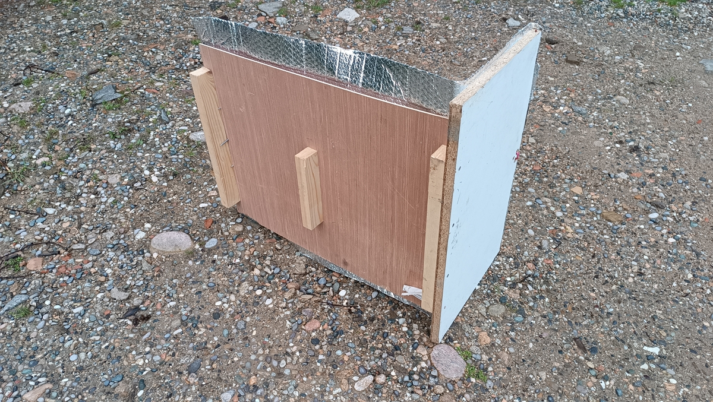
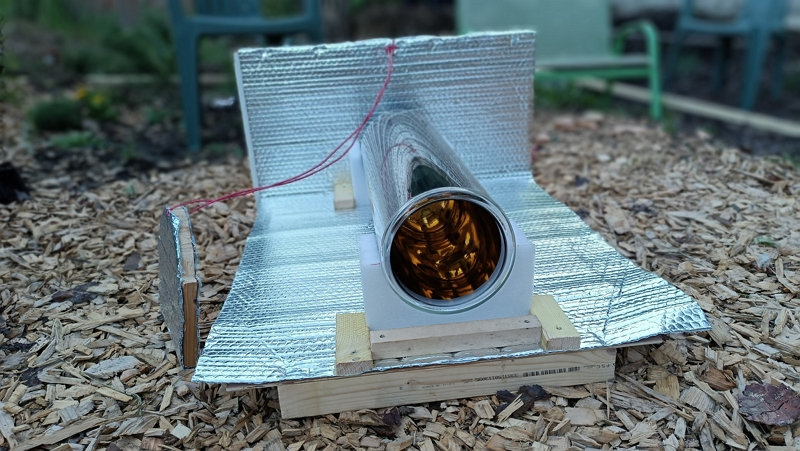
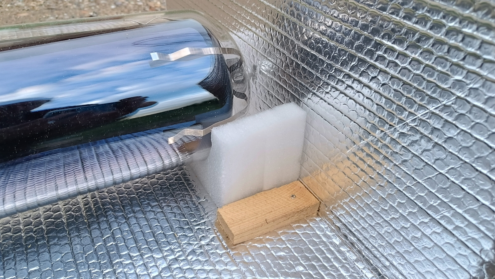
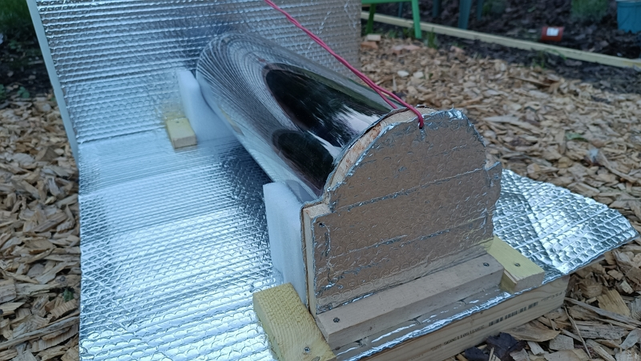
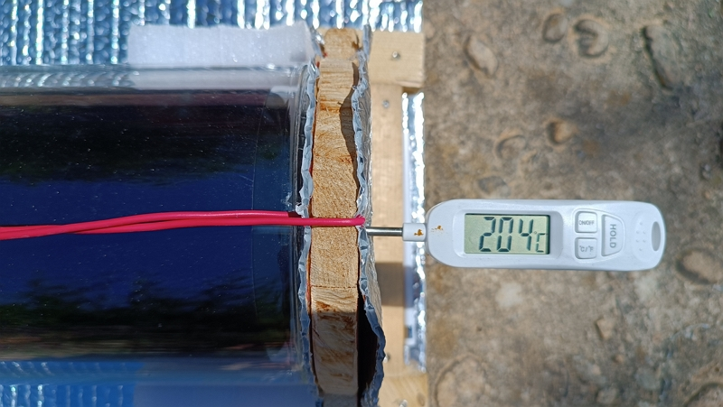
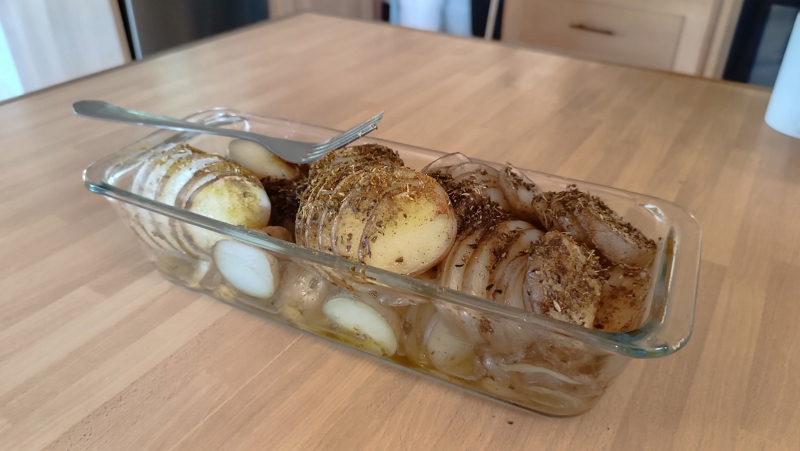

First of all, thanks to “**[DU SOLEIL DANS NOS ASSIETTES](https://www.dusoleildansnosassiettes.com/content/22-tubes-solaires)**”. I discovered them the “Archipelle” YoutTube channel on [this video](https://www.youtube.com/watch?v=fAYNytaWxBg&t=1698s).

David, the interviewee explains in detail how it works for the baking tube and another one used for sterilization.

In this article, I’ll be talking about the baking tube that you can use as an oven.

## The baking tube

It measures **13.5 cm** (+/- 2 mm) **inner diameter**, **16 cm outside** for a **length of 61.4 cm.**.

I made the **tube holder** from **packaging foam**, that comes with the tube to protect it, and scraps of planks and slats.

According to [**“DU SOLEIL DANS NOS ASSIETTES”**](https://www.dusoleildansnosassiettes.com/content/22-tubes-solaires):

> Temperatures go up to around 180°, making this oven suitable for gratins, cakes, lasagna, vegetables or rice. You could possibly use it 2/3 of the year.

More on this below.

## Where to order

With the baking tube, you can cook food as if it were in an oven.

To do this, you need to [order a tube (France-resident customers only)](https://www.dusoleildansnosassiettes.com/boutique/21-tube-de-sterilisation-solaire.html) (120 euros incl. VAT) from the [“DU SOLEIL DANS NOS ASSIETTES” website](https://www.dusoleildansnosassiettes.com/content/22-tubes-solaires)\*\* and collect it from a relay point near you.

This is likely not unique to France. So search in your country if you don’t reside in France and let us know.

## Building the stand

Next, we will look at building the wooden stand.

I used:

- for the base: a piece of plywood slightly longer than the tube, and almost as wide as it’s long,
- for the bottom: a piece of chipboard a twice higher than the tube
- for the energy boost: a 3 mm double-sided aluminized film with bubbles to optimize performance.
- for the support legs: offcuts of fir slats
- for the door:
  - one piece of fir plank (18 mm thick)
  - a piece of electrical cable to keep the door closed.

The wooden stand is easy to build.

I cut the slats to the width of the plywood piece to use as feet.

Then I screwed on the chipboard bottom.

Next, I stapled the aluminized foil thermal insulation to the entire base and back.

I cut in half one of the foam protectors. They come with the tube to stabilize and protect it during tranportation. I then stapled them to the plywood base.

For the door, I cut a piece of the fir plank to the diameter of the tube, then cut the top half to fit the tube rounded shape.

I made two holes:

- one to insert the thermometer to measure the live temperature while cooking.
- one for the cable to hold the door closed.

Finally, I installed the electrical cable to keep the door tightly closed, using the chipboard as the holder.

## Observations from the first test

At 10 a.m. on May 12, the sun peeks over our hill (yes, the sun rises late here because of the terrain).

Within seconds, the temperature immediately rises!



Two hours later (for the first test, I wasn’t around all the time), the temperature reached 204 °C. You could say that the preheating succeeded!

We then prepared potatoes cut into 5 mm slices.

After 30 min, the temperature reached 135 °C.

After one hour thirty minutes, we gained 10 °C more and the potatoes on top were “aldente”.

After two hours thirty minutes, cooking ends and the temperature has reached 155 °C. The potatoes on the bottom are a little undercooked, but overall, they’re fine to eat.

So, yes, it’s not crispy, because the moisture from cooking has stayed inside and there’s no “resistance” to grill the food prepared.

However, according to David, as long as you have moisture (I had put a little water in the bottom of the dish), the risk of messing up the preparation doesn’t exist.

## Conclusion

Two hours of cooking time should suffice next time, as having opened and closed 3 times to check for doneness, we lost heat each time.

However, it quickly returned to the max. temperature before opening.



It’s worth noting that the temperature with no load and under load differ significantly. I think this is because the mass of the food to cook is relatively “cold” and, of course, slower to heat, compared to air.

Now, is it possible to bake bread in this tube? Perhaps, but without too much opening and closing during baking. I think I’ll ask David if he has tried it.

I also know that I have put it in the first thing in the morning and for most of the day.

Before that, we’ll try baking a clafoutis. It’s risk-free and we know how to prepare it and we have cooked in an electric oven at 150°C.

If you like what I write, please let me know [on X](http://www.twitter.com/share) or [by helping me](../../../page/sponsor-me/index.md).

Thank you 👏.
