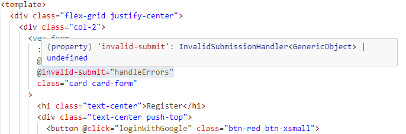

In the [old masterclass of VueSchool.io](https://vueschool.io/courses/the-vuejs-3-options-api-master-class), I used the `@invalid-submit` in the template.

In the custom function `handleErrors`, I needed to type the input argument.

## How did you find what to set?

I hovered the emit on the VeeForm component:



While the exact type is `InvalidSubmissionHandler<GenericObject> | undefined`, I remove the `undefined` to be able to destructure the object:

```ts
const handleErrors = ({
  errors,
  results,
}: InvalidSubmissionContext<GenericObject>) => {
  console.log("UserRegister>handleErrors>errors", errors);
  console.log("UserRegister>handleErrors>results", results);
};
```

This way, I could use the `errors` and `results` variables in the method. Of course, check for `undefined` value before you access them.

Using the exact type prevent the intellisense but you’ll need to give up the destructuring if you absolutely want the type safety.

Credit: Header photo is the homepage of VeeValidate website by [VeeValidate Team](https://vee-validate.logaretm.com/v4/).
