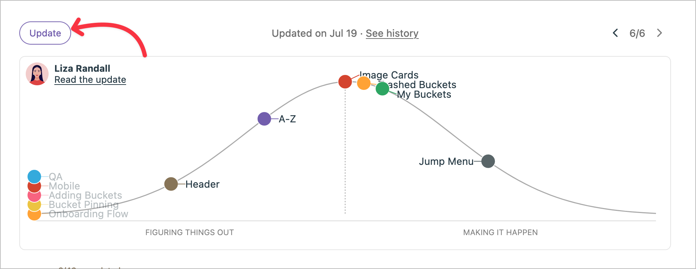

## Introduction

We know Basecamp as a software company building innovative approaches to work. The company introduced “Shape Up” in 2018 by Ryan Singer, Basecamp’s Head of Strategy, as an alternative to traditional agile methodologies.

It originates from Basecamp’s own experiences and need for a more focused approach to product development.

The free online book “[Shape Up: Stop Running in Circles and Ship Work that Matters](https://basecamp.com/shapeup)” describes the methodology in detail.

### Key Steps

You’ll find 4 steps to shape up your projects:

1. Shaping: Defining and outlining potential projects
2. Betting: Deciding which shaped projects to pursue
3. Building: Six-week cycle of focused development
4. Cool-down: Two-week period for reflection and preparation

Let’s dive in more detail about each step.

## 1. Shaping

We call _Shaping_ the initial phase when the team defines projects at a high level. It includes outlining the problem and solution, setting boundaries, identifying risks, and determining the appropriate time investment or “appetite.”

### What Shaping Includes and Doesn’t Include

It includes a high-level problem definition, solution outlines, rough sketches, risk identification.
However, you should go into detailed specifications, pixel-perfect designs, comprehensive feature lists, precise time estimates.

### Completion Criteria

Shaping is complete when the work is “shaped”—e.g. well-defined but flexible, with clear boundaries and identified risks, ready for the betting phase.

## 2. Betting

In the betting phase, stakeholders review shaped work and decide which projects to pursue in the upcoming cycle.

### How Is the Betting Process Organized

First, the senior leadership bet on the shaped projects. It occurs before each six-week cycle, at the cool down phase, described below.

It’s about decision making: projects are fully committed to or not at all, based on potential impact and available resources. Non-selected projects enter the pool for the next betting phase or might even be reshaped based on the feedback gathered during a cycle.

Finally, the leadership assigns small teams on bet-on projects.

## 3. Building

The building phase is a six-week cycle where teams work autonomously to complete their assigned projects.

### Building Process and Best Practices

Small, autonomous teams work without interruption.

The team visualizes progress using “hill charts”.

Source: [from basecamp-help.com](https://3.basecamp-help.com/article/412-hill-charts)

The team actively manages scope through “scope hammering”. The principle comes down to take out what isn’t essential. See below about “Scope Cutting Limits”.

No daily stand-up occurs and communication is asynchronous.

Shipping complete projects is the focus of the team, albeit potentially reduced in functionality.

### QA During Building

The team integrates QA throughout the development process.

The methods used include the well-know methods: TDD, pair programming, automated testing, continuous integration, manual and exploratory testing.

### Scope Cutting Limits

Cutting out must preserve core value and problem-solving capability.

It shouldn’t compromise user experience or technical viability.

Also, cuts shouldn’t prevent future extensibility or undermine business goals

## 4. Cool-down and Cycle Completion

After the six-week cycle, there’s typically a two-week cooldown period for reflection, bug fixes, and planning.

The team ships completed work to the customer(s).

The team evaluates the project outcomes and it may not complete unfinished work. It really depends on the next shaping phase.

Also, lessons learned are applied to future shaping and betting and the team prepares for the next cycle to begin.

## Conclusion

What do you think about the Shape Up methodology?

I like the commitment to the selected projects while building and give accountability to build the best product with the key shaping information in a relatively long period. In total, you have 8 weeks to complete a cycle and that seems enough to bring value and quality to a product.

I can’t wait to try it out.



Thanks for reading this article. Make sure to [follow me on X](https://x.com/LitzlerJeremie), [subscribe to my Substack publication](https://iamjeremie.substack.com/) and bookmark my blog to read more in the future.



Credits: header image from [ProductPlan website](https://www.productplan.com/glossary/shape-up-method/).
