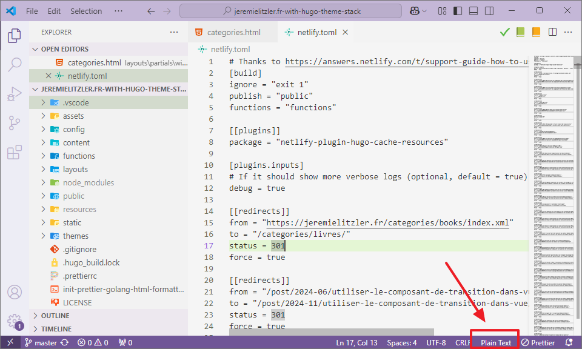
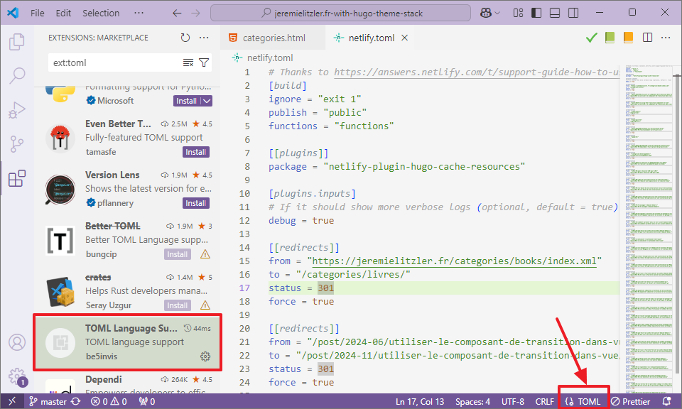
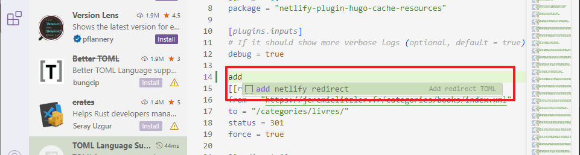

I was having an issue after creating my first `TOML` snippet to use in Visual Studio Code. Here is why it is didn’t work!

## The Snippet

I built this snippet to add a redirect to my `netlify.toml` file:

```toml
{
  "Add redirect TOML": {
    "scope": "toml",
    "prefix": "add netlify redirect",
    "body": [
      "[[redirects]]",
      "from = \"$1\"",
      "to = \"$2\"",
      "status = 301",
      "force = true",
    ],
    "description": "add a redirect handled by Netlify",
  },
}
```

## The Issue

When I tried to use it my `netlify.toml` file, `add netlify redirect` wouldn't show up... 🤔

Why? The reason is on this screen. Do you see it?



Yes, the “Plain Text” at the bottom. Since I scoped the snippet to work on `toml` code, it makes sense that it doesn't show up... Plain text isn't specified in the snippet's scope.

## The Fix

You simply need to install the "TOML Language Support" extension. Once you enabled the extension, you can use the snippet in `netlify.toml`!

Once this is done, you can see the file association is correct:



And the snippet works:



## Conclusion

Though Visual Studio Code comes with good file association, this was the first time I encountered the issue.

So, if you're like me and you notice a snippet not working, think about looking at the bottom right... 😁



Thanks for reading this article. Make sure to [follow me on X](https://x.com/LitzlerJeremie), [subscribe to my Substack publication](https://iamjeremie.substack.com/) and bookmark my blog to read more in the future.



Photo by [Anete Lusina](https://www.pexels.com/photo/person-choosing-document-in-folder-4792285/).
