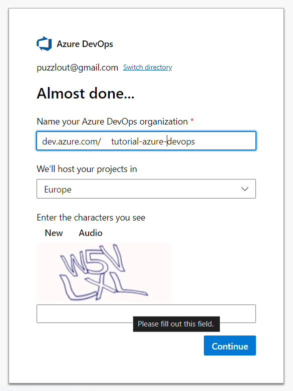
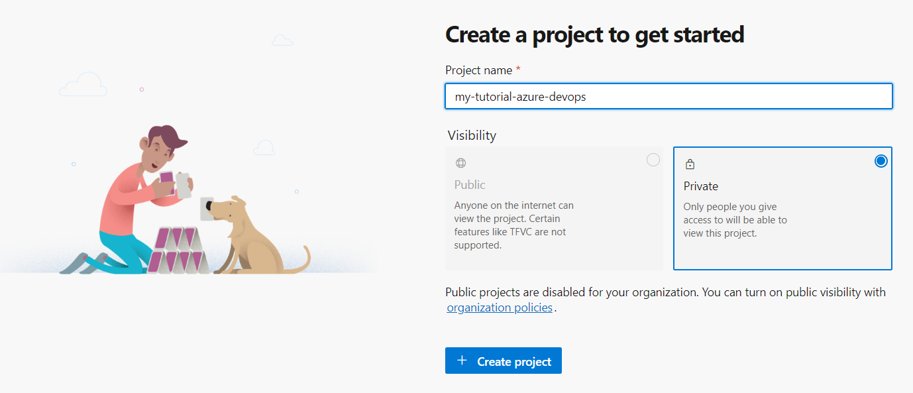
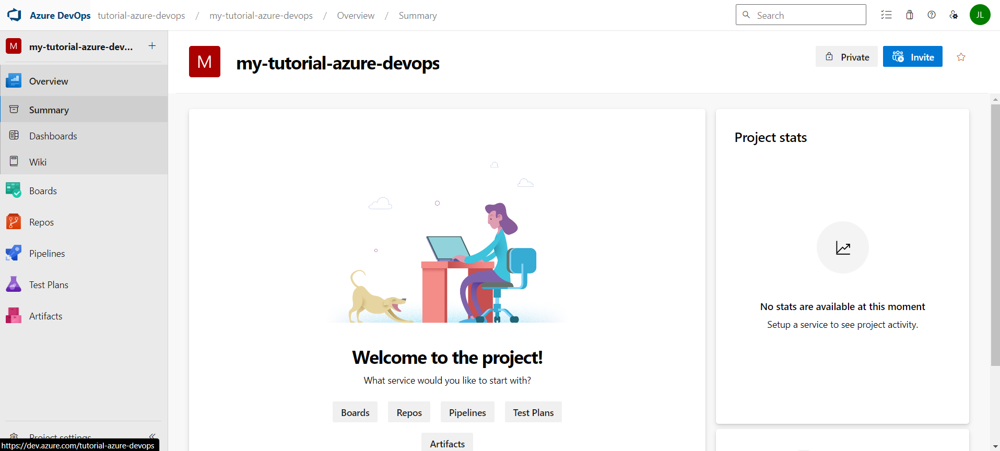
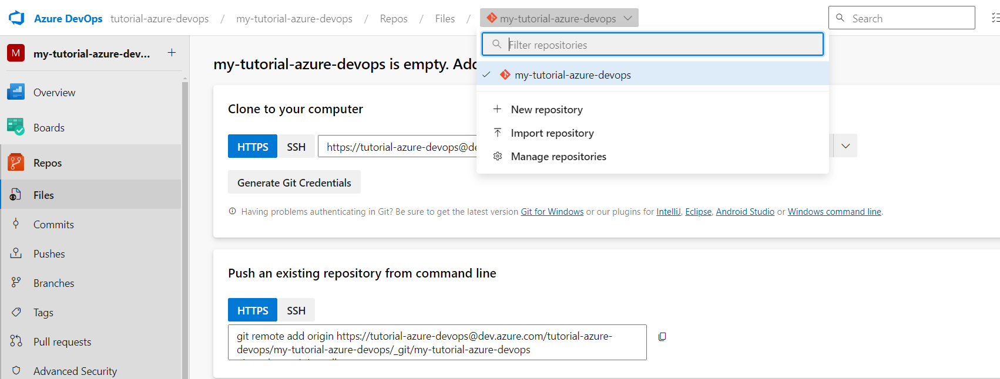
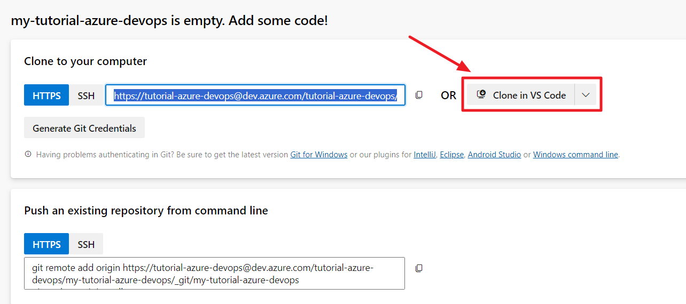

## Why

It provides **flexibility** by allowing integration with various tools and platforms, making it suitable for diverse development environments.

Additionally, Azure DevOps supports **continuous integration and delivery (CI/CD)** pipelines, which automate the build, test, and deployment processes, significantly reducing the time-to-market for software applications.

This automation enhances efficiency and reduces operational risks, making it an attractive choice for businesses seeking to streamline their development processes.

Another key advantage of Azure DevOps is its ability to **foster collaboration** and **improve code quality**.

It offers centralized platforms for code management, project tracking, and team collaboration, ensuring that all stakeholders have visibility into project progress.

Furthermore, Azure DevOps provides **high availability** with a 99.9% uptime SLA and robust security features, making it a reliable choice for businesses.

## Prerequisites

- Create an account on Microsoft. You can use any existing email address and it doesn't have to be a Microsoft one.
- Then browse to:

  ```plaintext
  https://portal.azure.com
  ```

- optin for the free tier
- browse the homepage to create your organization that will enable you to start with DevOps:

  ```plaintext
  https://aex.dev.azure.com/me
  ```

## Creation of the DevOps

Once you’re the `aex.dev.azure.com` page, click _Create an organization_.

Choose a name and choose the region where to host the code you’ll create.







Once the organization is created, DevOps will prompt you to create the first project where you will organize your work, store your code and generate your builds of the applications you’ll craft.

Provide the project name and click _Create project_:







There you are: your free DevOps workspace is ready to use!



## Description Of The DevOps Tools

### From the _Overview_ blade

You can configure some widgets from the screens Summary or Dashboards to view quickly your team's progress.

Also, you access the Wiki, a Markdown-friendly area where you can share processes, how-to and other quick documentation.

I don't find flexibly enough, but having used various versions of Azure DevOps, I see that it has improved over time. For me, the search and the link sharing isn't friendly enough compare to a Hugo website.

### From the _Board_ blade

You can create your stories, tasks and so on to organize your work. As part of the free tier, you’ve got these included:

- Up to 5 users
- Unlimited private Git repositories
- 1 Microsoft-hosted CI/CD parallel job (up to 1800 minutes per month)
- Basic Azure Boards features

You can configure your workflow and define how the workitems should organized according your need (with or without Agility).

### From the _Repos_ blade

You can start storing your code or create a custom repository with another name than the first project’s name.



Use Visual Studio Code and Git on your personal computer and run the command to clone the repository and start coding:

```bash
git clone https://tutorial-azure-devops@dev.azure.com/tutorial-azure-devops/my-tutorial-azure-devops/_git/my-tutorial-azure-devops
```

Or use the button on the DevOps screen:



### From the _Pipelines_ blade

You can configure the logic to generate the application from your reposity’s code and make it ready to deploy.

See this link below what a step-by-step example.

### About _Test Plans_ and _Artifacts_ blades

I’ve not used them so far, it is off-topic in this article for now.

## Conclusion

There you have it! You’re ready to start building your awesome ideas and share them with the world.

Next, go read the article “[\*\*Deploy a REST API Python to Microsoft Azure](../../2024-07/deploy-a-rest-api-python-to-azure/index.md)\*\*” that explains how to deploy a Flask application to Azure from a DevOps repository.



Thanks for reading this article. Make sure to [follow me on X](https://x.com/LitzlerJeremie), [subscribe to my Substack publication](https://iamjeremie.substack.com/) and bookmark my blog to read more in the future.



Photo by [Jakub Zerdzicki](https://www.pexels.com/photo/close-up-of-a-3d-printer-extruding-orange-plastic-31137405/)
