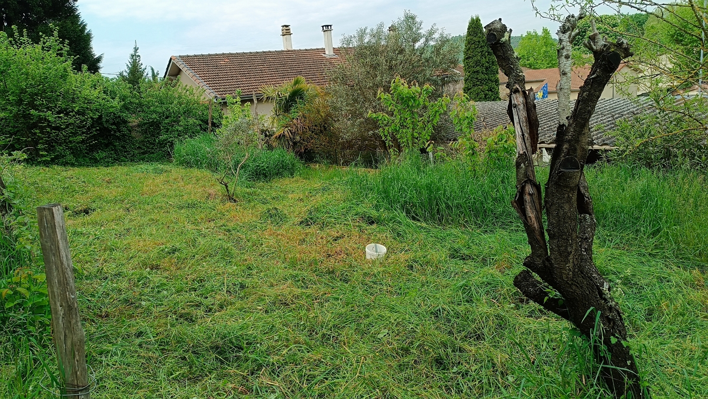
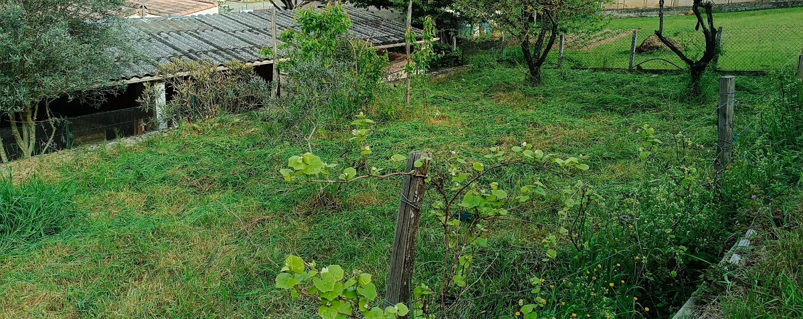

In 2024, [I bought this cordless trimmer](https://www.amazon.fr/dp/B08LQHKBNT), as I was already equipped with an Einhell battery.

It worked great for my old property, although brambles and stones “consumed” a lot of plastic blades…

## New property, New Challenges

On April 23, 2025, I bought this [_cordless trimmer metal knife set_](https://www.amazon.fr/dp/B088P29JFF) (and potentially [these spare blades](https://www.amazon.fr/dp/B0CZ3FPQ57)) for the trimmer, but… it consumes a lot from the batteries compared to the plastic blades! And you really have to watch out for stones or simply hard branches lying around…

What’s more, on tall grass (> 20 cm), it struggles… so you have to “cut in layers”. Not very efficient, I admit…

Finally, the terrain is uneven, so I’m reluctant to order a mower, because :

- The thermal solution smells bad and is expensive to maintain…
- The electric solution seems complicated in terms of performance over 500 meters square to mown regularly…

And then I remembered a video on the “L’archipelle” channel where Brian [was visiting someone in the Dordogne county of France](https://www.youtube.com/watch?v=mxFKWyC-4RI&t=2027s). And this person, Theud Bald called “Thibaud”, swears only by “oil-free” tools, where human strength and a well-prepared tool are all that’s needed to bring the tool to life and make it effective.

One such tool is the _faulx_ (ancient French writing) or scythe in English. I found another video where he explains [how to make a scythe handle with a branch](https://www.youtube.com/watch?v=R-18PeBxoRM).

I already had my criteria in mind:

- easy to use
- doesn’t break down
- cuts tall grass
- all for a price between 100 and 200 euros.

And then, in the second video, I saw the link to Thibaud’s store: [http://la-frontiere.fr/](http://la-frontiere.fr/).

I ordered [the model “_Falci blade model 128— La polyvalente_” (60 cm)](https://la-frontiere.fr/boutique/lame-de-faux-falci-modele-128-la-polyvalente) with [the handle **_Falci Robuste_** 150 cm](https://la-frontiere.fr/boutique/manche-de-faulx-falci-robuste) and [the synthetic stone](https://la-frontiere.fr/boutique/pierre-a-faux-carborundum-qualite-silicar).

## First Try

Received on April 27, 2025, I quickly tested my scythe and BAM! I’d never used this before and it works straight away. Fortunately, I’m a false left-hander and even with this right-handed scythe, the half-moon movement from right to left felt natural.

So, yes, right off the bat, my daughters told me: “it doesn’t cut” short grass at first glance. Indeed, I didn’t see the efficiency that Thibaud shows in the Archipelle video. But it does cut. I observe greater ease to mown harder or thicker grass when it’s short.

So, maybe I haven’t sharpened the blade enough? Or the uneven terrain too uneven? Thibaud points out that you need to use the Earth’s gravity, and to press the blade to the ground. In my case, I had a bit of trouble at first…

However, after 1 hour of playing with it, I cut 300–400 m2 of tall grass! Satisfying!

## Conclusion

For a first-time user, I think it’s a very good buy and a positive experience, even I haven’t yet got the hang of cutting short grass as neatly as Thibaud or my electric trimmer.

However, now that the grass is short, the electric trimmer will go through much more easily.

So I can tick all the boxes:

- easy to use ✅
- doesn’t break down ✅
- cuts tall grass ✅
- all for a price between 100 and 200 euros ✅: I paid 182.90 euros incl. VAT and shipping for the 2 scythes, the handle and the stone.

BTW, I also ordered a shorter blade, the [_faux Falci modèle 187 — La petite_ (35 cm)](https://la-frontiere.fr/boutique/lame-de-faux-falci-modele-187-la-petite), as I think it will be useful on the steep contours of my property where no mower goes and where the grass grows very high and the bushes numerous are numerous.

To be continued…



Thanks for reading this article. Make sure to [follow me on X](https://x.com/LitzlerJeremie), [subscribe to my Substack publication](https://iamjeremie.substack.com/) and bookmark my blog to read more in the future.


