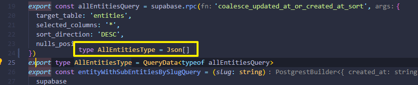

On January 27th, I shared a tip to [use Postgres functions](../../2025-01/the-order-by-clause-with-dates-in-supabase/index.md) to perform an advanced ordering on a table.

Let me show you the error I didn’t catch right away.

## The Issue

On all the code related to the `allEntitiesQuery`, many TypeScript errors showed up.

This first I saw happened to be on the datable columns definition where TypeScript was telling me that the properties of `AllEntitiesType` didn’t.


## The Cause

Supabase’s RPC returns the type according to the function’s return type, as defined in your database schema ([source](https://www.restack.io/docs/supabase-knowledge-supabase-rpc-typescript-guide)).

In my case, I set `RETURNS SETOF json AS $$` and so it did:



Since you can call the function with the table name as an input parameter, the returned type makes sense to me.

## The Fix

To fix this, you need to use Supabase generated types and create a new custom type:

```tsx
import type { Database } from "@/types/DatabaseTypes";

export type EntityRecordWithRpc =
  Database["public"]["Tables"]["entities"]["Row"];
```

Then, you update the returned type to `*as* unknown *as* PostgrestSingleResponse<EntityRecordWithRpc[]>` on the `allEntitiesQuery`.

The TypeScript requires the `as unknown` cast first before the `*as* PostgrestSingleResponse<EntityRecordWithRpc[]>` because neither type sufficiently overlaps with the other (rule _ts(2352)_).

Next, replace all references of `AllEntitiesTypes` to `EntityRecordWithRpc`.

Finish with another run of the build script and no TypeScript errors!

## Conclusion

My takeaway: I need to add a CI step to run the `npm run build` on each PR. A topic for another article. Stay tuned!



Thanks for reading this article. Make sure to [follow me on X](https://x.com/LitzlerJeremie), [subscribe to my Substack publication](https://iamjeremie.substack.com/) and bookmark my blog to read more in the future.



Photo by [Mido Makasardi ©️](https://www.pexels.com/photo/red-led-traffic-cone-2743739/)
