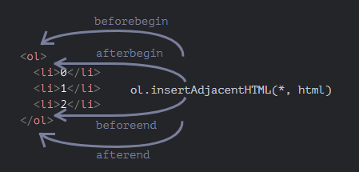
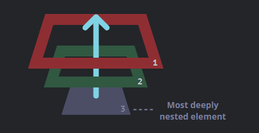
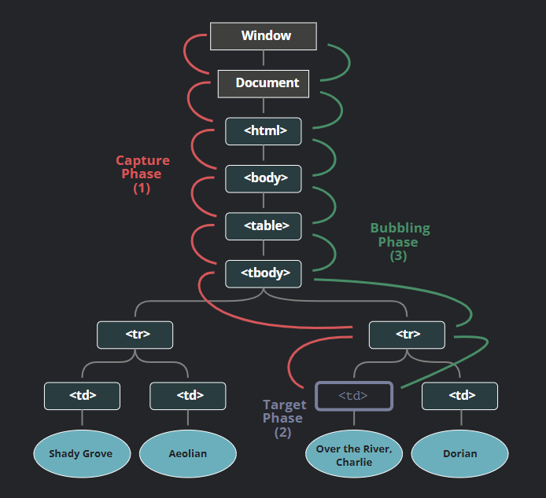
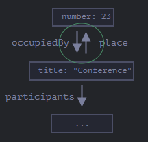

JavaScript is the programming language of the web browser and can also be found on web servers, IoT devices, and more.

You can learn about on those two websites:

- [MDN](https://developer.mozilla.org/en-US/docs/Learn/JavaScript/)
- [JavaScript.info](https://javascript.info)

Both have code examples, exercises and information you should know or be aware of.

All the following is what I’ve found important to take notes of while preparing for the [Certificates.dev JavaScript Mid-level certification](https://certificates.dev/javascript).

Let’s dive in!

## JavaScript Fundamentals

### Intro to JavaScript

For this exam, Certificates.dev expect that you should be familiar with both the basics of JavaScript and more intermediate concepts. This chapter gives a refresher of the basics that you review in their Junior Level Certification.

### Basic Debugging

During the certification exam, you should know simple issues you might face writing JavaScript and how you can fix those issues using the console and **`console.log`**.

### Variables and Data Types

Variables are like containers where you can store and label different types of information. That information can be a string of characters like those that makeup your name or a number that can be used in Math equations, like your age, or a variety of other types.

During the exam you’ll need to know the various ways of declaring variables with **`let`** and **`const`**. You’ll also need to be familiar with primitive data types like strings, numbers, and booleans. Later on we’ll also discuss more complex types, like arrays and objects.

<!-- - [**MDN > Storing the information you need — Variables**](https://developer.mozilla.org/en-US/docs/Learn/JavaScript/First_steps/Variables)
- [**JavaScript.info > Variables**](https://javascript.info/variables)
- [**JavaScript.info > Data types**](https://javascript.info/types)
- [**MDN > Handling text — strings in JavaScript**](https://developer.mozilla.org/en-US/docs/Learn/JavaScript/First_steps/Strings)
- [**MDN > Useful string methods**](https://developer.mozilla.org/en-US/docs/Learn/JavaScript/First_steps/Useful_string_methods) -->

My notes were the following:

- Using `string[index]` , you can access the character at the index, or position in the string, if it’s a valid index.
- Variables named `apple` and `APPLE` are two different variables.
- Even if without `use strict` we can create a variable without an assignment, it’s strongly recommended not to!
- Hoisting is declaring a variable anywhere in the code and this is equivalent to declaring it at the top. It’s performed before any execution occurs.
- However, `var` declarations are only hoisted to the top of the current script. If you have two `<script>` elements within one HTML, the first script can’t access variables declared by the second before the second script has been processed and executed.
- The meaning of `undefined` is “value isn’t assigned”.

### Basic Operators

For the exam, you should know how to use operators to perform match operations and comparisons.

- [**MDN > Basic math in JavaScript — numbers and operators**](https://developer.mozilla.org/en-US/docs/Learn/JavaScript/First_steps/Math)
- [**JavaScript.info > Basic Operators, maths**](https://javascript.info/operators)
- [**JavaScript.info > Comparisons**](https://javascript.info/comparison)

For example, when comparing string, remember that:

1. it compares unicode values so the unicode value of `a` (U+0061) is lower than `ä` (U+00E4).
2. it compares the characters at the same index in both string, one by one until the end of the shorter string is reached or both strings.

The binary `+` always concatenates the operands if one operand is a string.

The unary `+` converts any other type to the number equivalent. Remember: unary takes precedence to binary operation.

The binary `-` convert the operands to numbers. Same with `>` or `<` or `/`or `*`.



No conversion though with `==`.



Number conversion of `undefined` or any alphabetical only `string` produces a`NaN` .

Number conversion makes`null` become a `0` .

Be careful:

```jsx
alert(null === undefined); // false
alert(null == undefined); // true
```

Don’t use comparisons `>=`, `>`, `<` or `<=` with a variable which may be `null/undefined`, unless you’re really sure of what you’re doing.

The *prefix* form (for ex: `++counter`) increments `counter` and returns the **new value**. However the *postfix* form (for ex: `counter++`) increments `counter` and returns the **old value**.

### Arrays

Arrays allow us to store lists of data. For example, a list of products to display on an e-commerce site or a list of news articles to browse through.

For the exam, you should know the basics of working with arrays; things like: getting array length, adding new items to arrays, accessing an item at a specific index, removing items from arrays, and more.

For this exam, you’ll also need to know advanced array methods but we’ll cover that in the Advanced Array and Object Methods chapter.

<!-- - [**MDN> Arrays**](https://developer.mozilla.org/en-US/docs/Learn/JavaScript/First_steps/Arrays)
- [**JavaScript.info - Arrays**](https://javascript.info/array)
- [**JavaScript.info > Array Methods**](https://javascript.info/array-methods) -->

For example, `someArray.at(-1)` is equivalent to `someArray[someArray.length - 1]`.

But you can’t go beyond the array length negatively as you can go positively. Otherwise, you get a `undefined`.

Methods `push/pop` run fast, while `shift/unshift` are slow.

Use `for...of` on arrays if you don’t need the index.



⚠️ DON’T USE `for...in` on arrays!

⚠️ DON’T ASSIGN property `length` of an array… or suffer the consequences!

⚠️ About `(0 == [])` is equivalent to `(0 == '')`, that itself is equivalent to `(0 == 0)` that finally is `true`.



### Control Structures

Conditionals are how we give our code the ability to make decisions based on the values of our variables. Loops are useful for doing the same thing over and over again.

<!-- - [**JavaScript.info - Conditional Branching**](https://javascript.info/ifelse)
- [**JavaScript.info - Logical operators**](https://javascript.info/logical-operators)
- [**MDN > Looping code**](https://developer.mozilla.org/en-US/docs/Learn/JavaScript/Building_blocks/Looping_code)
- [**JavaScript.info - Loops: while and for**](https://javascript.info/while-for)
- [**JavaScript.info - The “switch” statement**](https://javascript.info/switch) -->

For example, the precedence of AND (`&&`) operator is higher than OR (`||`).

The `do...while` syntax should only be used when you want the body of the loop to execute **at least once** regardless of the condition being truthy. Otherwise, the other form is preferred: `while(…) {…}`.

Understand the `for` loops below:

```jsx
for (; i < 3; i++) {
  // no need for "begin"
  alert(i); // 0, 1, 2
}

for (; i < 3; ) {
  alert(i++);
}

for (;;) {
  // repeats without limits
}
```

You can label imbricated loops to beak/continue the outer one:

```jsx
outer: for (let i = 0; i < 3; i++) {
  for (let j = 0; j < 3; j++) {
    let input = prompt(`Value at coords (${i},${j})`, "");

    // if an empty string or canceled, then break out of both loops
    if (!input) break outer; // whereas a simple `break` stop the inner loop

    // do something with the value...
  }
}
```

**Any expression can be a `switch/case` argument:**

```jsx
let a = "1";
let b = 0;

switch (+a) {
  case b + 1:
    alert("this runs, because +a is 1, exactly equals b+1");
    break;

  default:
    alert("this doesn't run");
}
```

Also, equality check is always strict on a switch.

### Functions

Functions allow you to store a piece of code that does a single task inside a defined block. Then call that code whenever you need it using a single short command — rather than having to type out the same code multiple times.

<!-- - [**MDN > Functions — reusable blocks of code**](https://developer.mozilla.org/en-US/docs/Learn/JavaScript/Building_blocks/Functions)
- [**MDN > Function return values**](https://developer.mozilla.org/en-US/docs/Learn/JavaScript/Building_blocks/Return_values)
- [**JavaScript.info > Functions**](https://javascript.info/function-basics)
- [**JavaScript.info > Function expressions**](https://javascript.info/function-expressions)
- [**JavaScript.info > Arrow functions, the basics**](https://javascript.info/arrow-functions-basics) -->

Learn the various syntax for defining functions, how to call functions, and how to make them flexible with arguments.

If a same-named variable is declared inside the function then it shadows the outer one. For instance, in the code below the function uses the local `userName`. The _outer one_ is ignored:

```javascript
let userName = "John";

function showMessage() {
  let userName = "Bob"; // declare a local variable

  let message = "Hello, " + userName; // Bob
  alert(message);
}

// the function will create and use its own userName
showMessage();

alert(userName); // John, unchanged, the function did not access the outer variable
```

Minimize the use of global variables.

A parameter is the variable listed inside the parentheses in the function declaration (it’s _a declaration time term_).

An argument is the value that is passed to the function when it’s called (it’s a _call time term_).

A function returns `undefined` by default if no `return` or an empty `return` is used.



⚠️ A function should do exactly what is suggested by its name, no more.



**A Function Expression is created when the execution reaches it and is usable only from that moment. So it can’t be called before.**

Contrary, a **Function Declaration can be called earlier than it’s defined. However, in strict mode, when a Function Declaration is within a code block, it’s visible everywhere inside that block, but not outside of it.**

In arrow functions, `this` is undefined! Arrow functions don’t have their own `this`. Consequently, they don’t have the special `arguments` object either.

Below, `arguments` corresponds to the `sayHi` method.

```jsx
function defer(f, ms) {
  return function () {
    // arguments = string "John" = parameter "who" of `sayHi`
    setTimeout(() => f.apply(this, arguments), ms);
  };
}

function sayHi(who) {
  alert("Hello, " + who);
}

let sayHiDeferred = defer(sayHi, 2000);
sayHiDeferred("John"); // Hello, John after 2 seconds
```

Without arrow function, we’d write the following code:

```jsx
function defer(f, ms) {
  return function (...args) {
    let ctx = this;
    setTimeout(function () {
      return f.apply(ctx, args);
    }, ms);
  };
}
```

<!--
See also [Certification Junior JavaScript Developer](https://www.notion.so/Certification-Junior-JavaScript-Developer-1b3115a9e178801eb23bd8db61ebf5d4?pvs=21). -->

### Objects

Objects are data structures used for grouping variables (properties) together with related functions (methods).

<!-- - [**MDN > JavaScript Object Basics**](https://developer.mozilla.org/en-US/docs/Learn/JavaScript/Objects/Basics)
- [**JavaScript.info - Objects**](https://javascript.info/object)
- [**JavaScript.info - Object references and copying**](https://javascript.info/object-copy) -->

<!-- See also [Certification Junior JavaScript Developer](https://www.notion.so/Certification-Junior-JavaScript-Developer-1b3115a9e178801eb23bd8db61ebf5d4?pvs=21). -->

I talk about this in my notes on the Junior level certification.

## DOM Manipulation

### What is the DOM and Traversing It

The Document Object Model, or DOM for short, represents all page content as objects that can be modified. The **`document`** object is the main “entry point” to the page. We can change or create anything on the page using it. For the exam, know the basics of what the DOM is and how to interact with it.

<!-- - [**JavaScript.info > Browser environment, specs**](https://javascript.info/browser-environment)
- [**JavaScript.info > DOM tree**](https://javascript.info/dom-nodes)
- [**JavaScript.info > Walking the DOM**](https://javascript.info/dom-navigation) -->

So `DOM = Document Object Model` and `BOM = Browser Object Model`.

If we put something after `</body>`, then that is automatically moved inside the `body`, at the end, as the HTML spec requires that all content must be inside `<body>`.

Browsers automatically process errors in the document: close tags, add missing ones (`tbody`) and so on. But in my experience, it doesn’t solve everything. The best is to use a formatter like Prettier in your IDE to know, as you code, when the syntax is incorrect.

In particular, if a script is inside `<head>`, then `document.body` is unavailable, because the browser didn’t read it yet. That’s why scripts are usually put at the bottom of the body tag.

```html
<html>
  <body>
    <div>Begin</div>
    <ul>
      <li>Information</li>
    </ul>
    <div>End</div>
    <script>
      for (let i = 0; i < document.body.childNodes.length; i++) {
        alert(document.body.childNodes[i]); // Text, DIV, Text, UL, ..., SCRIPT
      }
    </script>
    <!-- ...more stuff... -->
  </body>
</html>
```

If we run the example above, the last element shown is `<script>`. In fact, the document has more stuff below, but at the moment of the script execution the browser didn’t read it yet, so the script doesn’t see it.

`childNodes` looks like an array. But actually it’s not an array, but rather a *collection*. You can use `for...of` on it since the `Symbol.iterator`is set.



⚠️ DON’T USE `for...in` on DOM collections.



But you can’t use array methods on DOM collection. To be able to, cast the collection using `Array.from` to transform the collection into an array.



⚠️ DOM collections are read-only.



The `parentElement` property returns the parent “element”, while `parentNode` returns “any node” that is the parent. These properties are usually the same: they both get the parent.

With the one exception of `document.documentElement`:

```jsx
alert(document.documentElement.parentNode); // document
alert(document.documentElement.parentElement); // null
```

### Targeting and Manipulating Elements

With JavaScript, it’s easy to query the DOM for a specific element.

<!--
- [**JavaScript.info > Searching: getElement*, querySelector***](https://javascript.info/searching-elements-dom)
- [**JavaScript.info > Node properties: type, tag and contents**](https://javascript.info/basic-dom-node-properties)
- [**JavaScript.info > Attributes and properties**](https://javascript.info/dom-attributes-and-properties)
- [**JavaScript.info > Modifying the Document**](https://javascript.info/modifying-document)
- [**JavaScript.info > Styles and Classes**](https://javascript.info/styles-and-classes) -->

#### Searching: getElement*, querySelector*



**⚠️ Please don’t use id-named global variables to access elements.**

```javascript
<div id="elem"></div>

<script>
  let elem = 5; // now elem is 5, not a reference to <div id="elem">

  alert(elem); // 5
</script>
```



The method `getElementById` can be called only on `document` object. It looks for the given `id` in the whole document.

Check out the interesting `closest` method:

```jsx
<h1>Contents</h1>
<div class="contents">
  <ul class="book">
    <li class="chapter">Chapter 1</li>
    <li class="chapter">Chapter 2</li>
  </ul>
</div>
<script>
  let chapter = document.querySelector('.chapter'); // LI
  alert(chapter.closest('.book')); // UL
  alert(chapter.closest('.contents')); // DIV
  alert(chapter.closest('h1')); // null (because h1 is not an ancestor)
</script>
```

All methods `"getElementsBy*"` (ByTag, ByName, etc.) return a *live* collection. Such collections always reflect the current state of the document and “auto-update” when it changes.

In contrast, `querySelectorAll` returns a *static* collection.

| Method                   | Searches by… | Can call on an element? | Live? |
| ------------------------ | ------------ | ----------------------- | ----- |
| `querySelector`          | CSS-selector | ✔                      | ❌    |
| `querySelectorAll`       | CSS-selector | ✔                      | ❌    |
| `getElementById`         | `id`         | -                       | ❌    |
| `getElementsByName`      | `name`       | -                       | ✅    |
| `getElementsByTagName`   | tag or `'*'` | ✔                      | ✅    |
| `getElementsByClassName` | class        | ✔                      | ✅    |

#### Nodes properties

The `nodeType` property provides one more, “old-fashioned” way to get the “type” of a DOM node. However, in modern scripts, we sohuld use `instanceof`.

`innerHTML` works on elements objects, not node.



⚠️ Therefore, as the content is “zeroed-out” and rewritten from scratch, all images and other resources will be reloaded.



About `outerHTML` :

```html
<div>Hello, world!</div>

<script>
  let div = document.querySelector("div");
  // replace div.outerHTML with <p>...</p>
  div.outerHTML = "<p>A new element</p>"; // (*)
  // Wow! 'div' is still the same!
  alert(div.outerHTML); // <div>Hello, world!</div> (**)
  p = document.querySelector("p");
  alert(p.outerHTML);
</script>
```

So what happened in `div.outerHTML=...` is:

- `div` was removed from the document.
- Another piece of HTML `<p>A new element</p>` was inserted in its place.
- `div` still has its old value. The new HTML wasn’t saved to any variable.

#### Attributes and properties

The browser parses one-to-one known HTML attributes to DOM properties on an element basis (since they aren’t the same always).

The non-standard attributes aren’t parsed.

All attributes are accessible by using the following methods:

- `elem.attributes`: get all attributes.
- `elem.hasAttribute(name)`: checks for existence.
- `elem.getAttribute(name)`: gets the value.
- `elem.setAttribute(name, value)`: sets the value.
- `elem.removeAttribute(name)`: removes the attribute.

Attribute names are case-insensitive.

Property-attribute synchronization is automatic, but not for `input` ’s value.

Why would using an attribute be preferable to having classes like `.order-state-new`, `.order-state-pending`, `.order-state-canceled`?

Because an attribute is more convenient to manage. The state can be changed as easy as:

```jsx
// a bit simpler than removing old/adding a new class
div.setAttribute("order-state", "canceled");
```

**All attributes starting with “data-” are reserved for programmers’ use. They’re available in the `dataset` property.** Multiword attributes like `data-order-state` become camel-cased: `dataset.orderState`.

#### Modifying the Document

- `node.append(...nodes or strings)`: append nodes or strings *at the end* of `node`,
- `node.prepend(...nodes or strings)`: insert nodes or strings *at the beginning* of `node`,
- `node.before(...nodes or strings)`: insert nodes or strings *before* `node`,
- `node.after(...nodes or strings)`: insert nodes or strings *after* `node`,
- `node.replaceWith(...nodes or strings)`: replaces `node` with the given nodes or strings.

Strings are inserted in a safe way:

```html
<div id="div"></div>
<script>
  div.before("<p>Hello</p>", document.createElement("hr"));
</script>
```

outputs:

```html
&lt;p&gt;Hello&lt;/p&gt;
<hr />
<div id="div"></div>
```

Other methods: `insertAdjacentText` and `insertAdjacentElement` that work as follows.



The call `elem.cloneNode(true)` creates a “deep” clone of the element – with all attributes and subelements. If we call `elem.cloneNode(false)`, then the clone is made without child elements.

**The call to `document.write` only works while the page is loading.** If we call it afterwards, the existing document content is erased.

#### Styles and Classes

Methods of `classList`:

- `elem.classList.add/remove("class")`: adds/removes the class.
- `elem.classList.toggle("class")`: adds the class if it doesn’t exist, otherwise removes it.
- `elem.classList.contains("class")`: checks for the given class, returns `true/false`.

Browser-prefixed properties like `-moz-border-radius`, `-webkit-border-radius` follow this rule: a dash means an upper case.
Otherwise, for a multi-word property, `camelCase` is used.

There is a special method for that, `elem.style.removeProperty('style property')`.

To set the full-style like `div.style="color: red; width: 100px"`, use the special property `style.cssText`.



⚠️ Don’t forget to add CSS units to CSS property values.



**The `style` property operates only on the value of the `"style"` attribute, without any CSS cascade.**

To get the style of CSS classes, you need to use `getComputedStyle(element, [pseudo])`.



⚠️ **`getComputedStyle` requires the full property name**



We should always ask for the exact property that we want, like `paddingLeft` or `marginTop` or `borderTopWidth`. Otherwise the correct result isn’t guaranteed.

For instance, if there are properties `paddingLeft/paddingTop`, then what should we get for `getComputedStyle(elem).padding`? Nothing, or maybe a “generated” value from known paddings? There’s no standard rule here in browser implementations.

**Styles applied to `:visited` links are hidden!** Why? JavaScript may not see the styles applied by `:visited`. And also, there’s a limitation in CSS that forbids applying geometry-changing styles in `:visited`. That’s to guarantee that there’s no way for an evil page to test if a link was visited and hence to break the privacy.

## Events

### Event Handling

Reacting to user events such as clicking, scrolling, moving the mouse, and more is an essential skill to master when using JavaScript in the browser.

<!-- - [**MDN > Introduction to Events**](https://developer.mozilla.org/en-US/docs/Learn/JavaScript/Building_blocks/Events)
- [**JavaScript.info > Introduction to Events**](https://javascript.info/events) -->

As we know, HTML attribute names aren’t case-sensitive, so `ONCLICK` works as well as `onClick` and `onCLICK`… But usually attributes are lowercased: `onclick`.

However, DOM properties are case-sensitive.

**As there’s only one `onclick` property, we can’t assign more than one event handler.** Otherwise, the JavaScript handler overwrites the in-HTML handler.

The value of `this` inside a handler is the element targeted.

Be careful:

```jsx
// right
button.onclick = sayThanks;

// wrong: If we add parentheses, then sayThanks() becomes a function call
button.onclick = sayThanks();
```

**Don’t use `setAttribute` for handlers.**

The syntax to add a handler: `element.addEventListener(event, handler, [options]);`.

- `event` is the event name, e.g. `"click"`.\*\*`handler`
- `handler` is the function that handles the event.
- `options` is an additional optional object with properties like:
  - `once`: if `true`, then the listener is automatically removed after it triggers.
  - `capture`: the phase where to handle the event, to be covered later in the chapter [Bubbling and capturing](https://javascript.info/bubbling-and-capturing). For historical reasons, `options` can also be `false/true`, that’s the same as `{capture: false/true}`.
  - `passive`: if `true`, then the handler won’t call `preventDefault()`, we’ll explain that later in [Browser default actions](https://javascript.info/default-browser-action).

To remove a handler we should pass exactly the same function as was assigned.

So this doesn’t work:

`elem.addEventListener( "click" , () => alert('Thanks!'));// ....
elem.removeEventListener( "click", () => alert('Thanks!'));`

The handler won’t be removed, because `removeEventListener` gets another function – with the same code, but that doesn’t matter, as it’s a different function object.

Here’s the right way:

`function handler() {alert( 'Thanks!' );}

input.addEventListener("click", handler);// ....
input.removeEventListener("click", handler);`

Please note – if we don’t store the function in a variable, then we can’t remove it. There’s no way to “read back” handlers assigned by `addEventListener`.

**For some events, handlers only work with `addEventListener`**, for example, the `DOMContentLoaded` event.

We can assign not just a function, but an object as an event handler using `addEventListener`. When an event occurs, its `handleEvent` method is called.

```html
<button id="elem">Click me</button>

<script>
  let obj = {
    handleEvent(event) {
      alert(event.type + " at " + event.currentTarget);
    },
  };

  elem.addEventListener("click", obj);
</script>
```

We could also use objects of a custom class.

The method `handleEvent` doesn’t have to do all the job by itself. It can call other event-specific methods instead:

```javascript
<button id="elem">Click me</button>

<script>
  class Menu {
    handleEvent(event) {
      // mousedown -> onMousedown
      let method = 'on' + event.type[0].toUpperCase() + event.type.slice(1);
      this[method](event);
    }

    onMousedown() {
      elem.innerHTML = "Mouse button pressed";
    }

    onMouseup() {
      elem.innerHTML += "...and released.";
    }
  }

  let menu = new Menu();
  elem.addEventListener('mousedown', menu);
  elem.addEventListener('mouseup', menu);
</script>
```

Event handlers can also be removed by passing an [`AbortSignal`](https://developer.mozilla.org/en-US/docs/Web/API/AbortSignal) to [`addEventListener()`](https://developer.mozilla.org/en-US/docs/Web/API/EventTarget/addEventListener) and then later calling [`abort()`](https://developer.mozilla.org/en-US/docs/Web/API/AbortController/abort) on the controller owning the `AbortSignal`. For example, to add an event handler that we can remove with an `AbortSignal`:

```html
<button id="elem">Click me</button>

<script>
  class Menu {
    handleEvent(event) {
      // mousedown -> onMousedown
      let method = "on" + event.type[0].toUpperCase() + event.type.slice(1);
      this[method](event);
    }

    onMousedown() {
      elem.innerHTML = "Mouse button pressed";
    }

    onMouseup() {
      elem.innerHTML += "...and released.";
    }
  }

  let menu = new Menu();
  elem.addEventListener("mousedown", menu);
  elem.addEventListener("mouseup", menu);
</script>
```

About removing handlers, beside using `removeEventListener`, you can use this method:

```jsx
const controller = new AbortController();

btn.addEventListener(
  "click",
  () => {
    const rndCol = `rgb(${random(255)} ${random(255)} ${random(255)})`;
    document.body.style.backgroundColor = rndCol;
  },
  { signal: controller.signal }, // pass an AbortSignal to this handler
);
```

Then the event handler created by the code above can be removed like this:

```jsx
controller.abort(); // removes any/all event handlers associated with this controller
```

### Event Bubbling

Webpages are made up of nested elements, meaning that a JavaScript must support event bubbling. You should be familiar with what event bubbling is, how to work with methods like **`stopPropagation`**, and how to utilize it for event delegation.

Reacting to user events such as clicking, scrolling, moving the mouse, and more is an essential skill to master when using JavaScript in the browser.

<!-- - [**MDN > Event Bubbling**](https://developer.mozilla.org/en-US/docs/Learn/JavaScript/Building_blocks/Event_bubbling)
- [**JavaScript.info > Bubbling and Capturing**](https://javascript.info/bubbling-and-capturing)
- [**JavaScript.info > Event Delegation**](https://javascript.info/event-delegation) -->

#### Bubbling and Capturing

When an event happens on an element, it first runs the handlers on it, then on its parent, then all the way up on other ancestors.



Source: [https://javascript.info/bubbling-and-capturing](https://javascript.info/bubbling-and-capturing)

Almost all events bubble, except for a `focus` event.

The method `stopPropagation()` stops the propagation, **but only on the handler using it.** On other handlers for the same elements, propagation will occur. To stop propagation on all handler, use `event.stopImmediatePropagation()` .



⚠️ Instead of preventing bubbling, using custom events can help without `event.stopPropagation()` hidden pitfalls.





Source: [https://javascript.info/bubbling-and-capturing](https://javascript.info/bubbling-and-capturing)

To catch an event on the capturing phase, we need to set the handler `capture` option to `true`.

```jsx
elem.addEventListener(..., {capture: true})

// or, just "true" is an alias to {capture: true}
elem.addEventListener(..., true)
```

⚠️ **To remove the handler, `removeEventListener` needs the same phase. And the `event.stopPropagation()` during the capturing also prevents the bubbling.**

#### Event Delegation

The idea is that if we have a lot of elements handled in a similar way, then instead of assigning a handler to each of them – we put a single handler on their common ancestor.

⚠️ **For document-level handlers – always `addEventListener`**

We can also use event delegation to add “behaviors” to elements *declaratively*, with special attributes and classes. For ex:

```html
<button data-toggle-id="subscribe-mail">Show the subscription form</button>

<form id="subscribe-mail" hidden>Your mail: <input type="email" /></form>

<script>
  document.addEventListener("click", function (event) {
    let id = event.target.dataset.toggleId;
    if (!id) return;

    let elem = document.getElementById(id);

    elem.hidden = !elem.hidden;
  });
</script>
```

### Common UI Events

There are a plenty of user triggered events that JavaScript developers can listen for. You should be familiar with some of the most commons ones: mouse events, scroll, pointer events, and keyboard events:

<!-- - [**JavaScript.info > UI Events**](https://javascript.info/event-details) -->

#### Mouse Events

On mouse event, you can use these properties:

- `shiftKey`: Shift
- `altKey`:  Alt (or Opt for Mac)
- `ctrlKey`: Ctrl
- `metaKey`:  Cmd for Mac

About `metaKey` : **on Mac it’s usually `Cmd` instead of `Ctrl` so** where a Windows user presses Ctrl+Enter or Ctrl+A, a Mac user would press Cmd+Enter or Cmd+A, and so on.
So for JS-code it means that we should check `if (event.ctrlKey || event.metaKey)`.

But **there are also mobile devices,** so if their device doesn’t a keyboard, then there should be a way to live without modifier keys.

Using metakey with events:

```jsx
button.onclick = function (event) {
  if (event.altKey && event.shiftKey) {
    alert("Hooray!");
  }
};
```

Now, you should know about the double-click caveat:

```html
Before...
<!-- prevent text selection in "Double-click me" with onmousedown's handler -->
<b ondblclick="alert('Click!')" onmousedown="return false"> Double-click me </b>
...After
```

If we want to disable selection to protect our page content from copy-pasting, then we can use another event: `oncopy`.

#### Moving the mouse

Interesting events mouseover/mouseout, relatedTarget : read more at [Events mouseover/mouseout, relatedTarget](https://javascript.info/mousemove-mouseover-mouseout-mouseenter-mouseleave#events-mouseover-mouseout-relatedtarget).

I’m sure not to grasp the [Mouseout when leaving for a child](https://javascript.info/mousemove-mouseover-mouseout-mouseenter-mouseleave#mouseout-when-leaving-for-a-child) scenario. Maybe read it again.

It seems that there is an extra `mouseover`.

Compared to `mouseover/mouseout`, there are two important differences with `mouseenter/mouseleave`:

1. Transitions inside the element, to/from descendants, aren’t counted.
2. Events `mouseenter/mouseleave` don’t bubble. So we can’t use event delegation with them.

⚠️ I feel there’ll be [something about this](https://javascript.info/mousemove-mouseover-mouseout-mouseenter-mouseleave#event-delegation) in the code challenge of the exam.

#### Drag’n’Drop with mouse events

The browser has its own drag’n’drop support for images and some other elements. It runs automatically and can conflict with any customization.

To disable it:

```jsx
ball.ondragstart = function () {
  return false;
};
```

⚠️ Also, be aware of the positioning: see the example > [**Correct positioning**](https://javascript.info/mouse-drag-and-drop#correct-positioning)

Check out the example of a dragged element over droppable element: [**Potential drop targets (droppables)**](https://javascript.info/mouse-drag-and-drop#potential-drop-targets-droppables)

#### Pointer events

Unless you develop for old browsers, such as Internet Explorer 10, or for Safari 12 or below, there’s no point in using mouse or touch events any more – we can switch to pointer events.

| Pointer event        | Similar mouse event |
| -------------------- | ------------------- |
| `pointerdown`        | `mousedown`         |
| `pointerup`          | `mouseup`           |
| `pointermove`        | `mousemove`         |
| `pointerover`        | `mouseover`         |
| `pointerout`         | `mouseout`          |
| `pointerenter`       | `mouseenter`        |
| `pointerleave`       | `mouseleave`        |
| `pointercancel`      | -                   |
| `gotpointercapture`  | -                   |
| `lostpointercapture` | -                   |

We can replace `mouse<event>` events with `pointer<event>` in our code and expect things to continue working fine with mouse.

The support for touch devices will also “magically” improve. Although, we may need to add `touch-action: none` in some places in the CSS.

#### Keyboard: keydown and keyup

The `key` property of the event object allows to get the character, while the `code` property of the event object allows to get the “physical key code”.

**Case matters: `"KeyZ"`, not `"keyZ"` ?**

To reliably track layout-dependent characters, `event.key` may be a better way.

On the other hand, `event.code` has the benefit of staying always the same, bound to the physical key location. So hotkeys that rely on it work well even in case of a language switch.

Do we want to handle layout-dependant keys? Then `event.key` is the way to go.

We want a hotkey to work even after a language switch? Then `event.code` may be better.

Which to use: `key` or `code` property?

For events triggered by auto-repeat, the event object has `event.repeat` property set to `true`.

⚠️ On form inputs, be aware of the Enter key behavior that submits the form if the focus is inside any input. To cancel this, use `keydown`, not `keyup` event to cancel browser default behavior.

#### Scrolling

[This article](https://javascript.info/size-and-scroll) summarizes the properties to use to calculate position in the windows when the `scroll`, `scrollend`or `scrollstart`happen.

## Advanced Functions

This is the part I have the most difficulty to grasp…

But there is a very good code challenge if you purchase the preparation bundle. So I recommend that you get it if you struggle with the following concepts. To me, an example is always better than the theory.

### First Class and Higher Order Functions

Functions in JavaScript are treated much like any other variable. This means they can be passed around as the argument to other functions or even returned from functions. You need to learn how to take advantage of the first-class nature of functions to create higher-order functions.

<!-- - [**MDN > First-class function**](https://developer.mozilla.org/en-US/docs/Glossary/First-class_Function)
- [**Free Code Camp > Higher Order Functions in JavaScript**](https://www.freecodecamp.org/news/higher-order-functions-in-javascript-explained/)
- [**MDN > Callback function**](https://developer.mozilla.org/en-US/docs/Glossary/Callback_function) -->

#### First-class Function Definition

A programming language is said to have **first-class functions** when functions in that language are treated like any other variable.

We assigned an *Anonymous Function* in a [variable](https://developer.mozilla.org/en-US/docs/Glossary/Variable), then we used that variable to invoke the function by adding parentheses `()` at the end.

#### Higher-Order Functions

A function that returns a function or takes other functions as arguments is called a *higher-order function*.

The `map` or `reduce` functions of the `Array` type are examples of that.

Practical example:

```jsx
// logic to clculate area
const area = function (radius) {
  return Math.PI * radius * radius;
};

// logic to calculate diameter
const diameter = function (radius) {
  return 2 * radius;
};

// a reusable function to calculate area, diameter, etc
const calculate = function (radius, logic) {
  const output = [];
  for (let i = 0; i < radius.length; i++) {
    output.push(logic(radius[i]));
  }
  return output;
};

console.log(calculate(radius, area));
console.log(calculate(radius, diameter));
```

Higher-order functions can help improve the legibility of your code by making it more concise and easy to understand. This can help speed up the development process and make it easier to debug code.

Second, higher-order functions can help organize your code into smaller chunks, making it easier to maintain and extend.

### Callbacks

Examples of synchronous callbacks include the callbacks passed to [`Array.prototype.map()`](https://developer.mozilla.org/en-US/docs/Web/JavaScript/Reference/Global_Objects/Array/map), [`Array.prototype.forEach()`](https://developer.mozilla.org/en-US/docs/Web/JavaScript/Reference/Global_Objects/Array/forEach), etc. Examples of asynchronous callbacks include the callbacks passed to [`setTimeout()`](https://developer.mozilla.org/en-US/docs/Web/API/Window/setTimeout) and [`Promise.prototype.then()`](https://developer.mozilla.org/en-US/docs/Web/JavaScript/Reference/Global_Objects/Promise/then).

Is Callback a higher-order function? Or not always?

A callback isn’t inherently a higher-order function, but the two concepts are closely related in JavaScript.

- A callback is a function passed as an argument to another function, to be invoked later (either synchronously or asynchronously). For example, in array.map(x => x \* 2), the arrow function is a callback.

- A higher-order function is any function that takes one or more functions as arguments, or returns a function as its result. For example, `map`, `filter`, and `setTimeout` are higher-order functions because they expect a function as a parameter.

### Other Advanced Function Concepts

Functions and closures are closely coupled concepts that any advanced JavaScript dev should be familiar with. Immediately invoked function expression (or IIFEs) are also a useful tool for the advanced dev. For the exam, be familiar with both of these concepts.

<!-- - [**MDN > Closures**](https://developer.mozilla.org/en-US/docs/Web/JavaScript/Closures)
- [**MDN > IIFE**](https://developer.mozilla.org/en-US/docs/Glossary/IIFE)
- [**Method Chaining in JavaScript**](https://www.geeksforgeeks.org/method-chaining-in-javascript/) -->

#### Closure

A **closure** is the combination of a function bundled together (enclosed) with references to its surrounding state (the **lexical environment**). In other words, a closure gives a function access to its outer scope.

In JavaScript, closures are created every time a function is created, at function creation time.

```jsx
function init() {
  const name = "Mozilla"; // name is a local variable created by init
  function displayName() {
    // displayName() is the inner function, that forms a closure
    console.log(name); // use variable declared in the parent function is accessible from `displayName`
  }
  displayName();
}
init();
```

#### IIFE

**IIFE** = Immediately Invoked Function Expression

```jsx
// standard IIFE
(function () {
  // statements…
})();

// arrow function variant
(() => {
  // statements…
})();

// async IIFE
(async () => {
  // statements…
})();
// With argument
// Logs "testing IFFE"
((myVar) => console.log(myVar))("testing IFFE");
```

Use cases of IIFEs include:

- Avoiding polluting the global namespace by creating a new [scope](https://developer.mozilla.org/en-US/docs/Glossary/Scope), which can be useful with `setInterval` or `setTimeout` used inside a `for` loop where you’d need access to the `index` of the loop.
- Creating a new async context to use [`await`](https://developer.mozilla.org/en-US/docs/Web/JavaScript/Reference/Operators/await) in a non-async context.
- Computing values with complex logic, such as using multiple statements as a single expression.

#### Method Chaining

Method chaining allow executing on a same instance many methods in a chain matter:

```jsx
let firstName = "  Rajat  ";
console.log(firstName);
let modifiedName = firstName.toUpperCase().trim();
console.log(modifiedName);

//creating a function Land()
function Land() {
  this.area = "";
  this.status = "for Sale";
}
//Setting status open for sale
Land.prototype.open = function () {
  this.status = "Open for Sale";
  return this;
};
//Setting status not for sale
Land.prototype.close = function () {
  this.status = "Not for Sale";
  return this;
};
//Setting Parameters
Land.prototype.setParams = function (area) {
  this.area = area;
  return this;
};
//printing land status
Land.prototype.doorStatus = function () {
  console.log("The", this.area, "Land is", this.status);
  return this;
};

//creating a land object
let land = new Land();
land.setParams("500 sq ft").close().doorStatus().open().doorStatus();
```

## Asynchronous JavaScript and API’s

### Promises and Async/Await

Many operations in JavaScript are done asynchronously. Promises and async/await are the go-to way of working with such async code.

<!-- - [**JavaScript.info > Promises, async/await**](https://javascript.info/async)
- [**MDN > Promises**](https://developer.mozilla.org/en-US/docs/Web/JavaScript/Guide/Using_promises)
 -->

#### Callback Asynchronous Programming

Here is a “callback-based” style of asynchronous programming:

```jsx
function loadScript(src, callback) {
  let script = document.createElement("script");
  script.src = src;

  // handle nominal scenario
  script.onload = () => callback(script);
  // handle errors
  script.onerror = () => callback(new Error(`Script load error for ${src}`));

  document.head.append(script);
}

loadScript("/my/script.js", function (error, script) {
  if (error) {
    // the “error-first callback” style
    // handle error
    return;
  }

  // script loaded successfully
  newFunction(); // function from script.js
});
```

#### Promises

It’s either **one** resolve or **one** reject.

It’s recommended to reject with `Error` objects.

The properties `state` and `result` of the Promise object are internal. We can’t directly access them. We can use the methods `.then`, `.catch` and `.finally` for that. They’re described below:

- `.then` follow the last `resolve`

  ```jsx
  let promise = new Promise((resolve) => {
    setTimeout(() => resolve("done!"), 1000);
  });

  promise.then(alert); // shows "done!" after 1 second
  // equivalent to resolve the first function in .then
  promise.then(
    (result) => alert(result), // shows "done!" after 1 second
    null, // doesn't run
  );
  ```

- `.catch` follow the last `reject`

  ```jsx
  let promise = new Promise(function (resolve, reject) {
    setTimeout(() => reject(new Error("Whoops!")), 1000);
  });

  promise.catch(alert); // shows "Error: Whoops!" after 1 second
  // equivalent to reject runs the second function in .then
  promise.then(
    (result) => alert(result), // doesn't run
    (error) => alert(error), // shows "Error: Whoops!" after 1 second
  );
  ```

- `.finally` follow `catch` (or `then` if you don’t use the short hand). It doesn’t get the outcome of the previous handler (it has no arguments).

We can conclude that `then` and `finally` are always called.

We can implement _Thenable object_ which isn’t a promise:

```jsx
class Thenable {
  constructor(num) {
    this.num = num;
  }
  then(resolve, reject) {
    alert(resolve); // function() { native code }
    // resolve with this.num*2 after the 1 second
    setTimeout(() => resolve(this.num * 2), 1000); // (**)
  }
}

new Promise((resolve) => resolve(1))
  .then((result) => {
    return new Thenable(result); // (*)
  })
  .then(alert); // shows 2 after 1000ms
```

#### Promises Chaining

Performing a return inside a `then` allows chaining to another `then`. The next `then` gets the previous `then`result.

Chaining after a timeout:

```jsx
fetch("/article/promise-chaining/user.json")
  .then((response) => response.json())
  .then((user) => fetch(`https://api.github.com/users/${user.name}`))
  .then((response) => response.json())
  .then(
    (githubUser) =>
      new Promise(function (resolve, reject) {
        // (*)
        let img = document.createElement("img");
        img.src = githubUser.avatar_url;
        img.className = "promise-avatar-example";
        document.body.append(img);

        setTimeout(() => {
          img.remove();
          resolve(githubUser); // (**)
        }, 3000);
      }),
  )
  // (**) => then below triggers after 3 seconds, once the `resolve`
  // is called inside the timeout
  .then((githubUser) => alert(`Finished showing ${githubUser.name}`));
```

Below works the same but with step-by-step functions:

```jsx
function loadJson(url) {
  // step 1
  return fetch(url).then((response) => response.json());
}

function loadGithubUser(name) {
  //step 2
  return loadJson(`https://api.github.com/users/${name}`);
}

function showAvatar(githubUser) {
  // step 3
  return new Promise(function (resolve, reject) {
    let img = document.createElement("img");
    img.src = githubUser.avatar_url;
    img.className = "promise-avatar-example";
    document.body.append(img);

    setTimeout(() => {
      img.remove();
      resolve(githubUser);
    }, 3000);
  });
}

// Use them:
loadJson("/article/promise-chaining/user.json")
  .then((user) => loadGithubUser(user.name))
  .then(showAvatar)
  .then((githubUser) => alert(`Finished showing ${githubUser.name}`));
```

As a good practice, an asynchronous action should always return a promise. That makes it possible to plan actions after it; even if we don’t plan to extend the chain now, we may need it later.

#### Error Handling With Promises

The easiest way to catch all errors is to append `.catch` to the end of the chain.

Why `catch`? The code of a promise executor and promise handlers has an “invisible `try..catch`” around it. If an exception happens, it gets caught and treated as a rejection.

To catch any error not caught by a promise handler, you can catch such errors using the event `unhandledrejection`:

```jsx
window.addEventListener("unhandledrejection", function (event) {
  // the event object has two special properties:
  alert(event.promise); // [object Promise] - the promise that generated the error
  alert(event.reason); // Error: Whoops! - the unhandled error object
});

new Promise(function () {
  throw new Error("Whoops!");
}); // no catch to handle the error
```

#### Promise API

- `Promise.all(iterable)` : wait all promises in `iterable` are resolved to use the next `then`.

  - **If any of the promises is rejected, the promise returned by `Promise.all` immediately rejects with that error. Therefore, other promises are ignored.**
  - **`Promise.all(iterable)` allows non-promise “regular” values in `iterable`**

    ```jsx
    Promise.all([
      new Promise((resolve, reject) => {
        setTimeout(() => resolve(1), 1000);
      }),
      2,
      3,
    ]).then(alert); // 1, 2, 3
    ```

- `Promise.allSettled()` : waits for all promises to settle, regardless of individual result.

  - For example, we’d like to fetch the information about multiple users. Even if one request fails, we’re still interested in the others.
  - For each promise, the result looks like this:

    ```jsx
    [
      {status: 'fulfilled', value: ...response...},
      {status: 'fulfilled', value: ...response...},
      {status: 'rejected', reason: ...error object...}
    ]
    ```

- `Promise.race`: similar to `Promise.all` but waits only for the first settled promise and gets its result (or error).

  ```jsx
  Promise.race([
    new Promise((resolve, reject) => setTimeout(() => resolve(1), 1000)),
    new Promise((resolve, reject) =>
      setTimeout(() => reject(new Error("Whoops!")), 2000),
    ),
    new Promise((resolve, reject) => setTimeout(() => resolve(3), 3000)),
  ]).then(alert); // 1
  ```

- `Promise.any(promises)` (recently added method) – waits for the first promise to fulfill, and its result becomes the outcome. If all of the given promises are rejected, [`AggregateError`](https://developer.mozilla.org/en-US/docs/Web/JavaScript/Reference/Global_Objects/AggregateError) becomes the error of `Promise.any`.

#### Promisification

“Promisification” is a long word for the conversion of a function that accepts a callback into a function that returns a promise.

Check out [this full example](https://www.freecodecamp.org/news/write-your-own-promisify-function-from-scratch/).

#### Microtasks

Promise handling is always asynchronous, as all promise actions pass through the internal “promise jobs” queue, also called “microtask queue” (V8 term).

So `.then/catch/finally` handlers are always called after the current code is finished.

If we need to guarantee that a piece of code is executed after `.then/catch/finally`, we can add it into a chained `.then` call.

In most JavaScript engines, including browsers and Node.js, the concept of microtasks is closely tied with the “event loop” and “macrotasks”. As these have no direct relation to promises, they’re covered in another part of the tutorial, in the article [Event loop: microtasks and macrotasks](https://javascript.info/event-loop).

#### Async/await

The word “async” before a function means one simple thing: a function always returns a promise **IMPLICITLY** but we could also return a promise explicitly as well.

The keyword `await` makes JavaScript wait until that promise settles and returns its result. It works only inside async functions.

So the following doesn’t work:

```jsx
function f() {
  let promise = Promise.resolve(1);
  let result = await promise; // Syntax error
}
```

In modern browsers, `await` on top level works just fine, when we’re inside a module.

If we’re not using modules, or [older browsers](https://caniuse.com/mdn-javascript_operators_await_top_level) must be supported, there’s a universal recipe: wrapping into an anonymous async function or IIFE.

When we use `async/await`, we rarely need `.then`, because `await` handles the waiting for us. And we can use a regular `try..catch` instead of `.catch`. That’s usually (but not always) more convenient.

But at the top level of the code, when we’re outside any `async` function, we’re syntactically unable to use `await`, so it’s a normal practice to add `.then/catch` to handle the final result or falling-through error.

### Data Fetching and JSON

One very common asynchronous operation is fetching JSON data from a remote server. The time it takes to receive a response will always be variable and depend on server conditions, network conditions, and more. Learn to use the native **`fetch`** function and the **`JSON`** object to fetch and parse data.

<!-- - [**MDN > Fetching data from the server**](https://developer.mozilla.org/en-US/docs/Learn/JavaScript/Client-side_web_APIs/Fetching_data)
- [**JavaScript.info > Fetch**](https://javascript.info/fetch)
- [**MDN > JSON**](https://developer.mozilla.org/en-US/docs/Web/JavaScript/Reference/Global_Objects/JSON)
- [**MDN > Working with JSON**](https://developer.mozilla.org/en-US/docs/Learn/JavaScript/Objects/JSON)
- [**JavaScript.info > JSON methods, toJSON**](https://javascript.info/json) -->

#### Fetching Data From the Server

You can use two methods :

- Fetch API (preferred)
- XHR API (old)



In an article, I wrote how you can handle data-fetching in [an interesting manner](../../../post/2025-03/frontend-api-querying-without-fetch-or-xhr/index.md).



#### Using Fetch

Example:

```jsx
let response = await fetch(url);

if (response.ok) {
  // if HTTP-status is 200-299
  // get the response body (the method explained below)
  let json = await response.json();
} else {
  alert("HTTP-Error: " + response.status);
}
```

Or using pure promises syntax:

```jsx
fetch(url)
  .then((response) => {
    if (!response.ok) {
      alert("HTTP-Error: " + response.status);
    }
    return response.json();
  })
  .then((json) => console.log(json));
```

⚠️ We can choose only one body-reading method: `response.text()`or `response.json()`.

The response contains the headers:

```jsx
for (let [key, value] of response.headers) {
  alert(`${key} = ${value}`);
}
```

On the request, you can set headers. But there’s a list of [forbidden HTTP headers](https://fetch.spec.whatwg.org/#forbidden-header-name) that we can’t set. These headers ensure proper and safe HTTP, so they’re controlled exclusively by the browser.

#### JSON

### Working with JSON

The methods available are:

- `JSON.stringify`
- `JSON.parse`

You can the first method on these data types:

- Objects `{ ... }`
- Arrays `[ ... ]`
- Primitives:
  - strings,
  - numbers,
  - boolean values `true/false`,
  - `null`.

JSON is data-only language-independent specification, so some JavaScript-specific object properties are skipped by `JSON.stringify`.

Namely:

- Function properties (methods).
- Symbolic keys and values.
- Properties that store `undefined`.



No circular references can exist!





Here is the full specs of `JSON.stringify`:

```jsx
JSON.stringify(value[, replacer, space])
```

### Advanced Array and Object Methods

#### Advanced Array Methods

Arrays have many powerful methods built in making it easier to accomplish almost anything with a list of items.

<!-- - [**MDN > Array.prototype.map()**](https://developer.mozilla.org/en-US/docs/Web/JavaScript/Reference/Global_Objects/Array/map)
- [**MDN > Array.prototype.filter()**](https://developer.mozilla.org/en-US/docs/Web/JavaScript/Reference/Global_Objects/Array/filter)
- [**MDN > Array.prototype.reduce()**](https://developer.mozilla.org/en-US/docs/Web/JavaScript/Reference/Global_Objects/Array/reduce)
- [**MDN > Array.prototype.forEach()**](https://developer.mozilla.org/en-US/docs/Web/JavaScript/Reference/Global_Objects/Array/forEach)
- [**MDN > Array.prototype.find()**](https://developer.mozilla.org/en-US/docs/Web/JavaScript/Reference/Global_Objects/Array/find)
- [**MDN > Array.prototype.findIndex()**](https://developer.mozilla.org/en-US/docs/Web/JavaScript/Reference/Global_Objects/Array/findIndex)
- [**MDN > Array.prototype.every()**](https://developer.mozilla.org/en-US/docs/Web/JavaScript/Reference/Global_Objects/Array/every)
- [**MDN > Array.prototype.some()**](https://developer.mozilla.org/en-US/docs/Web/JavaScript/Reference/Global_Objects/Array/some) -->

Check out [MDN > Array](https://developer.mozilla.org/en-US/docs/Web/JavaScript/Reference/Global_Objects/Array).

#### Advanced Object Methods

Objects have considerably less useful methods available and yet you’ll find yourself reach for a handful of them quite often.

Check out [MDN > Objects](https://developer.mozilla.org/en-US/docs/Web/JavaScript/Reference/Global_Objects/Object).

- `Object.entries`:

  ```jsx
  const object1 = {
    a: "somestring",
    b: 42,
  };

  for (const [key, value] of Object.entries(object1)) {
    console.log(`${key}: ${value}`);
  }

  // Expected output:
  // "a: somestring"
  // "b: 42"
  ```

- `Object.assign(target, source1, source2, /* …, */ sourceN)` copies all [enumerable](https://developer.mozilla.org/en-US/docs/Web/JavaScript/Reference/Global_Objects/Object/propertyIsEnumerable) [own properties](https://developer.mozilla.org/en-US/docs/Web/JavaScript/Reference/Global_Objects/Object/hasOwn) from one or more *source objects* to a *target object*. It returns the modified target object.
- `Object.freeze(obj)` prevents object’s [extensions](https://developer.mozilla.org/en-US/docs/Web/JavaScript/Reference/Global_Objects/Object/preventExtensions) and makes existing properties non-writable and non-configurable. The `Object.freeze()` static method *freezes* an object. In other words, new properties can’t be added, existing properties can’t be removed, their enumerability, configurability, writability, or value can’t be changed, and the object’s prototype can’t be reassigned. `freeze()` returns the same object that was passed in.
- `Object.prototype.hasOwnProperty(obj, prop)` (or recently renamed `Object.prototype.hasOwn(obj, prop)`) returns a boolean indicating whether this object has the specified property as its own property (as opposed to inheriting it).
  - `.hasOwn()` is recommended over `.hasOwnProperty()`, in browsers where it’s supported.

## ES6+ Features

### Miscellaneous ES6+ Improvements

JavaScript ES6 brought a wealth of new and useful features over 10 years ago that are still huge timesavers to this day. You should familiarize yourself with the following syntax.

<!-- - [**MDN > Destructuring assignment**](https://developer.mozilla.org/en-US/docs/Web/JavaScript/Reference/Operators/Destructuring_assignment)
- [**JavaScript.info > Destructuring assignment**](https://javascript.info/destructuring-assignment)
- [**MDN > Spread Syntax**](https://developer.mozilla.org/en-US/docs/Web/JavaScript/Reference/Operators/Spread_syntax)
- [**MDN > Rest Parameters**](https://developer.mozilla.org/en-US/docs/Web/JavaScript/Reference/Functions/rest_parameters)
- [**JavaScript.info > Rest parameters and spread syntax**](https://javascript.info/rest-parameters-spread)
- [**MDN > Template Literals**](https://developer.mozilla.org/en-US/docs/Web/JavaScript/Reference/Template_literals) -->

#### Spread and Rest

**⚠️ The rest parameters must be at the end**.

```jsx
function f(arg1, ...rest, arg2) { // arg2 after ...rest ?!
  // error
}
```

`arguments` is both array-like and iterable, it’s not an array and so doesn’t support array methods.

#### Destructuring Arrays

“Destructuring” doesn’t mean “destructive”.

You can ignore elements using commas:

```jsx
// second element is not needed
let [firstName, , title] = [
  "Julius",
  "Caesar",
  "Consul",
  "of the Roman Republic",
];

alert(title); // Consul
```

It works with any iterable on the right side, like looping with `.entries()`:

```jsx
for (let [key, value] of Object.entries(user)) {
  alert(`${key}:${value}`); // name:John, then age:30
}
```

And you need to know the “**Swap variables trick**”:

```jsx
let guest = "Jane";
let admin = "Pete";

// Let's swap the values: make guest=Pete, admin=Jane
[guest, admin] = [admin, guest];

alert(`${guest} ${admin}`); // Pete Jane (successfully swapped!)
```

If the array is shorter than the list of variables on the left, there will be no errors. Absent values are considered undefined. So if you need something else than `undefined`, use the default value syntax:

```jsx
// default values
let [name = "Guest", surname = "Anonymous"] = ["Julius"];

alert(name); // Julius (from array)
alert(surname); // Anonymous (default used)
```

#### Destructuring Objects

If we have a complex object with many properties, we can extract only what we need.

If we want to assign a property to a variable with another name, for instance, make `options.width` go into the variable named `w`, then we can set the variable name using a colon.

For potentially missing properties we can set default values using `"="`, similar to arrays.

The `...rest` works as well on Objects and must go at the end.

**Gotcha if there’s no `let` :** if you declare the object properties before the destructuring and destructure some props of the object using those variables, it’ll fail because `{ var1, var2, var3 } = myObject;` is considered as a variable redeclaration, which isn’t possible:

```jsx
let title, width, height;

// error in this line
{title, width, height} = {title: "Menu", width: 200, height: 100};
```

So do this instead (kinda of a IIFE):

```jsx
let title, width, height;

// okay now
({ title, width, height } = { title: "Menu", width: 200, height: 100 });
```

And if you need complex destructuring:

```jsx
let options = {
  size: {
    width: 100,
    height: 200,
  },
  items: ["Cake", "Donut"],
  extra: true,
};

// destructuring assignment split in multiple lines for clarity
let {
  size: {
    // put size here
    width,
    height,
  },
  items: [item1, item2], // assign items here
  title = "Menu", // not present in the object (default value is used)
} = options;

alert(title); // Menu
alert(width); // 100
alert(height); // 200
alert(item1); // Cake
alert(item2); // Donut
```

Finally, you can use destructuring in the method’s parameters if the argument passed is an object.

### JavaScript Modules

JavaScript modules allow us to split up our scripts into various files for the sake of organization and encapsulation. Read up on how they work and how to use them to prepare for the exam.

Checkout [**JavaScript.info > Modules**](https://javascript.info/modules) to learn more.

Here are my summary:

- Modules always work in strict mode, e.g., assigning to an undeclared variable will throw an error.
- Each module has its own top-level scope. In other words, top-level variables and functions from a module aren’t seen in other scripts. Unless a given module imports another explicitly. But that other script can only import the first exports.
- A module is executed only once, on the first import. Exports are generated, and then they’re shared between importers, so if something changes the imported object, other importers will see that.
- The object `import.meta` contains the information about the current module.
- In a module, “this” is undefined.
- Module scripts are *always* deferred, in other words:

  - downloading external module scripts `<script type="module" src="...">` doesn’t block HTML processing, they load in parallel with other resources.
  - module scripts wait until the HTML document is fully ready (even if they’re tiny and load faster than HTML), and then run.
  - relative order of scripts is maintained: scripts that go first in the document, execute first.

As a side effect, module scripts always “see” the fully loaded HTML page, including HTML elements below them (remember above, a `<script>` before the `</body>` can’t _see_ HTML elements between it and the `</body>`).

Async scripts, external or inline, run immediately when ready, independently of other scripts or the HTML document. But use it on functionality that doesn’t depend on anything.

No “bare” modules are allowed in HTML, though we can find them in NodeJS applications.

#### What is tree-shaking?

It’s the removal of unused exports, making the JavaScript code deployed lighter.

So on build time, transformations and optimizations may be applied:

- Unreachable code removed.
- Unused exports removed (“tree-shaking”).
- Development-specific statements like `console` and `debugger` removed.
- Modern, bleeding-edge JavaScript syntax may be transformed to an older one with similar functionality using [Babel](https://babeljs.io/).
- The resulting file is minified (spaces removed, variables replaced with shorter names, etc).

#### Export and Import

No semicolons after export class/function, like on Function or Class declaration.

For `export [const | class | function] something` , the import is `import { something } from './my-module.js` .

Same in this syntax:

```jsx
// 📁 say.js
function sayHi(user) {
  alert(`Hello, ${user}!`);
}

function sayBye(user) {
  alert(`Bye, ${user}!`);
}

export { sayHi, sayBye }; // a list of exported variables
```

But if there’s a lot to import, we can import everything as an object using `import * as <obj>`, for instance.

We can also use `as` to import under different names.

For instance, let’s import `sayHi` into the local variable `hi` for brevity, and import `sayBye` as `bye`.

#### What about `export default`?

1. Modules that contain a library, pack of functions are imported as `import { constant1,  func1, etc } from '...'`.
2. Modules that declare a single entity, e.g. a module `user.js` exports only `class User`.

   ```jsx
   // user.js
   export default class User {
     // just add "default"
     constructor(name) {
       this.name = name;
     }
   }
   // ...
   // main.js
   import User from "./user.js";
   ```

⚠️ There may be only one `export default` per file.

Named exports are explicit. They exactly name what they import, so we have that information from them; that’s a good thing.

But default export can be named to anything… And team members may use different names to import the same thing, and that’s not good.

Usually, to avoid that and keep the code consistent, there’s a rule that imported variables should correspond to file names.

#### Dynamic Imports

Although `import()` looks like a function call, it’s a special syntax that just happens to use parentheses (similar to `super()` in a class constructor).

It can be achieved with the `import()` expression that returns a Promise.

So we can’t copy `import` to a variable or use `call/apply` with it. It’s not a function.

If you need to load a module with a dynamic name, it looks like that:

```jsx
// path/to/module/myFunction.js
export const myFunction = {
  prop1: "Value of prop1",
  prop2: 1,
};

// ...
// in main.js
export async function doSomething(variable) {
  const module = await import(`./path/to/module/${variable}Function.js`);
  return module[`${variable}Function`];
}

// "my" is the value of the parameter "variable"
doSomething("my").then((myFunction) => {
  if (myFunction) {
    console.log(`${myFunction.prop1} / ${myFunction.prop2}`);
  }
});
```

## Error Handling

### Handling Errors with Try/Catch

No matter how great we’re at programming, sometimes our scripts have errors. You need to know how to use try/catch to handle them.

<!-- - [**JavaScript.info > try/catch**](https://javascript.info/try-catch)
- [**MDN > try…catch**](https://developer.mozilla.org/en-US/docs/Web/JavaScript/Reference/Statements/try...catch) -->

For `try...catch` to work, the code must be runnable. In other words, it should be valid JavaScript.

`try...catch` works synchronously, so make sure to put `try...catch` inside the asynchronous code, like `setTimeout`, otherwise, the error will be hard to _catch_.

For all built-in errors, the error object has two main properties: `name`and `message`. Sometimes, you have `stack` properties as well, though it isn’t standard.

We can omit `(error)` in `catch(error) { ... }` in modern browser , if we don’t need the error details.

**Catch should only process errors that it knows and “rethrow” all others.**

To finish, like C#, you can “clean up” after the catch with `finally { ... }`.

Also, remember that **variables are local inside `try...catch...finally`.**

And you can use **`try...finally` without a `catch`.** But then any error fall through!

If you need to catch all errors, then use `onerror` event:

```jsx
/**
 * message: Error message.
 * url: URL of the script where error happened.
 * line, col: Line and column numbers where error happened.
 * error: Error object.
 */
window.onerror = function (message, url, line, col, error) {
  // ...
};
```

### Custom Errors

Our unique applications will certainly throw and catch common errors from various APIs and libraries but you’ll also need to create your own Error types to correctly describe issues in your app. Make to know how to extend the `Error` class.

<!-- - [**JavaScript.info > Custom errors**](https://javascript.info/custom-errors)
- [**Site Point > The Ultimate Guide to JavaScript Error Handling**](https://www.sitepoint.com/javascript-error-handling/)
- [**MDN > Error**](https://developer.mozilla.org/en-US/docs/Web/JavaScript/Reference/Global_Objects/Error) -->

Extending `Error` built-in class involves using the `extends` keyword:

```jsx
class ValidationError extends Error {
  constructor(message) {
    super(message); // (1)
    this.name = "ValidationError"; // (2)
  }
}
```

To get instance’s type of the error, use `instanceof` rather than the `err.name == 'MyCustomError'`. It’s cleaner and less prone to typing errors.

### What is “wrapping exceptions”?

Review this example:

```jsx
class ReadError extends Error {
  constructor(message, cause) {
    super(message);
    this.cause = cause;
    this.name = "ReadError";
  }
}

class ValidationError extends Error {
  /*...*/
}
class PropertyRequiredError extends ValidationError {
  /* ... */
}

function validateUser(user) {
  if (!user.age) {
    throw new PropertyRequiredError("age");
  }

  if (!user.name) {
    throw new PropertyRequiredError("name");
  }
}

function readUser(json) {
  let user;

  try {
    user = JSON.parse(json);
  } catch (err) {
    if (err instanceof SyntaxError) {
      throw new ReadError("Syntax Error", err);
    } else {
      throw err;
    }
  }

  try {
    validateUser(user);
  } catch (err) {
    if (err instanceof ValidationError) {
      throw new ReadError("Validation Error", err);
    } else {
      throw err;
    }
  }
}

try {
  readUser("{bad json}");
} catch (e) {
  if (e instanceof ReadError) {
    alert(e);
    // Original error: SyntaxError: Unexpected token b in JSON at position 1
    alert("Original error: " + e.cause);
  } else {
    throw e;
  }
}
```

## Conclusion

Understanding JavaScript should be an entry gate to the JavaScript world, even before training and working JavaScript framework like Vue, Angular or React.

I did train with Wes Bos and his [ES6](../../2020-12-20-es6-by-wesbos/index.md) and [JavaScript 30](../../2021-01-26-js30-by-wesbos/index.md) courses. So when I started with Vue, I was already familiar with many concepts.

Still, going through the Mid-level JavaScript certification, I learned that I didn’t know everything and that I needed to deepen some concepts.

I recommend this [Certificates.dev](https://certificates.dev/javascript) program (no affiliation, I just like what they do and I have found it very helpful).



Thanks for reading this article. Make sure to [follow me on X](https://x.com/LitzlerJeremie), [subscribe to my Substack publication](https://iamjeremie.substack.com/) and bookmark my blog to read more in the future.



Credits :

- Hero image is a capture of the homepage of [Certificates.dev JavaScript Homepage](https://certificates.dev/javascript).
- Some content is quoted from the [JavaScript.info website](http://javascript.info/) or the [MDN website](https://developer.mozilla.org/) and is used as a summary. The copyright remains theirs.
