How to build sturdy mosquito nets yourself for a tight price; that’s what I present to you in this less technological, but just as a technical article.

What’s more, I reused old wooden cleats after dismantling numerous panelled partitions, and this drastically reduced the total cost.

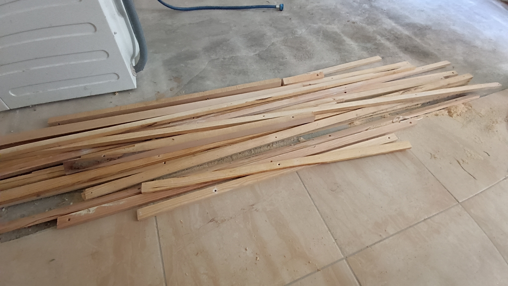

Here’s the story of the realization.

## Starting Question

I had made mosquito nets in my old house using [this stainless steel model](https://www.amazon.fr/dp/B09HKKB6YB), which was UV-resistant (but fragile to cat claws…).

However, the frames remained fixed, and we didn’t mind.

In our new home, our wooden _persian_ shutters are foldable. And I had the idea of putting the screens in the metal frame.

However, how do I make a solid frame out of my 37 mm by 10 mm salvaged cleats?

I knew a few wood assembly techniques, but I didn’t want to use brackets or screws.

I thought I’d use Perplexity to sketch out ideas and choose the one that seemed most feasible.

With the request “I need to create frames from 27 mm wide by 10 mm thick wooden cleats. The frame will measure approximately 125 cm by 61 cm”, it gave me these options:

> To securely join 27 mm wide and 10 mm thick wooden strips to create a 125 cm x 61 cm frame, several techniques are available. Here are the most suitable options:
>
> **1. Gluing together**
>
> Gluing is a simple and effective way of joining cleats:
>
> - Apply vinyl wood glue to contact surfaces.
> - Position the pieces to form a rectangle with perfectly squared corners.
> - Hold the joints together with clamps while they dry (several hours).
> - To strengthen the joint, you can add fine nails or screws after drying
>
> **2. Half-timber jointing**
>
> Half-timber jointing involves notching each cleat halfway through so that they fit together perfectly:
>
> - Mark out the notches.
> - Saw and hollow out at half-thickness with a saw or router.
> - Glue surfaces before fitting.
> - Tighten with clamps to ensure strength.
>
> **3. Dowel assembly**
>
> Dowels are ideal for strengthening the assembly:
>
> - Drill holes in the ends of the cleats using a drilling jig.
> - Insert glued wooden dowels into the holes.
> - Assemble the pieces and hold them in place with clamps while drying.
>
> **4. Miter joint**
>
> For an aesthetic finish, you can cut the ends of the cleats at a 45° angle:
>
> - Use a miter saw to make precise cuts.
> - Apply glue to the joints and secure with clamps.
> - Reinforce with universal staples or fine nails if necessary.
>
> **5. Using the DOMINO system**
>
> If you have a special tool such as the DOMINO system:
>
> - Drill holes in the ends of the cleats.
> - Insert glued tenons into these holes.
>   Assemble and tighten with clamps to create a sturdy frame.

Not a big fan of the glued or mitered option, as I didn’t think it was very solid in my mind. Neither did the half-timber.

The DOMINO system or dowels seemed interesting. What’s more, [the 1 m dowel rods (French shop)](https://www.entrepot-du-bricolage.fr/p/pr-tourillon-rond-bois-hetre-rabote-non-traite-diam-5-x-1000-mm-monnet-seve-295949) at the nearby shop were very inexpensive.

So I went for this option.

Then I decided to place the 2-frame mosquito nets in the _persian_ shutter frame for ease on installation when we needed them.

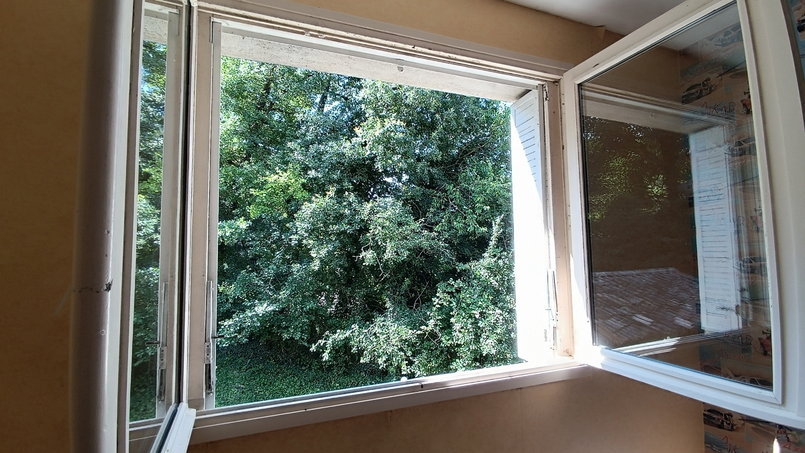
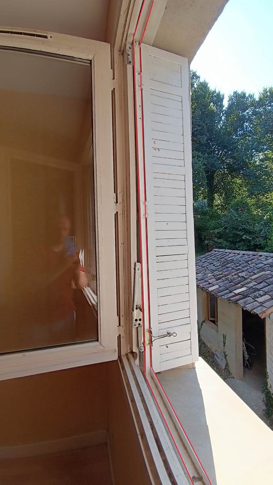

Why 2 frames per window? To facilitate installation and removal on the shutter frame. If I’d made a single frame for each window, it would have been difficult (impossible?) to position the screens because of the design of the shutter frame itself.

## Position the Cleats in a Corner

This challenge took me two attempts to find the right method.

On the first try, I used [a large spring clamp](https://www.amazon.fr/Nirox-Jeu-pinces-%C3%A9tau-ressort-Serre-joints/dp/B0844GNX6C) to wedge the first corner together.

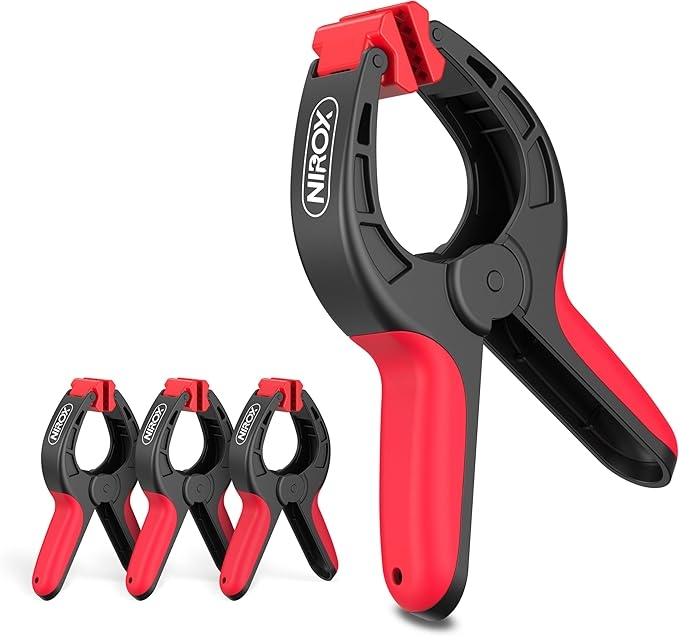

Credit: spring clamp image from Amazon.fr.

Except that the spring clamps weren’t tight enough. I managed to drill the first corner and the following ones with my first attempt, but it took a long time (over one hour per frame).

On the second attempt, I decided to use my clamps again, but this time I prepared 2 wooden wedges (offcuts of cleats), one spring clamp and a regular screw clamp per corner.

Once assembled, it looks like this:

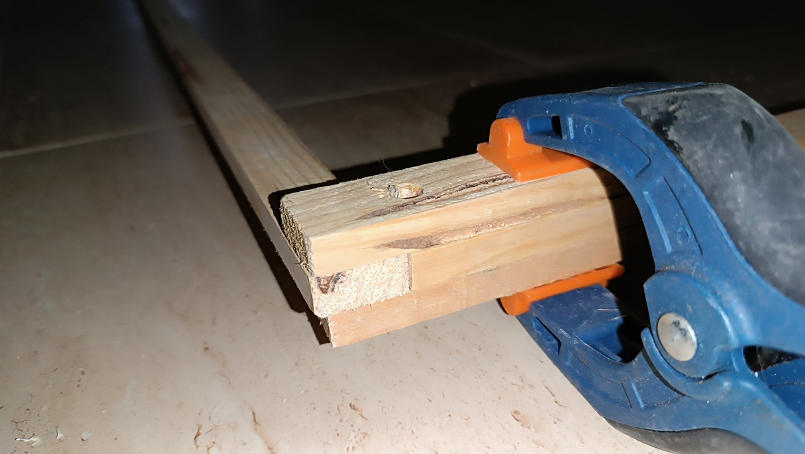

The wedges are used to pre-position the cleats in a corner, then the regular screw clamp is used to screw the two cleats tightly together. This prevents them from moving.

Here is the final result of the complete frame before drilling:

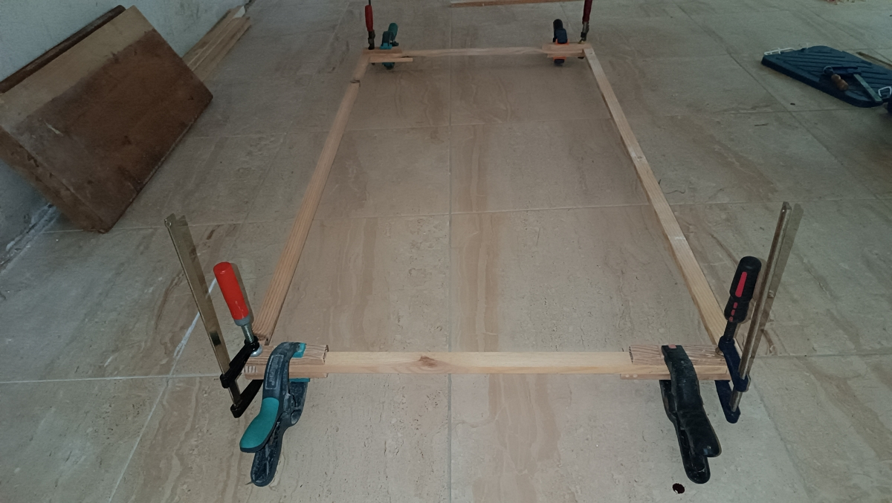

To finish, check that the corners are square, and you’re ready to drill.

## Drill the Cleats

Using a 5 mm drill bit (half the thickness of the cleat), I drilled a 54 mm long hole (27 mm on the side of the first cleat and 27 mm along the length of the second cleat).

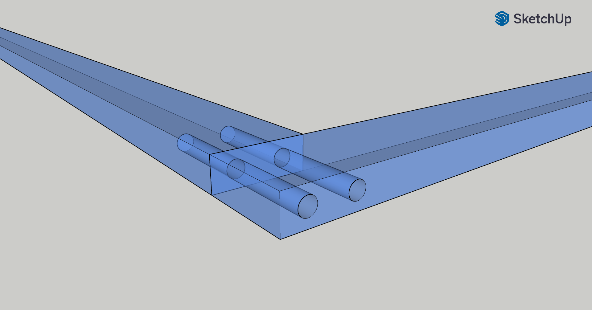

Make sure you drill straight and center!

## Insert the Dowels

The next step is to insert a dowel rod into each hole.

You have two ways to do it:

- either the rod glides easily and you simply cut at the edge of the cleat,
- or you force it a little at first, then cut it long enough (max. 54 mm), insert it with a hammer and trim off the excess.

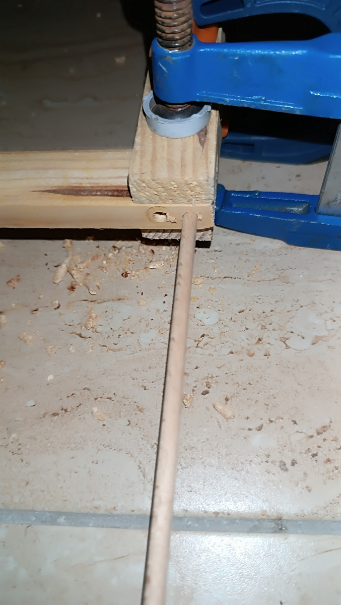

In the end, the result is rather clean and remarkably solid, especially once all dowels had been inserted.

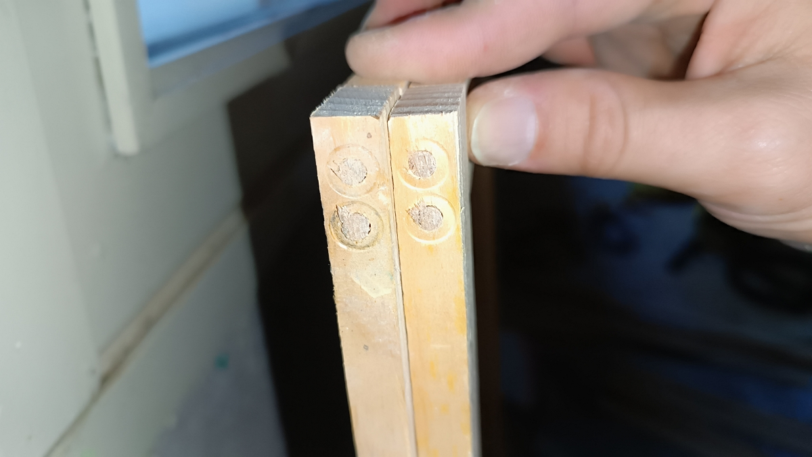

## Fastening the Stainless Steel Screen to the Frame

I used [10 mm staples](https://www.amazon.fr/Rapid-construction-disolation-galvanis%C3%A9-performance/dp/B0002Z0206) for [wall staplers](https://www.amazon.fr/Agrafeuse-Rapid-Bricolage-Tapisserie-Ergonomique/dp/B0DTYDT29M). They hold the screen firmly every 10 cm. At the corners, I used 3 staples to ensure a durable joint between the cleats.

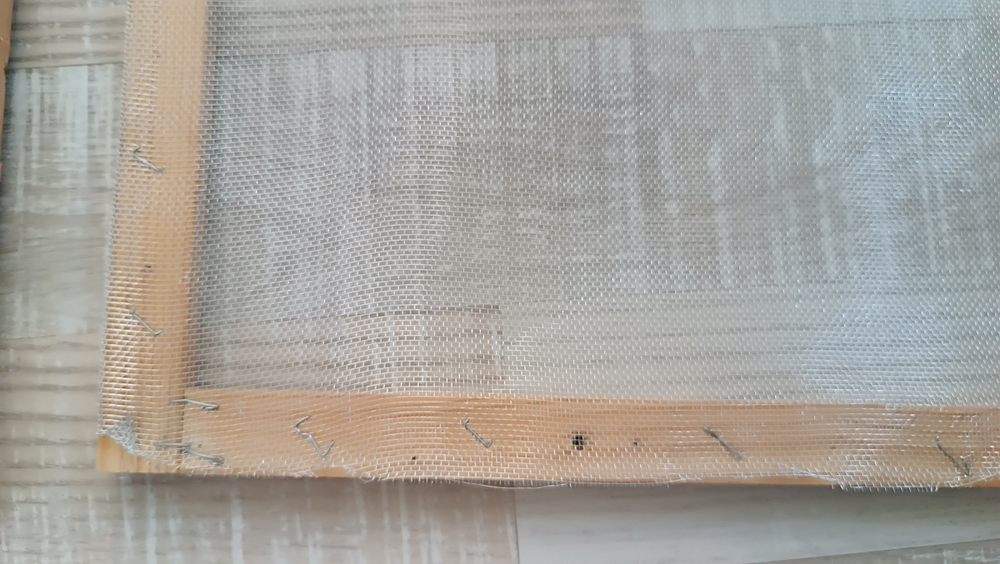

Voilà!

## Conclusion

I unintentionally sized the frames 27 mm wider than the _persian_ shutter. The unforeseen advantage is that I have no gap between the frames and I’m sure I won’t have any mosquitoes flying in!

Do you like them?

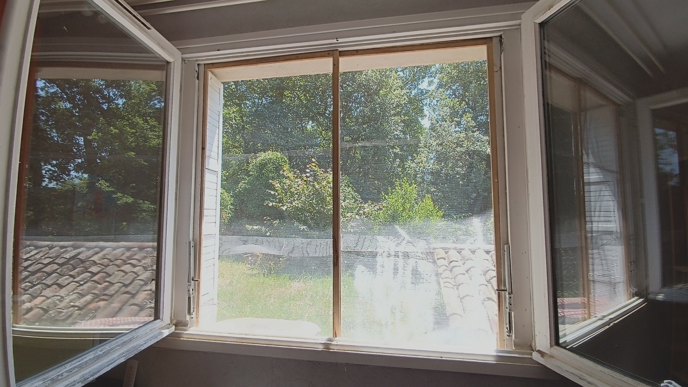



Thanks for reading this article. Make sure to [follow me on X](https://x.com/LitzlerJeremie), [subscribe to my Substack publication](https://iamjeremie.substack.com/) and bookmark my blog to read more in the future.






