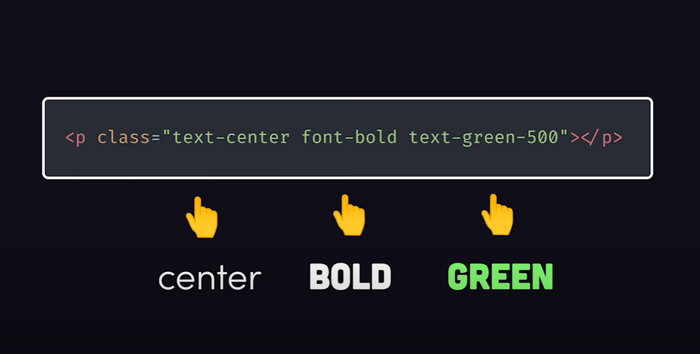

Whether you love its utility-first approach or hate its crowded class lists, Tailwind CSS stirs up strong opinions among developers.

Let’s take a closer look at what makes it both powerful and polarizing.

## Is Tailwind CSS Worth It?

Frankly, the first thing that struck me was the really blotted HTML, like many of you out there, I’m sure. So many CSS classes!

However, [here are the problems](https://www.youtube.com/watch?v=lHZwlzOUOZ4) it tries to solve by using vanilla CSS, according to [Fireship](https://www.youtube.com/@Fireship):

- Colocation:
  - With vanilla CSS, we decided to apply a separation of concerns between markup (HTML) and styles (CSS). This requires naming classes and we, humans, aren’t good at it. And also, the class name wouldn’t tell you the styles behind it.
  - With Tailwind, we use utility classes that explicit the styles in the markup. This is what creates the gross HTML that displays a class attribute with tons of classes…
- Verbosity
  - With vanilla CSS, verbosity is a reality. For example, to position an element, you would need to set the properties `position`, `top`, `right`, `bottom` and `left`.
  - With Tailwind, we can simply use “inset-0”, you don’t need to write all those properties.
- Too much power
  - With vanilla CSS, you can give you too much control over the UI, and if you don’t understand it well, you can suffer.
  - With Tailwind, we fall right the middle of vanilla CSS (using Convention) and Bootstrap (using Configuration).
- Zombies
  - With vanilla CSS, it’s highly possible you might write styles that don’t get used or become unused as you update the markup.
  - With Tailwind, since it’s integrated with the CSS bundle, the build step will automatically purge CSS that the app doesn’t need.

In the end, you like it and you use it. Or you don’t. Period.

But, before we dive into the list of problems, understand that using a tool like Tailwind CSS will make it hard to go back to whatever way you were doing it before.

Why? Because it will save you time.

Let’s dive in.

## The Problems Tailwind Tries to Solve

### Separation of Concern

The standard for the last 20 years has been to separate the markup from the style. And it requires naming CSS classes that you’ll see in the HTML (which is hard).

But, more importantly, several weeks later, you’d come back to your code and you’d have forgotten what is the style applied to these classes just by looking at the HTML. So you go back the styles.

Plus, you might use those CSS classes in multiple places and changing their style could break things where you don’t expect…

With Tailwind CSS, you don’t have that problem.

Credit: Screenshot from “**Tailwind CSS is the worst…**” by Fireship.

True, this can result in the bolded HTML we’ve all seen and say: “BURK!”

With Visual Studio Code, you can use the extension “Inline fold” to minimize those inline Tailwind CSS classes.

Alternatively, you can use the `@apply` grouping in your component’s CSS, but that won’t solve the problem of blotted HTML when you look at the HTML in your browser DevTools.

### Verbosity

CSS is verbose. With Tailwind CSS classes, you type a lot more characters.

Yes, it’s always better to use the platform directly. With Tailwind CSS, you have to learn an abstraction on top of the CSS. It’s additional work if you’re getting started.

I’d say that you need a good understanding of CSS before you decide to use Tailwind CSS.

### Too Much Power

While CSS gives you too much control over the UI. And you probably know BootStrap, right? Well, it’s difficult to customize and doesn’t give enough power.

Tailwind CSS falls right in the middle of these.

It gives a standard set of constraints that you can use to design a good-looking and consistent UI.

### Zombies

Who has written a CSS class that ends up not being used at all? I have.

With Tailwind CSS, you know that the tool will strip off everything that you don’t use, generating a smaller bundle in the end.

Yes, the drawback is that you need to follow at least 5 steps to set Tailwind CSS up in your project. So it might be better to use it on large projects.

For smaller projects, consider [PicoCss](https://picocss.com/). I’ll give some feedback on this framework later if I use it.

## My Conclusion: Know CSS Before Learning Tailwind CSS

When I discovered Tailwind CSS, the thought that came after a few weeks of using it was:

> You need to understand CSS no matter what.

If you don’t understand Flexbox, you won’t know how to use Tailwind CSS Flexbox classes. And so on…

This is what [Web Dev Simplified](https://www.youtube.com/@WebDevSimplified) also tells web developers.

## Sources I Reviewed For This Article

- [Tailwind CSS is the worst, by Fireship](https://www.youtube.com/watch?v=lHZwlzOUOZ4)
- [Why developers HATE TailwindCSS, by James Luterek](https://www.youtube.com/watch?v=mznsLAWVnOI)
- [Should You Use Tailwind CSS, by Web Dev Simplified](https://www.youtube.com/watch?v=hdGsFpZ0J2E)



Thanks for reading this article. Make sure to [follow me on X](https://x.com/LitzlerJeremie), [subscribe to my Substack publication](https://iamjeremie.substack.com/) and bookmark my blog to read more in the future.


