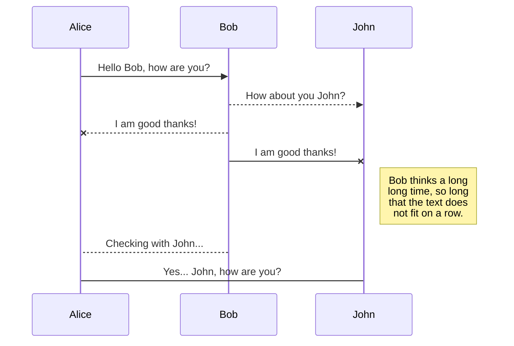

Making diagrams used to be very different not so long ago. Then, came Mermaid Diagrams.

Let’s look at it live below.

## What is Mermaid Diagram

Mermaid is a JavaScript-based diagraming and charting tool that was created by Knut Sveidqvist in 2014. He developed it out of frustration with the existing tools for creating diagrams in documentation.

### Why It Exists

Well, the core problem Mermaid solves is that traditional diagraming tools require you to use separate applications (like Visio, Lucidchart, or draw.io), export images, and then embed them in your documentation.

This creates several issues:

- diagrams become outdated when code changes,
- they’re hard to version control,
- updating them requires switching contexts between tools.

Mermaid’s solution is elegant: you write diagrams using simple text syntax directly in your markdown files and they render as visual diagrams.

For example, you can describe a flowchart or sequence diagram in plain text, and it automatically generates the visual representation.

### Key Benefits

For me, the most interesting benefit is that Mermaid diagrams are **version control friendly**. Since diagrams are just text, they work perfectly with Git and other version control systems. No more conflicts to resolve on binary files...

This makes a **living documentation**. Diagrams can be updated as easily as editing text, making it more likely they’ll stay current.

Also, they provide good **accessibility**. Anyone who can write Markdown can create diagrams without learning complex drawing tools.

Finally, **integration** has become widespread. It works in markdown files, wikis, documentation sites, and has been adopted by platforms like GitHub, GitLab, and Notion. I’d not say it is always seamless, but it is possible. The proof is this article.

Mermaid has become particularly popular in software development teams, where keeping documentation synchronized with code is crucial, and where developers prefer working in text-based formats.

## Example

Here is the live demo.

The following Markdown code:

````md

````

becomes:


Thanks to [delize](https://github.com/delize) for his contributions in [issue #1213](https://github.com/CaiJimmy/hugo-theme-stack/issues/1213) to fix the initial implementation delivered in version 3.33.0 of the theme.

Note: I’ll need to fix the dark mode styling. So switching to light mode will make the diagram readable. Thanks for your patience.



Thanks for reading this article. Make sure to [follow me on X](https://x.com/LitzlerJeremie), [subscribe to my Substack publication](https://iamjeremie.substack.com/) and bookmark my blog to read more in the future.



Credit: Image from [the official Mermaid Diagrams website](https://mermaid.js.org).

```

```
