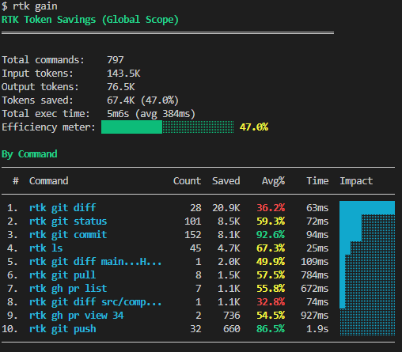

It has only been three months since I started using Claude Code almost each day. And token usage is the limiting factor when you invoke a team of agents or even use several Claude Code instances to build parallel features or resolve bugs.

Rust Token Killer was shared by a colleague last month and I integrated it into my workflow.

## What Is Rust Token Killer, a.k.a RTK

**RTK (Rust Token Killer)** is a high-performance CLI proxy written in Rust that sits between AI coding agents (Claude Code, Cursor, Copilot, Gemini CLI, etc.) and the shell, reducing _theoretically_ LLM token consumption by 60–90%. It has ~19.5k GitHub stars and is at version 0.35.0 at the time of writing this article.

It works by intercepting common developer commands (git, cargo, npm, docker, kubectl, AWS CLI, etc.) and applying four compression strategies: smart filtering (removes noise/boilerplate), grouping (aggregates similar items), truncation (keeps relevant context), and deduplication (collapses repeated lines). The overhead is under 10 ms per command.

RTK supports 10+ AI coding tools via auto-rewrite hooks that transparently (only on UNIX systems) prefix shell commands with `rtk`—the LLM never sees the rewrite, it just receives a compressed output.

Installation is straightforward via Homebrew, curl script, cargo, or prebuilt binaries for macOS/Linux/Windows. Setup per agent is a single `rtk init` command with a flag for the target tool. Or you can manually define RTK’s per agent. You’ll read about that in the next paragraph.

Key capabilities include 100+ supported commands spanning file operations, git, GitHub CLI, test runners (cargo, pytest, go, vitest, playwright, rspec), build/lint tools (tsc, eslint, clippy, ruff), package managers, AWS services, and container tooling.

A “tee” feature preserves a full unfiltered output on failures for recovery.

Finally, token savings analytics are built in via `rtk gain` and `rtk discover`.

Oh, and for the record, RTK collects anonymous, aggregate telemetry once daily (opt-out available).

See more on [their GitHub repository](https://github.com/rtk-ai/rtk/).

## Installing It in Windows 11 Home

The steps are simple:

- Download release from https://github.com/rtk-ai/rtk/releases
- Put exe into `/your/path/to/rtk/bin`
- Update PATH variable to add `/your/path/to/rtk/bin`

## Caveat With Non-Unix Environment

You can’t reach full transparent integration with Claude Code.

Note that if you have issues with subagents to run `rtk [command]`, make sure you restarted Windows after editing your path with the absolute path RTK’s bin. You always have the option to tell Claude and the sub-agents to run RTK using the absolute install bin path. In a MINGW64 shell, it might happen.

Also, in Windows, you won’t be able to use the hook to avoid the manual prefix on every command. I actually have to add the following to [`CLAUDE.md`](http://CLAUDE.md) to make Claude and the sub-agents would use RTK:

`````markdown
    ## Shell commands — use `rtk` wrappers

    **Always** use `rtk` for the commands listed below — never the bare equivalent. These are the commands auto-approved in `.claude/settings.local.json`; running them without `rtk` will trigger a permission prompt on every call.

    ### Git

    ```bash
    rtk git status          # compact status
    rtk git log -n 10       # one-line commits
    rtk git diff            # condensed diff
    rtk git add             # -> "ok"
    rtk git commit -m "msg" # -> "ok abc1234"
    rtk git push            # -> "ok main"
    rtk git pull            # -> "ok 3 files +10 -2"
    ```
    ````

    ### GitHub CLI

    ```bash
    rtk gh pr list          # compact PR listing
    rtk gh pr view 42       # PR details + checks
    rtk gh issue list       # compact issue listing
    rtk gh run list         # workflow run status
    ```

    ### Build & lint

    ```bash
    rtk tsc                 # TypeScript errors grouped by file
    rtk lint                # ESLint grouped by rule/file
    rtk err npm run build   # errors/warnings only
    rtk vitest run          # failures only
    ```

    `npm run type-check` (vue-tsc) has no rtk equivalent — keep as-is.

    ### Files & search

    ```bash
    rtk ls .                # token-optimized directory tree
    rtk read file.ts        # smart file reading
    rtk find "*.ts" .       # compact find results
    rtk grep "pattern" .    # grouped search results
    rtk diff file1 file2    # condensed diff
    ```

    ### Package managers

    ```bash
    rtk pnpm list           # compact dependency tree
    ```

    ### Token savings

    ```bash
    rtk gain                # summary stats
    rtk discover            # find missed savings opportunities
    ```
`````

It also means the `rtk` prefix is present when you see Claude run. But that's OK.

In my agents, I make sure to provide a clear sublist of the commands the agent must use with RTK. For example, my Git agent has:

```markdown
## RTK Token Optimization

Use `rtk` for all supported git and gh commands—it compresses output and reduces token usage:

| Raw command                | RTK equivalent                 |
| -------------------------- | ------------------------------ |
| `git status`               | `rtk git status`               |
| `git diff`                 | `rtk git diff`                 |
| `git log`                  | `rtk git log`                  |
| `git add <files>`          | `rtk git add <files>`          |
| `git commit -m "msg"`      | `rtk git commit -m "msg"`      |
| `git push origin <branch>` | `rtk git push origin <branch>` |
| `git pull`                 | `rtk git pull`                 |
| `gh pr list`               | `rtk gh pr list`               |
| `gh pr view <n>`           | `rtk gh pr view <n>`           |
| `gh run list`              | `rtk gh run list`              |

Commands without an rtk equivalent (`git worktree`, `git fetch`, `git remote`, `git branch`, `git worktree prune`) run as normal git commands.
```

The other agents are limited to file and search commands or test runners so I reminded them of those.

## Gain or No Gain

On my laptop usage, I see the following gain:



Though I’m not in the range advertised, any gain is still good, especially on `git` or `gh` CLI commands.

In reality, the biggest gain will come in the context engineering. I’ll cover my insights in a later article about this.

## Future Upgrade

I’ll upgrade to Windows Pro very likely to use WSL on Windows. It isn’t possible on Windows Home.

Why would I do that? Because WSL will make it possible to run RTK commands transparently with polluting the agent’s definition.



Thanks for reading this article. Make sure to [follow me on X](https://x.com/LitzlerJeremie), [subscribe to my Substack publication](https://iamjeremie.substack.com/) and bookmark my blog to read more in the future.



_Photo by Alex Knight on Pexels._
