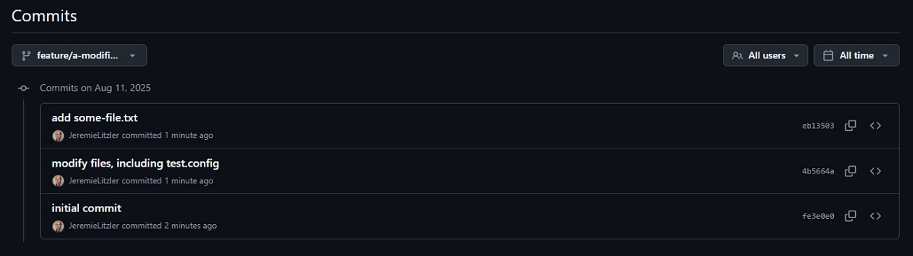
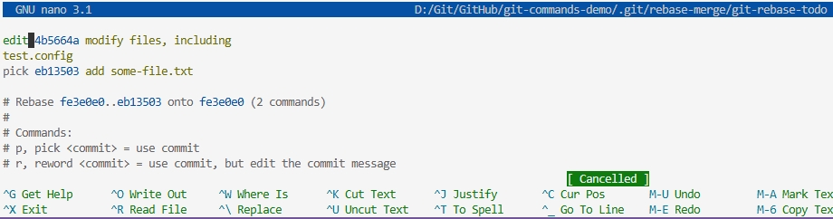
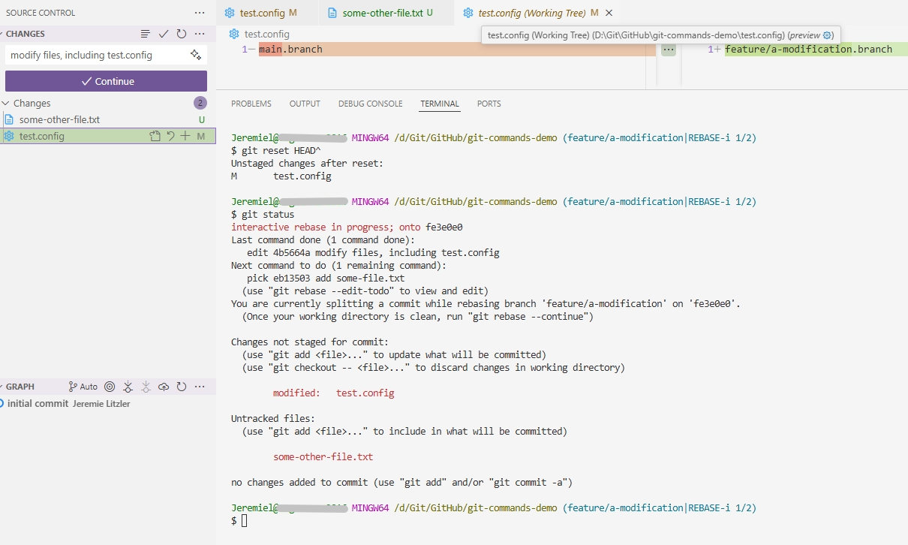
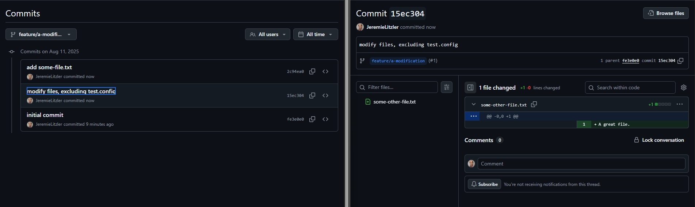

If the commit is the **first one on your feature branch** and you need to **exclude two file changes from it**, you can still fix it using an **interactive rebase**



Here’s how to do it:

## Rebase With the Hash For the Commit Before the One to Modify\*\*

You can rebase starting from **the commit before the one to modify** using:

```sh
git rebase -i [hash of the commit before the one to modify]
```

This will open an editor showing all the commits after the one provided in the rebase command. You can choose to `edit` it.

**Then:**

1. Mark the commit you need to edit as `edit`.

   

2. Save and exit
3. When Git pauses at that commit, run:

   ```sh
   git reset HEAD^
   ```

   This unstages all files from the commit.

   

4. Then re-add only the files you want to keep (or undo the files which changes you don’t need):

   ```sh
   git add <file1> <file2> ...
   git commit -m "[Your previous commit message or a new one]
   ```

5. Continue the rebase:

   ```sh
   git rebase --continue
   ```

## Important Note

- This rewrites history, so **only do this if the branch hasn’t been pushed** or if you’re okay force-pushing the modified commit. You’ll need to coordinate with collaborators if you work on a common repository.
- If the branch has already been pushed, you’ll need to force-push:

  ```sh
  git push --force
  # Or
  git push --force-with-lease
  ```



Both rewrite remote history. The difference is the safety check.

With `git push --force`, you overwrite the remote branch **unconditionally**. Whatever is on the remote gets replaced with your local version—no questions asked. If a teammate pushed commits you haven’t fetched yet, you’ll silently destroy them.

With `git push --force-with-lease`, you overwrite **only if the remote is where you last saw it**. Git compares the remote branch against your local remote-tracking ref (e.g., `origin/main`). If someone else pushed in the meantime, your ref is stale, the check fails, and the push is **rejected** instead of clobbering their work.

So default to `--force-with-lease`. It does everything `--force` does but refuses to overwrite work you didn’t know about.

⚠️ **One caveat:** `--force-with-lease` relies on your remote-tracking ref being accurate. Running `git fetch` right before it (or having an auto-fetch) can defeat the safety by updating the ref without you actually seeing the new commits—so avoid fetching just before force-pushing.

It’s therefore recommended to fetch any commit you may not have locally before rebasing.

## How Do You Merge To the Master Again

You may notice a message on GitHub “The branches have completely different histories” once you performed the above.

That’s because you ran the rebase command on the feature branch and rewrote the history, diverging entirely from the master branch.

To be able to merge the feature branch into master through a pull request, you need to make sure your local master is up-to-date with `git pull origin master`.

Then, checkout the feature branch and execute `git rebase master`. The histories are now synchronized and GitHub will propose to you to create the pull request.

For more about learning Git and related operation, I recommend you take a look at [https://learngitbranching.js.org/](https://learngitbranching.js.org/). It explains the fundamentals of Git commits, branchings and navigating in the history of a repository Git.



Thanks for reading this article. Make sure to [follow me on X](https://x.com/LitzlerJeremie), [subscribe to my Substack publication](https://iamjeremie.substack.com/) and bookmark my blog to read more in the future.



Credit: Git Logo by Jason Long is licensed under the Creative Commons Attribution 3.0 Unported License.
