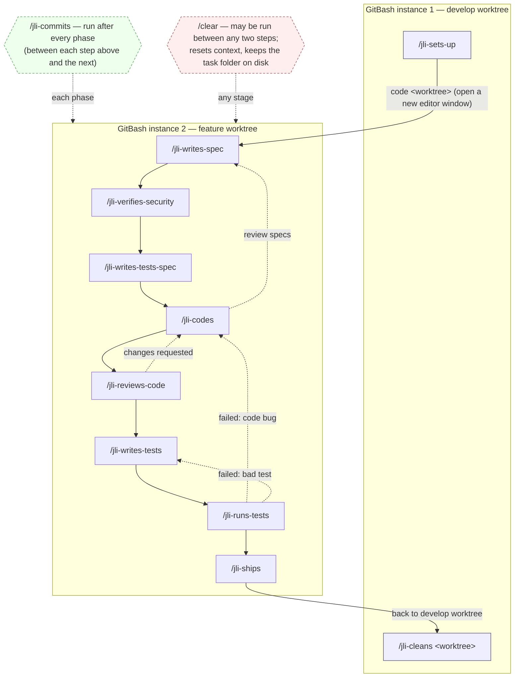

Three weeks ago, every feature and bug fix in [my SocialMediaPublisherApp repo](https://github.com/JeremieLitzler/SocialMediaPublisherApp) ran through one Agent orchestrator. Called `agent-0-orchestrator`, it spawned several specialist agents, one after another. With a predefined workflow, through the Task tool, it threaded all of their state through Markdown file using the SDD approach (Specification-Driven Development). It felt that a single long-running context was gobbling my tokens.

It worked until it didn’t. That context grew across seven phases in richer and richer application logic. Quickly, I would reach the 5-hour window limit and couldn’t finish the bug or feature started until I gained new tokens, by either waiting or buying credits.

Worse, there was no natural seam anywhere in the run. Once I kicked off a feature, I felt locked into that one session until it finished. Restarting it wasn’t smooth at all. If I wanted to step away from a bug fix for the day and pick it up the next day, there wasn’t a clean way to do that. And every one of those seven agents carried its own slice of the orchestrator’s system prompt into every call, which meant tokens burned like magic flash paper.

This agentic pipeline, in other words, wasn’t flexible enough for how I actually worked, and they consummed too many tokens for what they gave back.

So I tore it down and replaced it with something that would seem less clever, but efficient for my workflow: a chain of slash commands I run by hand.

## Eight Agents Become Twelve Commands

I spent the first session in plan mode to draft the chain: reading all nine agent files and the two existing command files end to end, then locking a handful of decisions through clarifying questions.

Every new command stayed self-contained, with no cross-references to the old agent files and no orchestrator vocabulary anywhere in its text. Each feature would get its own isolated git worktree. Each command required a task folder argument, except for two commands (read details later in the article), which equaled to a relative `@`-mention path once I was inside that worktree.

Every command would carry a `jli-` prefix to avoid a conflict with other commands I might install from the marketplace someday.

That produced ten command files:

- seven phase commands for (1) business and (2) test case specifications, (3) security checks, (4) test writing, (5) coding, (6) code reviewing, and (7) test running,
- four git commands for (8) setup, (9) commit, (10) shipping and finally (11) clean up.
- a maintenance (12) command could edit and improve the chain itself without breaking its invariants when I'd notice a gap.

In my repository root-level, `AGENT-COMMAND-MIGRATION.md` recorded the mapping table and the reasoning of my chain.

The old `agent-0-orchestrator` dissolved into a “Next” hint at the end of each command, telling me which one to run next.

The payoff showed up immediately. Because each command is self-contained, I could `/clear` freely between phases without losing anything that mattered. Because each feature lived in its own worktree, I could open it in its own editor window, work on it for an hour, close the window, and come back to it three days later, exactly where I left off. Or work on a bug in parallel to a feature that was unrelated.

That ability to resume at any time and any stage cheered me up.

## Fine-tuning

Of course, the chain took a few round to feel right.

### The Worktree Strategy

With the agent pipeline, I had my bare repository (ex: `SocialMediaPublisherApp.git` sitting in a folder `GitHub`) and the worktree folders were created inside it. With the chain, I realized that it would be much better that worktrees sat as siblings under the same parent folder (e.g., `GitHub` folder), not nested inside the bare repository:

```sh
ls -l /disk/GitHub
# bare repo
/disk/Git/GitHub/SocialMediaPublisherApp.git
# develop worktree, a sibling
/disk/Git/GitHub/SocialMediaPublisherApp_develop
# a feature worktree, a sibling
/disk/Git/GitHub/SocialMediaPublisherApp_feature-new-screen
```

The bootstrap scripts assumed nesting. `scripts/pipeline/fetch-origin.sh` climbed three directories up with a fixed `../../..` and landed on `/disk/GitHub`, which isn’t a git repo at all, so it could never infer the origin remote. `scripts/pipeline/worktree-create.sh` made the same assumption and ran `git worktree add` against a directory that wasn’t a repo either.

This first fix, shipped in [PR #116](https://github.com/JeremieLitzler/SocialMediaPublisherApp/pull/116) before I even started using the chain for the first time:

```bash
BARE_REPO="$(git rev-parse --git-common-dir)"
```

That resolves correctly whether the layout is nested or sibling. The scripts also stopped assuming a worktree folder, and instead located it dynamically with `git worktree list --porcelain` and a branch match. A missing fetch refspec on `origin` turned out to be a second, smaller bug hiding behind the first: until `remote.origin.fetch` was set explicitly, for example the `develop` worktreen and `origin/develop` wouldn’t resolve at all.

That same PR reshaped how I actually run the chain day to day. After `/jli-sets-up`, I open the feature worktree in its own editor window and run every phase command from inside it, with a relative `@`-mention pointing at the task folder.



After using it for three bugs, I think I might drop the use of VCode for simple Git Bash instances or [herd terminal](https://herdr.dev/) and neovim very soon. I’m currently working on installing Linux as dual boot rather WSL. I’ll share the why and how and provide my feedback soon.

Today, I actually use one Git Bash instance for the setup and clean up. Another instance of Git Bash is used to work on a feature and/or bug. The cool thing about herd terminal is that you can define workspace (a workspace per feature, per bug, etc.) and if an agent is running, it notifies you when work is complete or if the agent’s waiting for some inputs.

Back to the article…



Every `cd [worktree]` disappeared from the commands, because I now simply run them myself from wherever I already was. And because you can’t delete the worktree you’re standing in, cleanup command became its own step, run from `develop` worktree after the feature or bug merge, while shipping command was trimmed down to push, PR, and merge tasks only.

### The One Bug That Hid In `prunable`

A few days in, I ran the new cleanup command on a worktree that had already been merged, and its local branch was left behind. I had to delete it by hand.

The root cause was almost invisible. `worktree-cleanup.sh` read the branch name from inside the worktree:

```bash
BRANCH="$(git -C "$WORKTREE" branch --show-current 2>/dev/null || true)"
```

But once a worktree is marked as _prunable_, its working directory no longer existed, so that command silently returns an empty string, and the `git branch -D` step that depended on it just as silently did nothing.

The fix, added to [PR #118](https://github.com/JeremieLitzler/SocialMediaPublisherApp/pull/118), was to read the branch from `git worktree list --porcelain` instead. It still reports it even for a prunable worktree. Small bug, you'd say, but the kind that only shows up once you’ve actually used the thing for a while rather than just designed it on paper.

### Naming the Commands Settles

By the time the chain had been through a few real features and bugs, its shape had stabilized enough to name properly.

I renamed every command to a consistent verb style, so `jli-spec` became `jli-writes-spec`, `jli-code` became `jli-codes`, `jli-git-ship` became `jli-ships`, and so on across all twelve commands. The single `jli-test-write` command, which auto-detected whether it was writing a test spec or writing test code, was split into two single-purpose commands instead.

### Diagram Summary

I also made a Mermaid diagram, showing the split of setup/clean up vs. execution stages as separate subgraphs and the handoff between them as an edge.



Please don't use dark mode to view the diagram below, as I need to fix the styling of mermaid diagrams rendered.

Use the toogle at the bottom left to switch light mode.





## Trimming the Noise Out of CLAUDE.md

The last piece of housekeeping was `CLAUDE.md` itself.

Reading it back-to-back with all the `jli-*` command files turned up a lot of duplication. A full table of `rtk` commands that also lived in my global instructions and a “prerequisite” block repeated commands listed a few lines later.

None of that duplication was wrong but it was just dead weight the commands had already made redundant. Trimming it brought the file from 269 lines down to 185 without removing a single piece of actual codebase knowledge, like the architecture notes and conventions that no command file captures.

## What Three Weeks Actually Taught Me

None of this is more elegant than orchestrating agents. It may seem less clever, **but it works** for me.

What it gives back is something the orchestrator never could (_at least in my current understanding of using Agentic development_): I can stop in the middle of any feature, close the window, and come back whenever I want, because the state lives in a worktree and a task folder on disk rather than inside one continuously running context.

The cool part is that _Next_ evaluation specified at the end of each command. Because the last command execution end with it, the agent suggests the next command. It even allows me to simply tap TAB key to autocomplete the input area instead of writing it myself when I don't need `/clear` command call. Pretty handy!

Also I experienced scenarios where I had to go back to the specification step because the implementation was erroneous or incoherent or a gap existed. Sometimes the agent suggested it, sometimes I decided that it was needed.

Each command only loads its own slice of instructions and reads what it needs in the Markdown files of the task folder- I can follow as the agent writes specifications, tests or codes. I can catch gaps either in the business logic or the actual chain of commands and return to a previous step if I notice it’s needed or if the agent suggests it. In the end, I take the decision.

In reality, you **MUST** read everything and through iterations, I think I’m learning that one can’t catch everything at the business specifications step or during the coding phase. You can even miss a test case.

Frankly, the human is absolutely needed! The business logic or implementation bugs that showed up along the way, the sibling worktree paths and the prunable branch, weren’t failures of the idea. There are here to remind us that we, humans, are guardians of the output’s accuracy and relevance. They’re here to provide feedback on what the agent didn’t catch or take the initiative to solve. I may be missing or haven’t yet tried something that would make the agent more efficient. That’s something I’ll take more about next week.

After three weeks, I have updated two other projects with the same chain and I still refine it daily. One refinement will be the topic of next week’s article. On that third week, I ran into the need for an extra command to deal with large features. I had to make a few adjustments so stay tuned and… ⬇️⬇️⬇️



Thanks for reading this article. Make sure to [follow me on X](https://x.com/LitzlerJeremie), [subscribe to my Substack publication](https://iamjeremie.substack.com/) and bookmark my blog to read more in the future.



_Photo by Alex Knight on Pexels._
