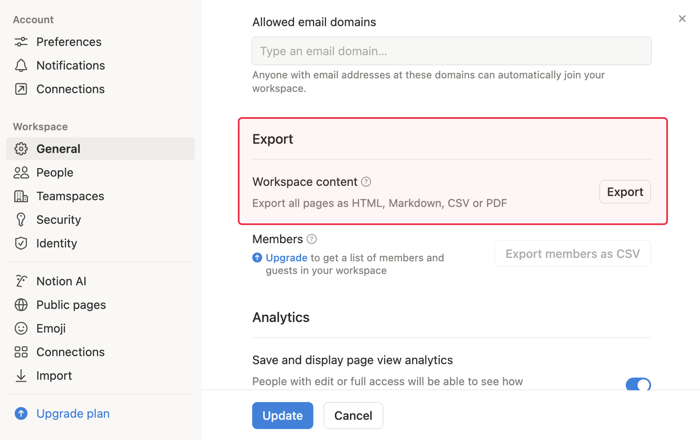
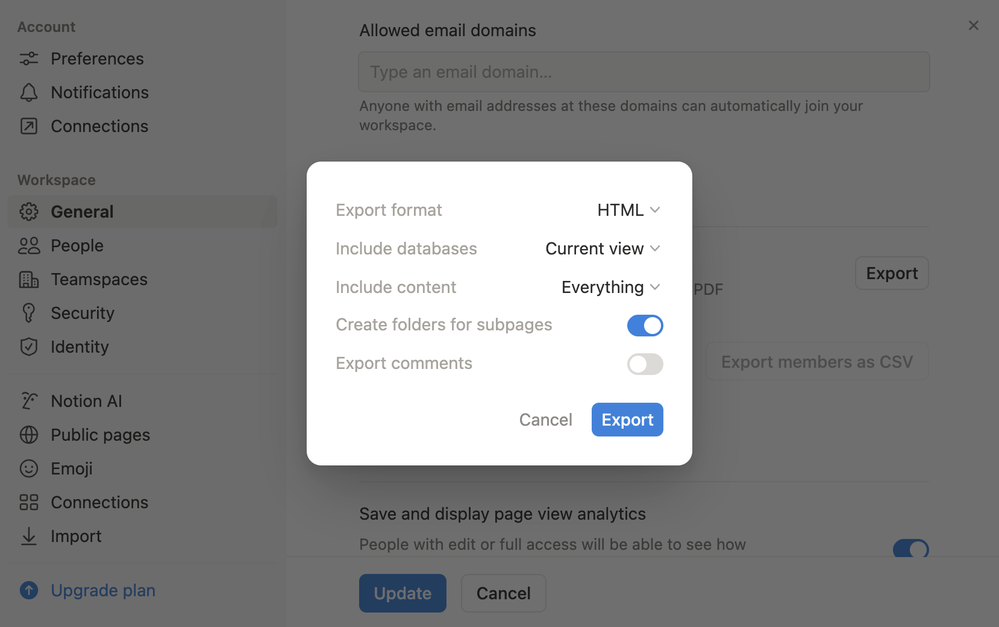

What could I use to take my notes, thoughts and all the content that I wanted to save?

In 2021, I picked Notion.

In 2025, I decided to move partially away from it, as I had a new and important need: privacy.

Yes, all those startups will say, “your data is safe\.” Blah, blah, blah… I needed to move some personal notes away from Notion to a place where I would know where was the data and who could see it.

The solution: Obsidian.

## Exporting Notes From Notion

Following the guide on Obsidian documentation site was enough:

1. Go to **Settings** at the top of the Notion sidebar.
2. Under **Workspace** select **General**.
3. Find and select **Export all workspace content**.

   

4. Under **Export format** select **HTML**.

   

5. Choose **Include everything**.
6. Enable **Create folders for subpages**.
7. You will receive a `.zip` file via email or directly in the browser.

## Import to Obsidian

Again, the documentation is great. However, I’ll add two important points:

- Do not use the portable version of Obsidian that you can find on Scoop if you’re Windows. Somehow, it won’t work to import a large ZIP. Mine was 800+ megabytes. Instead download the regular version from Obsidian website.
- Before running the steps of the documentation, close the graph view, if opened. When you have almost 8000 notes like me, it’ll slow down significantly the import. In my case, importing that many notes took a few minutes only.

Once you have configured the importer, a folder named “Notion” will appear as the default option\. Feel free to rename it to whatever you choose\. During the import process, all images will be placed directly in the root of your vault\.

After importing, I established a new folder to organize all the pictures\. Obsidian will alert you that it will rename the image paths in the notes to match the new locations\.

## Creating the Views You Had in Notion

One thing I used a lot in Notion were Views. I had a main database with more of my notes and to make it organized, I used a property `Journal-tags` which I updated whenever I needed to group a set of notes into a view, limiting the amount of notes Notion would display and make the pulling of those notes fast.

In Obsidian, the analogous tool is the Dataview plugin\.

### Dataview and Frontmatter Properties

Suppose there was a view in your morning journal that used to display all your notes, and the Notion properties were “Workout”, “Breath”, and “Take the sunshine”\.

If any of your frontmatter properties contains spaces or characters like `?`, you’ll need to select the properties with the index notation:

````plaintext
```dataview
TABLE
  file.frontmatter.Workout as “Workout”,
  file.frontmatter.Breath as “Breath”,
  file.frontmatter[“Take the sunshine”] as “Take the sunshine”,
  file.ctime as “Created”,
  file.mtime as “Modified”
FROM ""
WHERE startswith(file.name, “Notes of”) AND endswith(file.name, “morning")
SORT file.name DESC
```
````

### Dataview and Filtering On Properties

In my Notion, I had a few databases and the properties weren’t all the same.

If you need to filter on property that used to be a multi-select in Notion, you need to use `contains` instead the equal operator:

````plaintext
```dataview
TABLE
  file.frontmatter.What as "What",
  file.frontmatter.Status as "Status",
  file.frontmatter["Short description"] as "Short description",
  file.frontmatter["Next occurence"] as "Next occurence"
FROM ""
WHERE file.frontmatter["Journal:Tags"]
AND contains(file.frontmatter["Journal:Tags"], "House projects")
AND file.frontmatter["Short description"]
SORT file.name DESC
```
````

Also, to check a property exists in a note, the example of `file.frontmatter["Journal:Tags"] ` in the ’WHERE clause does the trick.

## The Truth About Transitioning from Notion to Obsidian

Although I picked up a few techniques, I ultimately transferred my most delicate notes to Obsidian\. Notion’s tight integration with its own product, not making it easy to move away. The Export feature works, but the equivalent in Obsidian isn’t really there, at leat not after a couple of weeks of trying out.

One advantage of Obisdian is the synchronization between several devices. Notion is a cloud\-based service, meaning you can access it from any browser or on your smartphone.

To solve the multi-device synchronization and keep my data secure, I used Cryptmator, a little software you can install on Windows and Android to create an encrypted vault. It works great in a folder located in your favorite cloud provider, in my case Google Drive. Once I created the vault, I copy-pasted all my Obsidian notes into it. The synchronization on Google Drive’s point of view remains seamless, but no one has any idea of the file’s content.

I confess that I can’t open the Obsidian vault when it’s in the Cryptomator vault on my Android\. The Cryptomator Android app lets you view and edit files in the vault, but it doesn’t provide the same UI as Obsidian\. But in reality, I don’t need to look at my notes on my smartphone\. It bothers me very little\.

## Conclusion

I left the other notes in Notion because there were so many, and I will take care of moving them at some point in the future\.

I realized that we are so dependent on those GAFAMs and their SaSS. They have won so far because they made their product so well that open-source alternatives aren’t great (compare Google Sheets to Framacalc) or require quite a step up to host it yourself. And in the end, if you go from a Cloud SaSS to a Cloud VPS, do you really change anything?

Regaining personal data sovereignty will take time, but I am convinced that I can achieve it\. It will require making some hard choices, but it is worth it\.



Thanks for reading this article. Make sure to [follow me on X](https://x.com/LitzlerJeremie), [subscribe to my Substack publication](https://iamjeremie.substack.com/) and bookmark my blog to read more in the future.



Photo by Giulia Botan (`https://www.pexels.com/photo/flock-of-birds-flying-at-sunset-over-forest-30136907/`).
